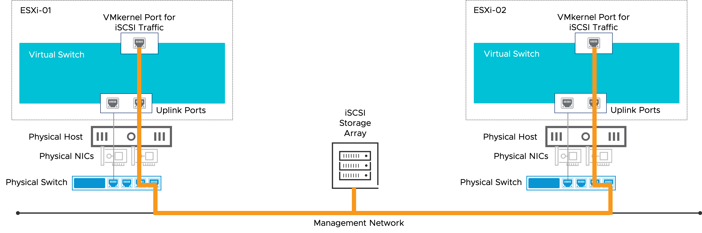

# Virtual Switches Overview

After completing this lesson, you will be able to meet the following objectives: 

- Define virtual networking
- Describe a virtual switch and its components
- Explain how virtual switches connect VMs and VMware ESXi™ hosts to the network

## Introduction

[VMBeans](https://core-vmware.bravais.com/api/dynamic/documentVersions/3658/files/72367/c4cdb738-c65e-45f3-96ff-280ea2ebed4a.html) *uses a virtual network for its successful, busy, and global online store at www.vmbeans.com.*

*As a new networking administrator at VMBeans, you must ensure that the virtual network runs smoothly so that customers can always access the online store.*

### Learner Objectives

- Define virtual networking
- Describe a virtual switch and its components
- Explain how virtual switches connect VMs and VMware ESXi™ hosts to the network

## About Virtual Networking

Virtual networking enables devices across many locations to function with the same capabilities as a traditional physical network.

Physical networking connects computers through cables and network hardware devices. Virtual networking extends the physical networking capabilities by using network virtualization platforms to connect workloads regardless of their physical location. This method allows data centers to stretch across different locations and enables network administrators to easily modify the network without buying more hardware.

Virtual networking uses software-based versions of traditional network devices, such as switches and routers, enabling a more efficient network configuration. This method results in greater flexibility in provisioning networks to meet the specific application needs.

---

At VMBeans, customers do not know if they are on a physical or virtual network. Customers want to connect to the online store and buy coffee.

As a network administrator at VMBeans, you must ensure that customers can access the online store, have a great user experience, and purchase seamlessly. You must prevent network failure or slowdown during periods of high activity, such as a sale.

---

Using virtual networking, you can create virtual networks in the region where a sale takes place to cope with the demand. Additional hardware is not necessary.

## Virtual Switches

### About Virtual Switches

A virtual switch is at the heart of a virtual network.
A virtual switch works like a physical switch in a physical network.
VMware vSphere® has two types of virtual switches: standard switches and distributed switches.

#### Using a Traditional Physical Network

A traditional physical network connects physical machines through a physical switch, physical cables, and other physical hardware.

#### Using a Virtual Network

A virtual network uses software versions of traditional network devices. These virtual devices are called virtual hardware.

#### Using a Virtual Switch

A virtual switch controls and directs communication between the virtual parts of the network. A virtual switch detects which virtual machines are connected to its virtual ports and forwards traffic to the correct virtual machines.

This traffic exists as network packets or data packets. A virtual switch checks the data packets and forwards them to their destination.

### Virtual Switch Connections

To connect VMs and ESXi hosts to the network, a virtual switch uses specific types of connections, or ports:

- Virtual machine
- VMkernel
- Uplink

#### Port Types

- Uplink Ports: Uplink ports connect the virtual network to the physical network.

  Each uplink port is associated with a physical network adapter on the ESXi host.

- VMkernel ports are used by the ESXi hypervisor (VMkernel) for managing ESXi system traffic.

- Virtual machine ports connect virtual machines to the virtual network.

## Connecting Virtual Machines and ESXi

### Connecting VMs to the Network

A VM uses a virtual switch to connect to the network.

#### Virtual NIC

A virtual machine has a virtual network adapter, also called virtual NIC (Network Interface Card).
The virtual NIC is configured to connect to a virtual machine port group, for example, Production.
When a virtual machine is powered on, the virtual NIC connects to a virtual port in the virtual machine port group.

#### VM Port Group

A virtual switch can have one or more port groups and can be used to logically group similar VMs.

VMs can communicate with other VMs in the same port group and in different port groups.

#### Uplink Ports

When a VM must communicate with a computer on the physical network, the uplink ports pass traffic from the VM to the physical network adapters that they are associated with.

#### Physical Network

The physical network adapters on the ESXi host are connected to the physical switch, which is connected to the physical network.

With this setup, a VM can communicate with a computer or device on the physical network.

### VMkernel Port

The ESXi host connects to the network by using a VMkernel port, also called the VMkernel adapter.

A VMkernel port manages network traffic for ESXi, such as management traffic, IP storage traffic, and so on.

#### Management Traffic

You can use a VMkernel port to control the management traffic. Management traffic refers to the communication between vCenter Server and the ESXi hosts that it manages.

For example, a user powers on a VM by using the VMware vSphere® Client™. To perform the task of powering on the VM, VMware vCenter Server® must communicate with the ESXi host where the VM is located.

#### IP Storage Traffic

The storage that an ESXi host uses to store its VMs can be located on the network. This type of storage is called network-attached storage or IP storage. iSCSI and NFS are examples of IP storage.

ESXi uses a VMkernel port to manage traffic between the ESXi host and IP storage, such as an iSCSI storage array, where the host's VMs are stored.

### Other Types of Traffic

VMkernel ports also manage other types of traffic:

- VMware vSphere® vMotion®

  This traffic flows between ESXi hosts. vSphere vMotion is a feature used to move a virtual machine from one host to another.

- VMware vSAN™

  This traffic flows between hosts in a vSAN cluster. vSAN is a cluster feature that combines the direct-attached storage of ESXi hosts to create a datastore on which VMs are stored.

- VMware vSphere® Fault Tolerance

  This traffic flows between the primary ESXi host and secondary ESXi host in a vSphere Fault Tolerance configuration. vSphere Fault Tolerance is a cluster feature that provides continuous availability (with no downtime) to virtual machines.

- VMware vSphere® Replication™
  This traffic flows between ESXi hosts. vSphere Replication is a data protection feature that replicates VMs from an ESXi host in the source site to an ESXi host in the target site.

## Summary

Virtual Switches Overview

*Virtual networks are critical for businesses such as the VMBeans online store to transact over the Internet.*

*Virtual switches play a key role in allowing users to access the virtual machines on a virtual network over the Internet.*

## Knowledge Check

### Virtual Networking

A virtual network uses a virtual switch to connect VMs and ESXi hosts to the physical network.
Select the option that best answers the question and click Submit.

- [x] True
- [ ] False

### Virtual Switch Components

What is the function of virtual switch components?
Match the virtual switch components to their corresponding descriptions. Then click Submit.

| Components           | Functions                                      |
| -------------------- | ---------------------------------------------- |
| Virtual machine port | Connects a virtual machine to the network      |
| Port group           | Logical grouping of ports                      |
| Uplink port          | Passes traffic to the physical network adapter |
| VMkernel port        | Manages ESXi traffic                           |

### Virtual Switch Connections

Which type of port is used to perform each virtual switch task?
For each statement, select the appropriate port and click Submit.

| Tasks                                                  | Virtual Machine Port | VMkernel Port | Uplink Port |
| ------------------------------------------------------ | :------------------: | :-----------: | :---------: |
| Send traffic from the VMBeans web server               |          x           |               |             |
| Manage traffic between an ESXi host and vCenter Server |                      |       x       |             |
| Receive incoming traffic from the Internet             |                      |               |      x      |

