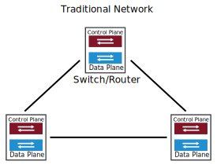
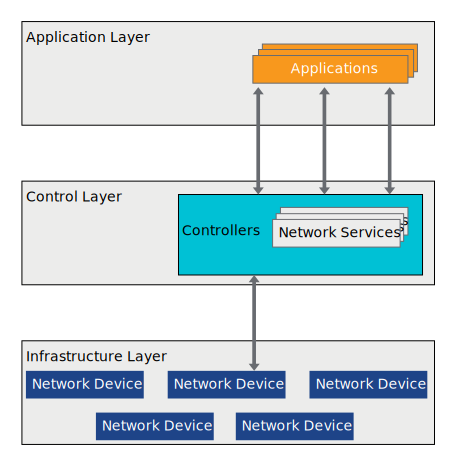

# Software Defined Networking

## Introduction

[VMBeans](https://core-vmware.bravais.com/api/dynamic/documentVersions/3656/files/72273/c4cdb738-c65e-45f3-96ff-280ea2ebed4a.html) is considering the adoption of software-defined networking (SDN) to support its online coffee shop.

As a network administrator, you evaluate how VMBeans can use SDN to control and configure its networking devices.

### Learner Objectives

- Describe the software-defined networking approach to control network traffic
- Compare traditional networking to software-defined networking
- Describe the software-defined networking architecture

## About Software-Defined Networking

### Overview of Software-Defined Networking

Software-defined networking (SDN) is an approach to networking that uses software-based controllers  or application programming interfaces (APIs) to control or direct the traffic on the underlying network infrastructure. This approach is different from traditional networks, which use dedicated hardware devices (routers and switches) to control the network traffic.

- software-based controllers:

  A software-based controller is an application that acts as a central control point in a software-defined network. Essentially, it is the brain of the network. The controller manages the traffic between the physical network hardware and the applications and business logic.

- application programming interface:

  An API  sends information back and forth between software applications and users. An API can be compared to the server in a restaurant, who passes the orders from the customer to the chef without knowing how to cook the items.

While network virtualization enables the creation of several virtual networks on one physical network, software-defined networking enables a new way of controlling the routing of data packets through a centralized device called a controller.

SDN can create and control a virtual network or control a traditional hardware network with software.

### Traditional Versus Software-Defined Networking

The key difference between SDN and traditional networking is infrastructure: SDN is software-based, while traditional networking is hardware-based.

#### Traditional Networking

In a traditional network architecture, the data plane, control plane, and management plane reside on the same hardware device, such as a router or switch.

#### Software-Defined Networking

Like any virtualized solution, SDN also moves the logic from hardware to software. It moves the control plane (which determines where to send traffic) to software and leaves the data plane (that forwards the traffic) in the hardware.

The software-defined controllers continue to direct the network traffic and communicate with the physical network devices, which are still responsible for forwarding all the traffic.

Because the control plane is software-based, SDN is much more flexible than traditional networking. It enables administrators to control the network, change configuration settings, provision resources, and increase network capacity from a centralized user interface, without adding more hardware.

## SDN Architecture

The SDN architecture enables network administrators to program and control the entire network through a single management console instead of configuring the network device by device.

A typical SDN architecture includes the following components:

- Applications (of the management plane), which enable the devices to interact with users and receive requests or configuration about the network as a whole
- Controllers (of the control plane), which use the information from applications to decide how to route a data packet in a network
- Network devices (of the data plane), which receive information from the controller about where to move the data packet

### Using the Software-Defined Networking Approach at VMBeans

SDN allows workloads to move easily between multiple locations, which is critical for modern-day cloud applications. VMBeans might need additional capacity to cope with the increased demand of online orders. The network administrators can use a virtual network infrastructure to shift workloads from private to public cloud infrastructures as necessary, and to make new customer services available instantly.

If a physical switch or router fails, SDN intelligently detects the failure and ensures that the traffic bypasses the failed networking device. This method enables vmbeans.com to operate seamlessly.

SDN also makes it easier to provision the virtual networks on demand, as the administrators add or remove virtual machines depending on the number of coffee orders. This ease exists whether those virtual machines reside in the on-premises data center or in the cloud.

## Summary

*Software-defined networking extends network virtualization and uses software to control and direct the traffic on the underlying network infrastructure.*

*SDN enables VMBeans administrators to control the network, change configuration settings, provision resources, and increase network capacity on demand. Workloads can move easily between multiple locations, and this feature is critical for modern-day cloud applications.*

## Knowledge Check

### About Software-Defined Networking

What are the characteristics of software-defined networking?
Select the two options that best answer the question and click Submit.

- [ ] Software-defined networking combines the data plane, control plane, and management plane into one software device.

- [x] Software-defined networking enables a new way of controlling the routing of data packets through a centralized device called a controller.

- [x] Software-defined networking uses software to control and direct the traffic on the underlying network infrastructure.

- [ ] Software-defined networking moves the data plane to software and leaves the control plane in the hardware.

### Software-Defined Networking Architecture

Which components are part of the software-defined networking architecture?
Select the three options that best answer the question and click Submit.

- [x] Controllers

- [ ] Routing tables

- [x] Applications

- [x] Network devices

- [ ] Containers

