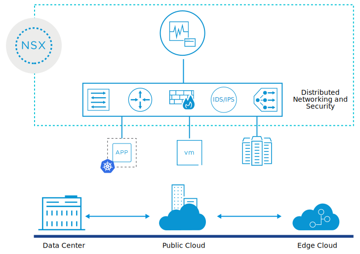

# Introduction to NSX-T Data Center

## Introduction

*As* [VMBeans](https://core-vmware.bravais.com/api/dynamic/documentVersions/3568/files/70533/c4cdb738-c65e-45f3-96ff-280ea2ebed4a.html) *grows, the networking infrastructure expands with it. VMBeans now uses physical networking devices from multiple vendors. These devices are proving difficult to operate and manage.*

*As a network administrator, you evaluate how to efficiently manage networking and security services across multiple sites, vendors, and clouds by using VMware NSX-T™ Data Center. You must be familiar with the features, benefits, and use cases of NSX-T Data Center.*

### Learner Objectives

- Describe the features and benefits of NSX-T Data Center
- Describe the use cases for NSX-T Data Center

## About NSX-T Data Center

Modern-day enterprises are adopting new strategies for cloud, containers, and new application frameworks. The IT teams must run, manage, and connect virtual machines and containers across multiple types of hypervisors and clouds.

NSX-T Data Center addresses the evolving needs of organizations to support cloud-native applications, bare-metal workloads, multi-hypervisor environments, and public clouds. NSX-T Data Center offers a full stack networking platform that includes virtual networking, security, services, and analytics.

NSX-T Data Center enables network and security services that span from any site, to any cloud, and to any endpoint device.

### Benefits of NSX-T Data Center

NSX-T Data Center provides the following advantages:

- Connects applications no matter where they reside across private and public clouds.
- Protects applications with built-in security features, including distributed firewall and threat prevention services.
- Eliminates manual configuration and achieves consistent networking and security configuration across private and public clouds.
- Provides a single access point to manage and monitor the network.
- Software-based networking and security solutions are easier to design, deploy, and manage compared to traditional hardware-based solutions.

### Use Cases for NSX-T Data Center

- **Security**: NSX-T Data Center offers security based on applications. This approach protects all the traffic inside the data center, and not only at the perimeter. This approach also prevents the spread of threats between internal workloads.
- **Multicloud networking**: NSX-T Data Center allows administrators to consistently configure networking and security services across multiple sites and cloud providers, including on-premises, private, and public cloud environments.
- **Automation**: NSX-T Data Center enables faster deployment of networking and security services through automation and reduces manual and error-prone tasks.
- **Cloud-native applications**: NSX-T Data Center enables the adoption of modern containerized solutions by connecting containers that run across multiple platforms such as vSphere with VMware Tanzu, Kubernetes, and others.

NSX-T Data Center resolves these problems by providing a single access point from which to operate and manage the network. The network extends across the data center and cloud. Logical networks and services can be provisioned in minutes.

### Using NSX-T Data Center to Manage the VMBeans Networking Infrastructure

To cope with an expected spike in demand from customers, VMBeans wants to add a cloud-based web server to supplement the existing web servers running in the data center. As the business expanded, the networking infrastructure expanded with it. VMBeans uses physical networking devices from multiple vendors. These devices are proving difficult to operate and manage. The network team estimates that it will take 2 days to make the required configuration changes.

## Summary

*NSX-T Data Center delivers a complete networking and security platform, which is implemented in software. NSX-T Data Center provides simplified management of your entire network and allows you to connect and protect your applications no matter where they are running across private and public clouds, containers, and on bare-metal physical servers.*

## Knowledge Check

### NSX-T Data Center Features

Which of the following features does NSX-T Data Center provide?
Select the three options that apply and click **Submit**.

- [x] Virtual Networking
- [ ] Physical networking
- [x] Security
- [x] Services
- [ ] Compute Virtualization

### Benefits of NSX-T Data Center

What are the benefits offered by NSX-T Data Center ?
Select the two options that apply and click Submit.

- [x] Consistent networking and security policies

- [ ] Increased management complexity

- [ ] Reduces operational efficiency

- [x] Connect and protect applications regardless of where they run: VM, container, or bare metal

- [ ] More complicated deployments compared to traditional hardware-based solutions

