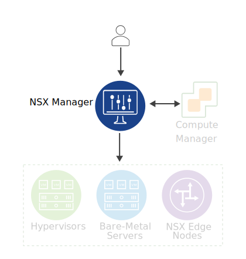

# NSX-T Data Center Components

## Introduction

[VMBeans](https://core-vmware.bravais.com/api/dynamic/documentVersions/3569/files/70548/c4cdb738-c65e-45f3-96ff-280ea2ebed4a.html) *wants to adopt VMware NSX-T™ Data Center to provide networking and security services across its different sites.*

*As a network administrator for VMBeans, your must understand the different components of NSX-T Data Center to efficiently configure networking and security services for your business.*

### Learner Objectives

- Identify the components in an NSX-T Data Center environment
- Describe the function of each NSX-T Data Center component

## NSX-T Data Center Components

NSX-T Data Center uses various components to provide networking and security to your data center.

Scroll down to learn about each NSX component.

### NSX Manager

NSX Manager is the main component in the NSX-T Data Center environment. NSX Manager is deployed as a virtual machine on a VMware ESXi™ host or KVM hypervisor. NSX Manager performs the management plane and the control plane functions in the same virtual machine.

NSX Manager provides a GUI and REST APIs for creating, configuring, and monitoring NSX-T Data Center components, such as logical switches, logical routers, and firewalls.

For high availability, you can deploy three NSX Manager instances as a cluster. This cluster is called an NSX Management cluster.

### Compute Manager

A compute manager is an application that manages resources such as hypervisors and VMs.

VMware vCenter Server® is an example of a compute manager.

### Hypervisors

NSX-T Data Center supports ESXi and KVM-based hypervisors, which host the workloads such as VMs or containers. Your environment can be based on ESXi hypervisors, KVM hypervisors, or a combination of both.

NSX Manager prepares these hypervisors to carry the NSX traffic between the workloads. After preparation, the hypervisors can host virtual networks that are used by the workloads to connect to each other.

### Bare-Metal Servers

Bare-metal servers are physical servers dedicated to a single operating system and application.

NSX-T Data Center supports several Linux and Windows-based bare-metal servers.

NSX Manager prepares these bare-metal servers to carry the NSX traffic. After preparation, the bare-metal servers can participate in the NSX virtual networks.

### NSX Edge Nodes

NSX Edge nodes can be deployed either as a VM form factor on an ESXi hypervisor or installed directly on a bare-metal server.

Like hypervisors, which provide a pool of resources to create virtual machines, the NSX Edge nodes offer a pool of resources to create virtual routers and network services such as NAT, VPN, and load balancing for the NSX environment.

- NAT:

  A public IP address is required to access the Internet. Because of the explosion in the number of devices connected to the Internet, enough public IP addresses might not be available for every device.
  Network Address Translation (NAT) is a mechanism used to translate between private IP addresses and public IP addresses.

- VPN:

  A VPN enables you to securely connect multiple data centers by using a public network such as the Internet.

- load balancing

  Load balancing distributes incoming service requests among multiple servers.

A group of NSX Edge nodes is usually combined to form a cluster. This cluster is called an NSX Edge cluster.

## Summary

*As a network administrator, you must understand the roles of various NSX-T Data Center components to effectively design and configure network and security features to support your business needs.*

## Knowledge Check

### Role of NSX-T Data Center Components

What are the functions of the NSX-T Data Center components?
Match the components to their corresponding benefits. Then click **Submit**.

| Components        | Benefits                                                     |
| ----------------- | ------------------------------------------------------------ |
| Bare-metal server | Linux and Windows physical servers that participate in the NSX networks |
| Hypervisors       | ESXi and KVM hosts that participate in the NSX networks      |
| NSX Edge          | Offers a pool of resources to create virtual routers and network services for the NSX environment |
| NSX Manager       | Provides a user interface for creating, configuring, and monitoring NSX components such as logical switches, logical routers, and firewalls |
| Compute manager   | Manages resources such as hypervisors and virtual machines   |

### Role of NSX Edge Nodes

Which statements are true about NSX Edge nodes?
Select the two options that best answer the question and click **Submit**.

- [x] Can be deployed as bare-metal servers or virtual machines
- [x] Provides routing capabilities and services
- [ ] Can be deployed as virtual machines only
- [ ] Provides routing and distributed firewalling capabilities

