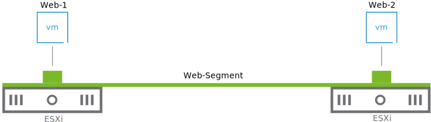
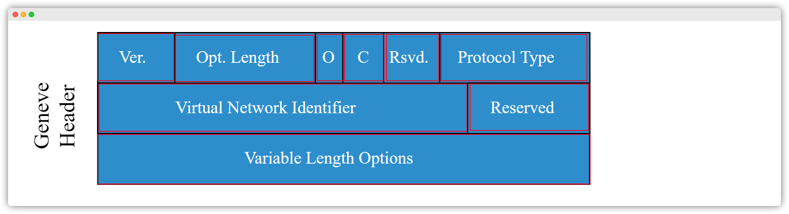
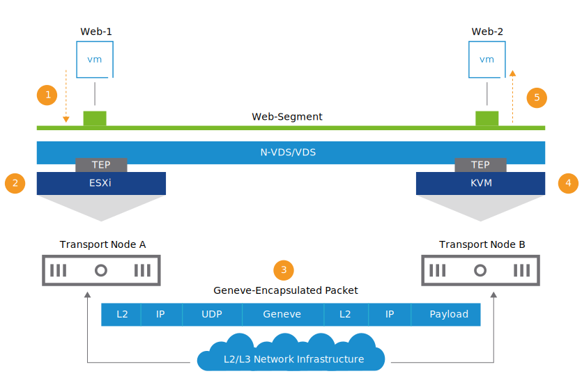

# NSX Logical Switching

## Learner Objectives

- Describe the end-to-end logical switching communication in VMware NSX-T™ Data Center
- Connect workloads to an existing segment and check connectivity

## Introduction

[VMBeans](https://core-vmware.bravais.com/api/dynamic/documentVersions/3655/files/72267/c4cdb738-c65e-45f3-96ff-280ea2ebed4a.html) *is adding more web servers to accommodate the rapidly increasing traffic on its website.*

*As a network administrator, you maintain connectivity between these new web servers.*

## Use Case for Logical Switching

---

The popularity of the VMBeans coffee delivery service is increasing. A software developer in your team recently deployed two additional web servers to cope with the increasing demand.

As a junior network administrator, you must ensure that these two new web servers can communicate with each other.

---

You can connect all the web servers to the same segment to ensure that they can communicate with each other and exchange information.

## Logical Switching End-to-End Communication

### About Geneve Tunneling

Geneve is an overlay tunneling mechanism, which:

- Provides L2 over L3 encapsulation
- Runs on UDP
- Uses port number 6081
- Adds an 8-byte tunnel header encapsulated in UDP over either IPv4 or IPv6
- Requires a MTU size of less than 1,600 (1,700 recommended)

- Version (2bits): The current version number is 0.
- Options Length (6 bits): This variable results in a minimum total Geneve header size of 8 bytes and a maximum of 260 bytes.
- O (1 bit): The Operations, Administration, and Maintenance (OAM) packet contains a control message instead of a data payload.
- C (1 bit): This field indicates that critical options are present.
- Rsvd. (6 bits): The Reserved field must be zero on transmission and ignored on receipt.
- Protocol Type (16 bits): The field indicates the type of protocol data unit appearing after the Geneve header.
- Virtual Network Identifier (VNI) (24 bits): The VNI uniquely identifies the segment that the inner Ethernet frame belongs to. It is a 24-bit number that is added to the Geneve frame, allowing a theoretical limit of 16 million separate networks. The NSX VNI range is 5,000 through 16,777,216.
- Reserved (8 bits): The Reserved field must be zero on transmission and ignored on receipt.
- Variable Length Options: The base Geneve header is followed by zero or more options in the type-length-value format. Each option includes a 4-byte option header and a variable amount of option data interpreted according to the type. Geneve provides NSX-T Data Center with the complete flexibility of inserting metadata in the type, length, and value fields that can be used for new features.

### Logical Switching End-to-End Communication

The two new web servers can communicate with each other when connected to the same segment.

NSX-T Data Center uses Geneve tunneling to encapsulate the virtual network traffic and carry it over the physical network:

- Each transport node (VMware ESXi™, KVM, or bare-metal server) is configured with a tunnel endpoint (TEP) that is used to encapsulate and decapsulate the Geneve traffic as it leaves or enters the host.
- Tunnels are set up between TEPs.
- VM frames are encapsulated with Geneve tunnel headers and sent across the tunnel.

The two web servers connected to the same segment communicate with each other:

1. Web-1 sends the traffic to Web-Segment.
2. The source transport node encapsulates the L2 frame with the Geneve header.
3. The source transport node forwards the packet to the physical network.
4. The destination transport node receives the packet and performs decapsulation.
5. The destination TEP forwards the L2 frame to the destination web server (Web-2).

## Hands-On Practice

### Simulation Overview

A software developer in your team recently deployed two web servers that need to communicate with each other to exchange information. As a junior network administrator, you must connect these two virtual machines to an existing segment in NSX called Web-Segment, and verify that communication between these two VMs is possible.

In this simulation, you connect VMs to a segment and verify layer 2 connectivity.

### Simulation: Connecting VMs to a Segment and Verifying Layer 2 Connectivity

In this simulation you will log in to the NSX UI, navigate the inventory to locate the Web-Segment. Then using the vSphere Web client, you will connect the T1-Web-01 and T1-Web-02 virtual machines to the Web Segment, and using the Web Console, verify connectivity between the VMs using ping. 

1. Click the **Networking** tab at the top of the NSX UI.

2. From the left menu, Click **Connectivity>Segments**.

3. Collapse the left side bar by clicking the **double arrow** at the top of the left menu.

4. Review the information presented on the Segments page.
   Verify the Web-Segment exists and has zero ports connected.
   When ready, **click anywhere** on screen to resume the simulation.

5. Click on the **vSphere browser tab** to open the vSphere Client. 

6. In the vSphere Client inventory, click the **T1-Web-01** virtual machine (VM)

7. Click **ACTIONS**.

8. From the ACTIONS drop down menu, click **Edit Settings.**

9. Click on **VM Network**, the name of the network to which Network adapter 1 is currrently connected. 

10. Click **Browse.**

11. From the list of available networks, click **Web-Segment**.

12. Click **OK**.

13. On the Edit Settings dialog, click **OK**.

14. Verify that the T1-Web-01 virtual machine has the following network configuration:

    - Network adapter 1: Web-Segment (Connected)
    - IP Address: 172.16.10.11

    When ready

     

    click anywhere

     

    on screen to resume the simulation.

15. In the vSphere Client inventory, click the **T1-Web-02** virtual machine (VM)

16. Click **ACTIONS**.

17. From the ACTIONS drop down menu, click **Edit Settings.**

18. Click on **VM Network**, the name of the network to which Network adapter 1 is currrently connected. 

19. Click **Browse.**

20. From the list of available networks, click **Web-Segment**.

21. Click **OK**.

22. On the Edit Settings dialog, click **OK**. 

23. Verify that the T1-Web-02 virtual machine has the following network configuration:

    - Network adapter 1: Web-Segment (Connected)
    - IP Address: 172.16.10.12

    When ready 

    click anywhere

     on screen to resume the simulation.

24. Click **Launch Web Console** to open the console of the T1-Web-02 virtual machine.

25. Confirm network connectivity between the virtual machines connected to the Web-Segment: **
    Press any key** to ping from T1-Web-02 to T1-Web-01.

26. Click the **NSX browser tab** to return to the NSX UI.

27. Note the number of Ports (0) connected to the Web-Segment, then click **REFRESH** at the bottom left of the NSX UI.

28. Click the number **2** of ports connected to the Web-Segment.
    Verify that Segment ports are created for both the T1-Web-01 and T1-Web-02 virtual machines. 

The simulation is now complete.

## Summary

NSX Logical Switching

*NSX-T Data Center uses Geneve tunneling to provide connectivity for virtual machines and containers that are connected to the same segment.*

*You must know how to connect your workloads to a given segment and verify that they can successfully communicate with each other.*

## Knowledge Check

### End-to-End Logical Switching Communication

What is the correct order of the steps required for Web-1 to communicate with Web-2?
Drag and drop the steps in the correct order.

1. Web-1 sends the traffic to Web-Segment.
2. The source transport node encapsulates the L2 frame with the Geneve header.
3. The source transport node forwards the packet to the physical network.
4. The destination transport node receives the packet and performs decapsulation.
5. The destination TEP forwards the L2 frame to the destination web server (Web-2).