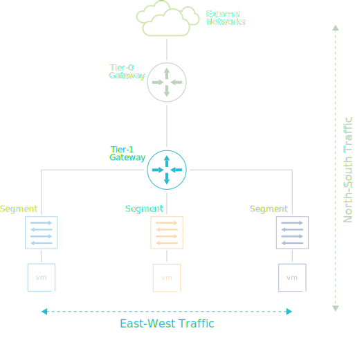
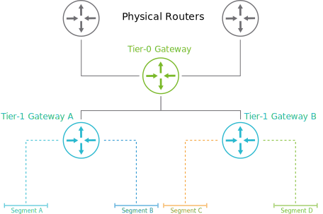

# NSX Routing Components

## Learner Objectives

- Describe the components and functions of NSX-T Data Center logical routing
- Identify the logical routing topologies that are available in NSX-T Data Center

## Introduction

*As the* [VMBeans](https://core-vmware.bravais.com/api/dynamic/documentVersions/3575/files/70645/c4cdb738-c65e-45f3-96ff-280ea2ebed4a.html) *online business expands, new virtual machines and containers are deployed across different networks to support the rapidly increasing demand.*

*As a network administrator, you must connect different networks and to ensure that your applications are accessible through the Internet. To accomplish this task, you must understand the VMware NSX-T™ Data Center logical routing components.*

## Logical Routing Components and Topologies

### Logical Routing Components

NSX-T Data Center uses software-based routers, called gateways, to connect different networks and to provide Internet access to your applications. You can configure both Tier-0 and Tier-1 gateways based on your requirements.

#### Tier-0 Gateway

Tier-0 gateways connect the virtual and physical networks to provide external connectivity to all the containers and virtual machines that run in the data center. This traffic is also called North-South traffic.

Tier-0 gateways have the following characteristics:

- Offer gateway services between VMware NSX® and the external networks.
- Require the deployment of one or more VMware NSX® Edge™ nodes to centrally configure and manage the routing capabilities.
- Support static and dynamic routing protocols (BGP Border Gateway Protocol (BGP) is a dynamic routing protocol that is used to route traffic across the Internet.) towards the physical network.
- Support equal-cost multipath (ECMP Equal-Cost Multipath (ECMP) is a routing protocol that increases the external network bandwidth by adding network links.) routing to load balance traffic and provide fault tolerance.

#### Tier-1 Gateway

Tier-1 gateways are typically used to connect virtual machines and containers that are attached to different networks or segments. The internal communication across segments is also called East-West traffic.

Tier-1 gateways have the following characteristics:

- Provide segment interconnection and separation
- Offer gateway services to the internal networks or segments
- Are implemented as a distributed solution across all participating transport nodes
- Do not use any dynamic routing protocols
- Connect to a Tier-0 gateway for external connectivity

### Logical Routing Topologies

NSX-T Data Center supports different types of routing topologies based on the needs of your environment.

#### Multitier Topology

In a multitier deployment, segments are connected to the Tier-1 gateways, and the Tier-1 gateways are connected to the Tier-0 gateway.

This topology is typically used when different teams or business units manage the Tier-0 and Tier-1 gateways. For example, the cloud provider manages the Tier-0 gateways, and each tenant is responsible for its own Tier-1 gateway.

#### Single-Tier Topology

In a single-tier deployment, segments are connected directly to the Tier-0 gateway, without a Tier-1 gateway.

This topology is used when the same team or business unit manages all gateways. For example, the service provider and tenant are the same and do not need to be separated.

## Summary

NSX Routing Components

*The NSX-T Data Center logical routing components enable you to successfully connect different networks and to access the Internet.*

*Tier-1 gateways are typically used to interconnect virtual machines and containers from different segments, whereas Tier-0 gateways provide external connectivity to such workloads.*

## Knowledge Check

### Characteristics of a Multitier Deployment

What are the characteristics of a multitier deployment?
Select the two options that best answer the question and click **Submit**.

- [x] Used when different teams or business units manage the gateways.

- [ ] Segments are connected directly to the Tier-0 gateway, without a Tier-1.

- [ ] Used when the same team or business unit manages the gateways.

- [x] Segments are connected to Tier-1 gateways and Tier-1 gateways to Tier-0 gateways

### NSX Gateway Characteristics

What are the characteristics of the different types of NSX gateways?
For each statement, select the appropriate type of NSX gateway.

| Characteristics                                              | Tier-0 Gateway | Tier-1 Gateway |
| :----------------------------------------------------------- | :------------: | :------------: |
| Offers gateway services between NSX and the external networks. |       x        |                |
| Requires the deployment of one or mode NSX Edges nodes.      |       x        |                |
| Support static and dynamic routing protocols.                |       x        |                |
| Implemented as a distributed solution                        |                |       x        |
| Does not use any dynamic routing protocols                   |                |       x        |
| Provides segment interconnection and separation              |                |       x        |
| Offers gateway services to the internal networks or segments |                |       x        |
| Supports equal-cost multipath (ECMP) routing.                |       x        |                |

