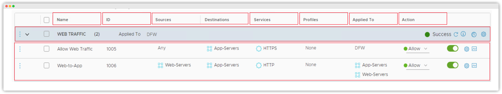
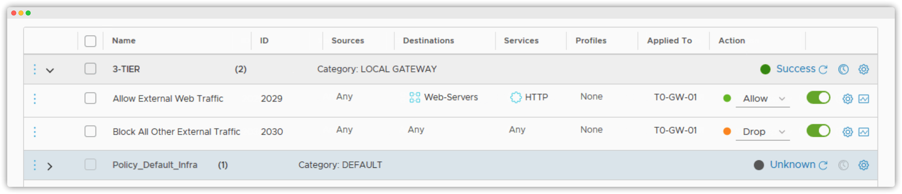

# NSX Data Center Firewalls

- Differentiate between gateway and distributed firewalls
- Identify preconfigured firewall rules from the NSX UI
- Validate preconfigured firewall rules from the NSX UI

## Introduction

*As a security administrator at* [VMBeans](https://core-vmware.bravais.com/api/dynamic/documentVersions/3579/files/70711/c4cdb738-c65e-45f3-96ff-280ea2ebed4a.html)*, you must protect your applications from external attacks and internal threats that can damage your online business.*

*VMware NSX-T™ Data Center includes gateway and distributed firewalls to help you protect your data center from both external and internal threats.*

## Use Case for NSX Firewalls

---

The VMBeans database is publicly accessible through the Internet. A security breach occurred in the coffee delivery service webpage. One of the users, who was disappointed with the allocated delivery slot, hacked the database to change the delivery slot to an earlier delivery time.

In addition, a recently hired intern made some cosmetic changes to the web interface. The intern accidentally used commands that deleted a few users.

---

NSX-T Data Center firewalls can help resolve these security problems:

- Gateway firewalls prevent users from accessing your servers through the Internet.
- Distributed firewalls prevent web developers from accidentally accessing your database and deleting valuable information.

## About NSX Firewalls

NSX-T Data Center includes gateway and distributed firewalls to protect your data center.

The distributed firewall is an NSX-T Data Center feature that implements micro-segmentation to build a Zero-Trust security approach.

### Gateway Firewall

The gateway firewall is used at the perimeter of the data center to protect traffic to and from physical environments. This traffic is also called North-South traffic.

The gateway firewall has the following features:

- Applies to Tier-0 and Tier-1 gateways and their uplinks
- Requires the deployment of an NSX Edge cluster
- Supports stateless and stateful firewall rules
  - Stateless: Stateless firewall rules allow or deny traffic based on the source, destination, and protocol or port combination of the packet.
  - Stateful: Stateful firewall rules perform packet inspection and track the state of network connections. Packets matching a known active connection are allowed, whereas packets that do not match are evaluated in a stateless manner.

### Distributed Firewall

The distributed firewall protects traffic between virtual machines and containers in the data center. This traffic is also called East-West or lateral traffic:

The distributed firewall has the following features:

- Is a distributed solution that runs on each transport node (VMware ESXi™ and KVM)
- Is applied to the virtual machine vNIC
- Supports layer 2, layer 3, and context-aware (layer 7) firewall rules.
- Supports Identity Firewall for Windows systems.

#### Layer 2

Layer 2, or the Data Link layer, of the OSI model ensures that data can be transferred between computers that are connected to the same network. Most network switches operate at Layer 2.

#### Layer 3

Layer 3, or the Network layer, of the OSI model is responsible for routing messages between computers. Routing finds the appropriate path through the network when a computer needs to send a packet to another computer in a different network.

#### Layer 3

Layer 3, or the Network layer, of the OSI model is responsible for routing messages between computers. Routing finds the appropriate path through the network when a computer needs to send a packet to another computer in a different network.

#### Identity Firewall

Identity Firewall allows or denies network traffic based on users and user groups.

## Security Policies and Rules

You can create both distributed and gateway firewall rules to secure traffic in your data center.

Firewall rules are a set of instructions that determine whether the network traffic should be blocked or allowed based on specific criteria.

A security policy is a set of firewall rules that are related to each other.

Firewall rules are processed top to bottom:

- Each packet is matched against the first rule in the policy before moving to the next rule.
- The first rule in the policy that matches the traffic parameters is applied. Subsequent rules are not evaluated.

- Name:
  - Add a meaningful name for the firewall rule.
- ID:
  -  is the rule identifier that the system generates. This value cannot be modified.
- Sources, Destinations
  - The source determines the origin of the traffic.
  - The destination determines the location to which the traffic is sent.
  - You can create static or dynamic groups of virtual machines, virtual interfaces, segments, segment ports, IP and MAC addresses, Active Directory user groups, and physical servers. You can use these groups as sources and destinations in your firewall rules.
- Services:
  - A service defines a port and protocol combination. The service is used to specify the type of traffic to be blocked or allowed in the firewall rules, for example, HTTP and port 80.
- Profiles:
  - A profile inspects the layer 7 application content of the packets before allowing or denying it.
- Applied To:
  - The Applied To field determines the scope of the rule enforcement. It helps to narrow down the application of security policies to specific workloads or tenants without affecting others.
- Action:
  - The action of the firewall determines how the traffic is handled. The possible options are Allow, Drop, and Reject.
  - Rejecting a packet is a more graceful way to deny a packet, because it sends a destination unreachable message to the sender.
- WEB TRAFFIC:
  - The security policy appears.
- Two firewall rules are available for web traffic:
  - Allow Web Traffic
  - Web-to-App

## Hands-On Practice

### Simulation Overview

A security administrator in your team created a set of distributed firewall rules to secure traffic between a three-tier application that includes web servers, an application server, and a database server. The gateway firewall rules were also created to protect the three-tier application from external access.

As a junior network administrator, you must verify that these rules were successfully configured from the NSX UI. You must also and verify that traffic between the three-tier application and the external networks is handled as defined in the firewall rules.

In this simulation, you perform the following tasks:

- Identify and validate preconfigured distributed firewall rules
- Identify and validate preconfigured gateway firewall rules

### Simulation: Identifying and Validating Preconfigured Distributed Firewall Rules

In this simulation, you navigate to the Distributed Firewall in NSX UI, examine the preconfigured rules, and validate the rules operate correctly.

1. Click the **Security** tab at the top of the NSX UI.

2. From the left menu, click **East West Security>Distributed Firewall**.

3. Click the **double arrow** at the top of the left menu to collapse the sidebar.

4. Locate the firewall policy called ***3-TIER POLICY\***, verify the status is ***Success*** and then click the **arrow** near at the beginning of the policy row to expand the rules in the policy.

5. Verify the three firewall rules in the policy:

   - Name: ***Allow Web Traffic***
   - ID:**2026**
   - Sources: ***Web-Servers***
   - Destinations: ***App-Servers***
   - Services: ***HTTP***
   - Action: ***Allow***

   - Name: ***Allow MySQL Traffic***
   - ID:**2027**
   - Sources: ***App-Servers***
   - Destinations: ***DB-Servers***
   - Services: ***MySQL***
   - Action: ***Allow***

   - Name: ***Drop All Other Traffic***
   - ID:**2028**
   - Sources: ***Web-Servers, App-Servers, DB-Servers***
   - Destinations: ***Web-Servers, App-Servers, DB-Servers***
   - Services: ***Any***
   - Action: ***Drop***

   When ready,

    

   click anywhere 

   on screen to resume the simulation.

6. Click the **T1-Web-01 browser tab** to open the T1-Web-01 console. 

7. **Press any key** to confirm, using ping, that the firewall rule with ID ***2028*** drops the traffic between T1-Web-01 and T1-App-01 (172.16.20.11).
   This traffic is dropped because it doesn't match any of the earlier rules that allow traffic.

8. **Press any key** to confirm, using curl, that the firewall rule with ID ***2026*** allows HTTP traffic between the T1-Web-01 and T1-App-01 (172.16.20.11) VMs. 

9. Click the **T1-App-01 browser tab** to open the T1-App-01 console.

10. **Press any key** to confirm, using ping, that the firewall rule with ID ***2028\*** drops the traffic between T1-App-01 and T1-DB-01 (172.16.30.11).
    This traffic is dropped because it doesn't match any of the earlier rules that allow traffic.

11. **Press any key** to confirm, using mysql, that the firewall rule with ID ***2027*** allows mySQL traffic between the T1-App-01 and T1-DB-01 (172.16.20.11) VMs. 

12. **Press any key** to enter the password.
    The mysql client connection is allowed.

The simulation is now complete.

### Simulation: Identifying and Validating Preconfigured Gateway Firewall Rules

In this simulation, you navigate to the Gateway Firewall in the NSX UI, examine the preconfigured rules, and validate the rules operate correctly. 

1. Click the **Security** tab at the top of the NSX UI.

2. From the left menu, click **North South Security>Gateway Firewall.**

3. Click the **double arrow** at the top of the left menu to collapse the sidebar.

4. Locate the firewall policy called ***3-TIER\***, verify the status is ***Success\*** and then click the **arrow** near the beginning of the policy row to expand the rules in the policy.

5. Verify the two firewall rules in the policy:

   - Name: ***Allow External Web Traffic***
   - ID:**2029**
   - Sources: ***Any***
   - Destinations: ***Web-Servers***
   - Services: ***HTTP***
   - Action: ***Allow***

   - Name: ***Block all Other External Traffic***
   - ID:**2030**
   - Sources: ***Any***
   - Destinations: ***Any***
   - Services: ***Any***
   - Action: **Drop**

   When ready

    

   click anywhere

    

   on screen to resume the simulation.

6. Click on the **New Tab** browser tab.

7. **Press any key** to open the website hosted by T1-Web-01.
   External connectivity to the website is possible because firewall rule with ID ***2029\*** allows HTTP traffic from external sources to T1-Web-01 (172.16.10.11).

8. Click the **command prompt icon** on the Windows taskbar.

9. **Press any key** to ping T1-Web-01 (172.16.10.11).
   The pings are not successful because firewall rule with ID ***2030\*** drops external traffic not matching any of the previous rules.

## Summary

NSX Firewalls

*NSX-T Data Center includes gateway and distributed firewalls to protect your data center from both external and internal threats. The gateway firewall is used at the perimeter of the data center. The distributed firewall protects traffic between virtual machines and containers in the data center.*

## Knowledge Check

### NSX Firewall Characteristics

What are the characteristics of different  firewalls?
For each characteristic, select the appropriate firewall type.

| Characteristics                                         | Gateway Firewall | Distributed Firewall |
| :------------------------------------------------------ | :--------------: | :------------------: |
| Protects North-South Traffic                            |        x         |                      |
| Applies to Tier-0 and Tier-1 gateways and their uplinks |        x         |                      |
| Runs on each transport node                             |                  |          x           |
| Protects East-West Traffic                              |                  |          x           |
| Is applied to the virtual machine vNIC.                 |                  |          x           |
| Requires the deployment of an NSX Edge cluster          |        x         |                      |

### NSX Firewall Rule Characteristics

What is the Applied To field used for when creating an NSX firewall rule?
Select the option that best answers the question and click Submit.

- [ ] Determines that layer 7 traffic should be analyzed
- [x] Determines the scope of the rule enforcement
- [ ] Defines a port and protocol combination
- [ ] Determines how the traffic is handled

### Sample Firewall Rule

Which statement is true about the firewall rule in the screenshot?
Select the option that best answers the question and click **Submit**.

- [ ] It is a gateway firewall applied to a Tier-1 gateway, which rejects the traffic on port 22.
- [ ] It is a distributed firewall applied to App-Servers, DB-Servers, and Web-Servers, which reject the traffic on port 22.
- [ ] It is a distributed firewall applied to App-Servers, DB-Servers, and Web-Servers, which drop the traffic on port 22.
- [x] It is a gateway firewall applied to a Tier-0 gateway, which drops the traffic on port 22.