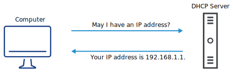
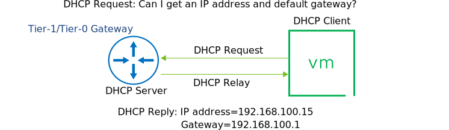
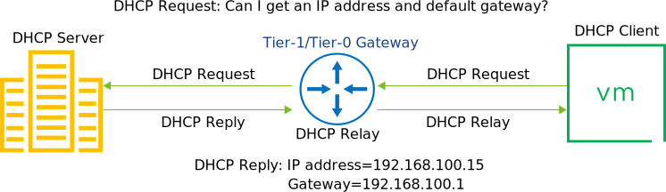

# NSX DHCP

- Describe DHCP and its use cases
- Implement DHCP in VMware NSX-T™ Data Center

## Introduction

*To avoid manually configuring the network settings every time a user joins a new network, your team at* [VMBeans](https://core-vmware.bravais.com/api/dynamic/documentVersions/3580/files/70727/c4cdb738-c65e-45f3-96ff-280ea2ebed4a.html) *is exploring using the Dynamic Host Configuration Protocol.*

*As a network administrator, you must configure that protocol. To accomplish this task, you must understand the multiple benefits of DHCP, and reduce the number of errors when configuring devices in different networks.*

## Use Case for DHCP

---

VMBeans provides free in-store WiFi to its customers. Configuring the network settings manually on each customer device is both time consuming and error-prone.

---

Each device that uses a network must be configured with an IP address, subnet mask, default gateway, DNS server, and other settings that are specific to that network. Manual configuration varies by device and is time consuming and error-prone. If a device moves to a new network, the network configuration must be updated again.

DHCP allows clients to automatically obtain network configuration settings such as IP addresses, subnet masks, default gateways, and DNS configuration from a DHCP server. The device can join the network without manual intervention and ensure that the correct network settings are used.

- Dynamic Host Configuration Protocol is a network management protocol used on Internet Protocol networks. A DHCP server dynamically assigns an IP address and other network configuration parameters to each device on the network, so that the device can communicate with other IP networks.

## Implementing DHCP in NSX-T Data Center

In NSX-T Data Center, you can configure Tier-0 and Tier-1 gateways to act as DHCP servers or DHCP relays. However, you should not configure both gateways on the same segment.

### DHCP Server

You can create a DHCP server on a Tier-1 or Tier-0 gateway that manages DHCP requests from the VMs attached to VMware NSX® segments.

In this configuration, the DHCP requests are managed within the NSX environment, without relying on any external DHCP server.

### DHCP Relay

You can configure a DHCP relay on a Tier-1 or Tier-0 gateway to forward DHCP requests from the NSX workloads to external DHCP servers.

## Summary

DHCP enables clients to automatically obtain the network configuration settings from a DHCP server. When DHCP is used, you do not need to manually configure network settings on each client device. NSX-T Data Center provides both DHCP server and DHCP relay as services on Tier-1 and Tier-0 gateways.

## Knowledge Check

### NSX DHCP: Network Configuration

Which network configuration settings does a DHCP server provide to a client device?
Select the two options that best answer the question and click Submit.

- [x] IP Address

- [ ] WiFi Password

- [ ] MAC Address

- [x] Default Gateway

### NSX DHCP Modes

Which DHCP modes does NSX-T Data Center support ?
Select the two options that best answer the question and click Submit.

- [ ] Replica

- [x] Relay

- [ ] Primary

- [x] Server