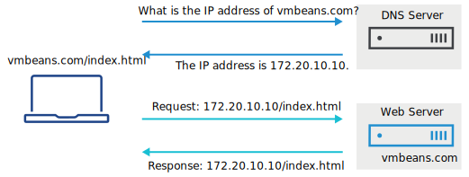
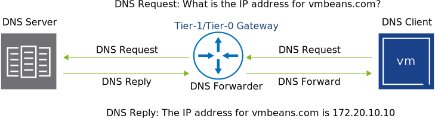

# NSX DNS

- Describe DNS and its use cases
- Implement DNS in NSX-T Data Center

## Introduction

[VMBeans](https://core-vmware.bravais.com/api/dynamic/documentVersions/3581/files/70748/c4cdb738-c65e-45f3-96ff-280ea2ebed4a.html) *wants to ensure easy access to the services for their users. So VMBeans wants the customers to use vmbeans.com instead of the IP address when searching for the company’s website.*

*As a network administrator, you must configure a DNS server in your company’s data center. To accomplish this task, you must understand how DNS servers work in VMware NSX-T™ Data Center.*

## Use Case for DNS

---

The users of VMBeans cannot remember the IP address of the webpage every time they place an order for coffee. So, the company uses a friendly name, such as vmbeans.com, instead of the IP address.

---

Computers find and communicate with each other over the Internet by using their IP addresses. Computers can use both IP version 4 addresses, such as `93.184.216.34`, and IP version 6 addresses, such as `2606:2800:220:1:248:1893:25c8:1946`. Humans prefer easy-to-remember domain names such as vmbeans.com or vmware.com.

DNS resolves computer names (vmbeans.com) to IP addresses (172.20.10.10), and conversely.

DNS is like a phone book for the Internet. When a user or computer wants to connect to another computer by using its name, a lookup request is sent to a DNS server. The DNS server responds with the IP address.

## Implementing DNS in NSX-T Data Center

A DNS server resolves computer names to IP addresses. The public DNS servers on the Internet are like the Internet's phone book. The public DNS servers resolve computer and website names to public IP addresses. In addition, most organizations maintain internal DNS servers that resolve computer names to private IP addresses that are used in that organization.

A DNS forwarder is a server that forwards local DNS requests from clients to external DNS servers. The DNS forwarder caches the responses received from the external DNS servers, so that it can service subsequent requests without reaching the external DNS server. This method improves system performance and hides internal DNS information from external networks.

NSX-T Data Center Tier-1 and Tier-0 gateways can be configured as DNS forwarders.

## Summary

*The NSX-T Data Center Tier-1 and Tier-0 gateways can be configured to provide DNS services. DNS makes it easier to navigate the Internet by resolving computer names to IP addresses.*

## Knowledge Check

To which address or tag does DNS resolve a computer name?
Select the option that best answers the question and click **Submit**.

- [ ] Asset Tag
- [x] IP Address
- [ ] Postal Address
- [ ] MAC Address

NSX-T Data Center Tier-1 and Tier-0 gateways can be configured as a DNS ________.
Select the missing word that completes the sentence:

- [x] Forwarder
- [ ] Server
- [ ] Relay
- [ ] Client