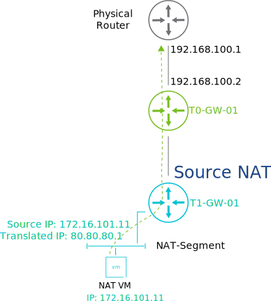
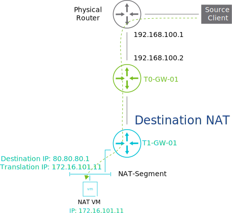

# NSX NAT

- Describe NAT and its use cases
- Implement NAT in VMware NSX-T™ Data Center

## Introduction

*With the increase in the number of devices connected to the Internet, enough public IP addresses are not available for every device.* [VMBeans](https://core-vmware.bravais.com/api/dynamic/documentVersions/3582/files/70764/c4cdb738-c65e-45f3-96ff-280ea2ebed4a.html) *must use a private IP address to connect to the Internet.*

*As a network administrator, you must implement Network Address Translation (NAT) in your company’s VMware NSX -T™ Data Center instances.*

## Use Case for NAT

---

A limited number of public IP addresses are assigned to VMBeans. The number of available IP addresses is not enough to configure each of the company's web servers with a dedicated public IP address. VMBeans needs to use a private IP address to connect servers to the Internet without revealing the server's IP address.

---

NAT is a mechanism used to translate between private IP addresses and public IP addresses. A private IP address is not globally unique and cannot be used to access the Internet directly. A public IP address is unique, but IP version 4 public addresses are limited because all the devices are now on the Internet. NAT performs one-to-one mapping or one-to-many mapping, which allows computers that use private IP addresses to access the Internet. The private IP addresses, which are used internally, are not revealed.

- NAT
  Network Address Translation is the process where a network device, usually a router or gateway, assigns a public address to a computer (or group of computers) in a private network. NAT reduces the number of public IP addresses that an organization needs to use.

- Private IP address
  Private IP addresses are used to communicate within the same network without any exposure to the Internet.

- Public IP address

  An Internet Service Provider (ISP) assigns a public IP address. The public IP address can be used to communicate over the Internet.

- one-to-one mapping:

  One public IP address is mapped to one private IP address.

- one-to-many-mapping:

  One public IP address is mapped to multiple private IP addresses.

## Implementing NAT in NSX-T Data Center

NSX-T Data Center enables you to create both source NAT (SNAT) and destination NAT (DNAT) rules. You can configure SNAT and DNAT rules on both Tier-0 and Tier-1 gateways.

### Source NAT

SNAT translates the source IP packets from a private IP address to a known public IP address. SNAT is used for traffic originating in the private network and reaching the Internet.

### Destination NAT

DNAT translates the destination public IP address to a private IP. DNAT is used for traffic originating on the Internet and reaching the private network.

## Summary

NSX NAT

*NAT is used to translate private IP addresses to public IP addresses, and the other way around. Using NAT enables computers that use private IP addresses to access the Internet, improves security by hiding internal IP addresses, and helps to conserve public IP addresses. NSX-T Data Center supports source NAT and destination NAT on Tier-0 and Tier-1 gateways.*

## Knowledge Check

### NSX NAT Translation

What does NAT translate a private IP address to?
Select the option that applies and click **Submit**.

- [ ] Public gateway address
- [x] Public IP address
- [ ] Domain name address
- [ ] Public MAC address

### Types of NSX NAT Rules

Which types of NAT rules do NSX-T Data Center support?
Select the two options that apply and click Submit.

- [ ] Dynamic NAT

- [ ] Static NAT

- [x] Source NAT

- [x] Destination NAT