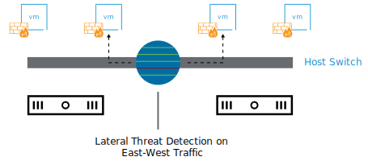
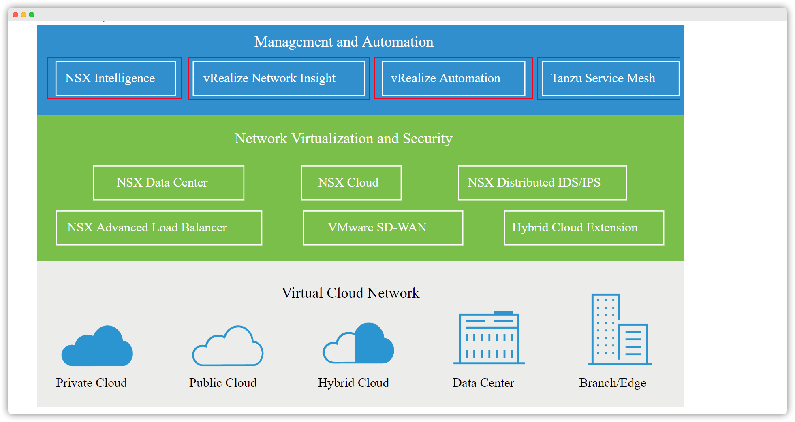

# Virtual Cloud Network

- Explain the VMware Virtual Cloud framework
- Describe the VMware Virtual Cloud product portfolio, its benefits, and use cases

## Introduction

[VMBeans](https://core-vmware.bravais.com/api/dynamic/documentVersions/3584/files/70797/c4cdb738-c65e-45f3-96ff-280ea2ebed4a.html) *is planning to modernize its network. VMBeans wants to implement a network that is defined entirely in software across multiple platforms.*

*As a network administrator, you must evaluate how VMBeans can use the products from the VMware Virtual Cloud Framework product portfolio to simplify operations and lower costs.*

## About VMware Virtual Cloud Network

The network of the future is virtualized, distributed, and software-defined. The VMware networking and security portfolio delivers on that future by creating a virtual cloud network that connects and protects applications across private clouds, public clouds, and edge devices.

This solution provides consistent policies across heterogeneous environments, simplified operations, and lower costs. The virtual networking and security capabilities extend to any workload that runs in VMs, containers, or bare-metal servers.

## VMware Virtual Cloud Network Portfolio Overview

The Virtual Cloud Network offers a complete portfolio of products that provide security, integration, extensibility, and automation.

### NSX Data Center

VMware NSX® Data Center is the industry's only complete layer 2 to layer 7 software-defined networking stack, including networking, load balancing, security, and analytics. With NSX Data Center, you can provision networking and security services across multiple hypervisors and bare-metal servers.

Benefits:

- Accelerates deployments
- Provides consistent network and security across multiple hypervisors.
- Cost savings

Use Cases:

- Automation
- Micro-segmentation
- Extending networking across multiple environments
- Containerized applications

### NSX Cloud

VMware NSX Cloud™ extends the networking and security capabilities of NSX Data Center to the public cloud. You can provide your workloads running natively on Amazon AWS or Microsoft Azure with consistent networking and security policies, helping you improve scalability, control, and visibility.

Benefits:

- Deployment flexibility
- Centralized management interface
- Integration with existing tools

Use Cases:

- Micro-segmentation
- Consistent policy management across clouds

### NSX Advanced Load Balancer

VMware NSX® Advanced Load Balancer™ (formerly Avi Networks) provides multicloud load balancing, web application firewall, and application analytics across on-premises data centers and cloud.

Benefits:

- Multicloud consistency
- Full life cyle automation
- Real-time analytics
- Supports cloud-native applications

Use Cases:

- Software-defined load balancer
- Load balancing and web application firewalling across multicloud environments
- Container Ingress (Management for incoming external traffic towards containerized applications) Services

### NSX Distributed IDS/IPS

VMware NSX® Distributed IDS/IPS™ is an advanced threat detection engine that detects lateral threat movement on east-west traffic across multicloud environments.

Benefits:

- Operationally simple
- Removes the need for buying expensive appliances
- Scales linearly by using CPU resources across multiple servers

Use Cases:

- Create virtual zones without requiring physical separation of network.
- Replace traditional security appliances
- Detect lateral threat movement

### VMware SD-WAN

Wide Area Network (WAN)

- A wide area network (WAN) is a network that interconnects multiple local area networks (LANs). A WAN is essentially a network of networks, with the Internet being the world's largest WAN.

VMware SD-WAN by VeloCloud virtualizes WAN connections to deliver high-performance, reliable branch access to cloud services, private data centers, and SaaS-based enterprise applications.

Benefits:

- Simplified WAN operations
- Improved application performance
- Ease of cloud adoption
- Choices in edge security

Use Cases:

- Bandwidth expansion
- Branch deployment automation

### VMware HCX

VMware HCX® (Hybrid Cloud Extension) makes it easy to migrate thousands of virtual machines within and across data centers or clouds, without requiring a reboot.

Benefits:

- Any-to-any mobility
- Secure and large-scale migrations
- Provides a hybrid interconnect optimized for WAN traffic

Use Cases:

- Application migration across data centers and clouds.
- Workload rebalancing
- Business continuity

## Additional VMware NSX Products

You can further extend the value of the NSX portfolio with an additional complement of VMware products.

- VMware NSX® Intelligence™
  - is a distributed analytics solution that provides visibility and dynamic security policy enforcement for NSX Data Center environments.
  - NSX Intelligence enables network and application security teams to deliver a more granular security posture, simplify compliance analysis, and enable proactive security.
- VMware vRealize® Network Insight™
  - provides visibility across virtual and physical networks. It helps with operations management for NSX Data Center and NSX Cloud.
- VMware vRealize® Automation™
  - is the VMware infrastructure automation platform for the modern software-defined data center. When used with NSX, it automates an application's network connectivity, security, performance, and availability, saving you time and money, and increasing your security.
- VMware Tanzu™ Service Mesh™, built on VMware NSX® is the VMware enterprise-class service mesh solution that provides consistent control and security for microservices, end-users, and data across the most demanding multicluster and multicloud environments.
  - service mesh:
    - The term mesh or service mesh is used to describe the network of microservices that make up modern applications and the interactions between them.
  - microservices:
    - It is a software architecture that structures an application as a collection of lightweight services that are related to each other, but the are coded and deployed independently.

## Summary

VMware Virtual Cloud Network

*The VMware Virtual Cloud Network framework can provide a network that is defined entirely in software.*

*You must understand how to use the products from the VMware Virtual Cloud Framework product portfolio to connect and secure your applications across private and public clouds, independently of the underlying physical infrastructure.*

## Knowledge Check

### VMware Virtual Cloud Framework Benefits and Use Cases

What are the business cases for products in the VMware Cloud Framework portfolio?
Match the business case with the corresponding product that best resolves the problem in the VMware Cloud Framework portfolio. Then click Submit.

- VMware HCX
  - “We need a solution to securely perform large-scale migration of workloads across any vSphere environment.”
- NSX Cloud
  - “We need a cloud-agnostic network and security platform for applications that run natively in public clouds.”
- NSX Distributed IDS/IPS
  - “We are looking for a solution that performs threat detection across multicloud environments.”
- NSX Advanced Load Balancer
  - “We need a solution that provides multicloud load balancing and web application firewall across on-premises data centers and cloud.”
- VMware SD-WAN
  - “We need reliable branch access to private data centers, cloud services, and SaaS-based enterprise applications."
- NSX Data Center
  - “We need a solution that provides network virtualization and security across multihypervisor deployments.”