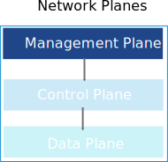
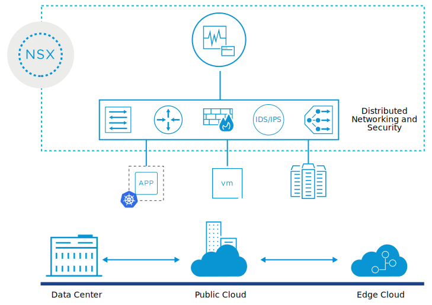

# ESTPYD02414 VMware Virtual Cloud Network - Core Technical Skills

- Sabe: [ESTPYD02414 VMware Virtual Cloud Network - Core Technical Skills](https://dell.sabacloud.com/Saba/Web_spf/PRODTNT091/app/shared;spf-url=common%2Fledetail%2Fcours000000000456128%3FfromAutoSuggest%3Dtrue)
- VMware: [VMware Virtual Cloud Network - Core Technical Skills | Connect Learning](https://learning.customerconnect.vmware.com/oltpublish/site/program.do?dispatch=showCourseSession&id=9fce082b-fcc8-11ea-9f48-0cc47adeb5f8&ssosign=true)

## Course Introduction:

### Course description:

The Virtual Cloud Network: Core Technical Skills self-paced course targets candidates who are new to the industry or entry-level employees looking for opportunities to advance their knowledge, skills, and understanding of VMware NSX®, which is the VMware network virtualization platform. Through a series of targeted, self-paced modules, the student will learn how to perform standard and typically repeated tasks that are delegated by an administrator to an operator or junior administrator.

The course aligns with the VMware Certified Technical Associate (VCTA) certification exam.

- Explain the basic concepts and features of the software-defined data center and VMware vSphere®
- Define network virtualization and software-defined networking
- Describe the features, components, and basic architecture of VMware NSX-T™ Data Center
- Describe the networking and security capabilities of NSX-T Data Center, including switching, routing, and firewalling
- Explain the implementation of networking services such as DHCP, DNS, NAT, load balancing, and VPNs in NSX-T Data Center
- Monitor the NSX components and objects from the NSX user interface
- Explain the VMware Virtual Cloud Network vision

### Overview

The Virtual Cloud Network: Core Technical Skills self-paced course targets candidates who are new to the industry or entry-level employees looking for opportunities to advance their knowledge, skills, and understanding of VMware NSX®, which is the VMware network virtualization platform. Through a series of targeted, self-paced modules, the student will learn how to perform standard and typically repeated tasks that are delegated by an administrator to an operator or junior administrator.

The course aligns with the VMware Certified Technical Associate (VCTA) certification exam.

**Please Note:** **This course** **requires a Premium subscription** to VMware Customer Connect Learning. Click [here](https://mylearn.vmware.com/mgrReg/courses.cfm?ui=www_edu&a=one&id_subject=82786) to purchase this subscription to gain access to this course. If you have a Premium subscription, log in first and then search for the course.**

## Objective

- Explain the basic concepts and features of the software-defined data center and VMware vSphere®
- Define network virtualization and software-defined networking
- Describe the features, components, and basic architecture of VMware NSX-T™ Data Center
- Describe the networking and security capabilities of NSX-T Data Center, including switching, routing, and firewalling
- Explain the implementation of networking services such as DHCP, DNS, NAT, load balancing, and VPNs in NSX-T Data Center
- Monitor the NSX components and objects from the NSX user interface
- Explain the VMware Virtual Cloud Network vision

## Modules
1. [vSphere and the Software-Defined Data Center](./01 vSphere and the Software-Defined Data Center.md)
2. VMware SDDC Solutions
3. VMware vSphere Components and Features
4. Network Virtualization
5. Virtual Switches Overview
6. vSphere Standard Switches
7. vSphere Distributed Switches
8. Management, Control and Data Plane
9. Software Defined Networking
10. Introduction to NSX-T Data Center
11. NSX-T Data Center Components
12. NSX-T Data Center Architecture
13. Benefits of NSX-T Data Center Logical Switching
14. NSX Logical Switching Components
15. NSX Logical Switching
16. Benefits of NSX-T Data Center Logical Routing
17. NSX Routing Components
18. NSX Logical Routing
19. Micro-segmentation
20. Zero-Trust Security
21. NSX Data Center Firewalls
22. NSX DHCP
23. NSX DNS
24. NSX NAT
25. NSX Load Balancing
26. NSX VPNs
27. Virtual Cloud Network
28. Certification Information

# vSphere and the Software-Defined Data Center

## Introduction

[VMBeans](https://core-vmware.bravais.com/api/dynamic/documentVersions/3559/files/70374/c4cdb738-c65e-45f3-96ff-280ea2ebed4a.html) wants to provide its internal departments and employees with on-demand computing services, such as network connectivity and security, storage, and applications. The most efficient way to deliver these services is through cloud computing. So VMBeans decides to implement a software-defined data center.

Your goal is to identify the reasons that VMBeans chooses this solution: How does a software-defined data center work, what benefits does it offer, and what has it got to do with cloud computing?

### Learner Objectives

- Identify types of virtualization used in a software-defined data center
- Recognize the components of an SDDC
- Describe the relationship between vSphere, the SDDC, and cloud computing

## Extending Virtualization to All Resources

A data center is a centralized physical facility that contains corporate computers, network, storage, and other IT equipment that support business operations. A traditional, on-premises, hardware-defined data center is limited by the physical attributes of the available resources.

If the demands placed on the infrastructure exceed its capacity, problems occur. Performance might be negatively affected, and the whole network can go down.

Virtualization software can transform a traditional data center into a software-defined data center (SDDC). In an SDDC, virtualization extends to all resources, including CPU, networking, storage, and security. And the data center is no longer limited by its physical dimensions.

## Data Center Virtualization

### Types of Virtualization

An SDDC uses different types of virtualization to deliver its resources as services:

- Server virtualization divides a physical server into multiple, unique, and isolated virtual servers.
- Network virtualization replicates a physical network in software. Applications run on the virtual network exactly as if on a physical network.
- Storage virtualization abstracts and pools multiple storage devices, so that they appear as a single virtual storage device.
- Desktop virtualization abstracts desktop services and applications from the underlying host system so that users can access them without having to interact with the physical host computer.

Exploring Types of Virtualization.

#### Server Virtualization

In server virtualization, each virtual server or virtual machine (VM) runs its own operating system, independently of other VMs.

Each VM can access the underlying computing resources of the physical server.

Server virtualization solution: vSphere
vSphere abstracts the physical resources of a host computer and makes them available to multiple guest virtual machines.

#### Storage Virtualization

By virtualizing storage, you separate the underlying hardware infrastructure from software-based storage management, providing more flexibility and scalability to your storage resources.

Storage virtualization solution: vSAN
vSAN provides storage virtualization at the host level and logically abstracts the physical storage layer for VMs.

#### Network Virtualization

Network virtualization presents logical networking devices and services such as ports, switches, routers, firewalls, load balancers, and VPNs to connected VMs.

Network virtualization solution: NSX Data Center
NSX Data Center delivers networking and security in one software application, abstracted from the underlying physical infrastructure.

#### Desktop Virtualization

By deploying desktops and applications as a managed service, you can respond on demand to the changing needs of your organization, using any device and any cloud.

Desktop virtualization solution: VMware Horizon
VMware Horizon simplifies the management and delivery of virtual desktops and apps through a single cloud platform to end users.

#### Question: Virtualization Solutions

| Virtualization         | Solution        |
| ---------------------- | --------------- |
| Desktop virtualization | VMware Horizon  |
| Network virtualization | NSX Data Center |
| Storage virtualization | vSAN            |
| Server virtualization  | vSphere         |

### vSphere and the SDDC

By using server virtualization, data centers can become fully virtualized software-defined data centers with virtual networking, storage, and security. How does this transformation occur?

vSphere is the virtualization platform that transforms traditional data centers into SDDCs by performing the following functions:

- Virtualization and pooling of resources such as CPU, storage, and networking
- Management of aggregated resources as unified computing infrastructures
- Provision of tools to administer the data centers

#### Components of a Standard SDDC

A standard SDDC consists of several components, each automating different types of services for users.

##### Service Management and Automation

Managing IT in any business requires a system that can administer the entire portfolio of services and operations:

- Keeping and managing the records of the service consumption
- Analyzing the data of events and trends to support better decision making
- Monitoring applications to ensure their availability and performance
- Alerting about system problems to resolve them promptly

The IT service manager typically uses a single software application to configure and automate the provision of services for different users.

##### Cloud Management Layer

The cloud management layer is the top layer of the stack. The consumption of cloud services occurs at this layer.

Some of the most common cloud services include access to the virtualized compute, network, and storage resources, and the subscription to software applications.

The cloud manager configures a set of privileges, pricing, terms, and conditions for the use of cloud services. This layer calls for resources and orchestrates the actions of the lower layers, based on the parameters predefined by the cloud manager.

##### Virtual Infrastructure Layer

The virtual infrastructure layer, which is the heart of the SDDC, abstracts the compute, networking, and storage resources from the physical layer to manage them as virtual pools of resources.

This layer presents the virtualized resources to the cloud management layer so that the cloud consumers can access the resources.

The virtual infrastructure layer establishes a virtualized environment that integrates with the solutions in all other layers of the SDDC.

##### Physical Layer

The lowest layer of the SDDC solution is the physical layer. It consists of the compute, network, and storage infrastructure components, which are the hardware that resides in the data center.

When setting up the physical infrastructure, you can use the VMware Compatibility Guide, which shows all the types and brands of supported hardware.

The infrastructure administrator organizes and manages the hardware by establishing a set of rules about how the resources function, who can access them, and by which methods.

##### Business Continuity

The business continuity layer includes solutions for data protection and disaster recovery of critical management components of the SDDC.

If a system component fails, redundant components immediately take over operations so that services are not interrupted. If a disaster occurs, the backup components in a remote location are used to resume operations promptly.

A business continuity plan must provide guidance on how to operate the backup and restore functions for the SDDC and prevent the permanent loss of business critical data.

##### Security

All systems must be secure by design. A secure design reduces the risk of data breaches, loss of data, and cyber attacks, for example.

The security layer controls the operations that make an SDDC resilient to both internal and external threats.

#### Question: vSphere and the SDDC

Drawing on what you have learned so far, which statements best describe the role of vSphere in the SDDC? Select all options that apply and click Submit.

- [ ] Simplifies the management and delivery of virtual desktops and applications
- [x] Controls access to the underlying physical infrastructure
- [ ] Delivers networking and security entirely in one software application
- [x] Pools, controls, and allocates resources that are consumed through the cloud management layer

### vSphere and Cloud Computing

#### vSphere and Cloud Computing

In an SDDC, the infrastructure is virtualized, and software automates the control of the data center. This virtual infrastructure and software automation are the foundation for cloud computing. But how does the SDDC use cloud computing technology?

Cloud computing is the delivery of on-demand computing services. In other words, your software runs on the SDDC of a cloud services provider.

Cloud services can be managed and delivered in different ways:

- Private cloud: You host and manage the underlying infrastructure of your SDDC on-premises (On-premises means on the physical resources owned and managed by your company.).
- Public cloud: A third party (You access the cloud services over the Internet.) owns and manages the underlying infrastructure of your SDDC.
- Hybrid cloud: Some resources are hosted on-premises and some in the public cloud.

#### vSphere and VMware Cloud Foundation

VMware Cloud Foundation integrates vSphere, NSX Data Center, and vSAN to provide a unified SDDC platform for the private and public cloud:

- vSphere, the foundation technology, virtualizes the compute resources of the data center.
- NSX Data Center manages the virtualization of networking.
- vSAN manages the virtualization of storage resources.

## Summary

*vSphere transforms the IT infrastructure at VMBeans into an SDDC, which helps deliver on-demand, private cloud computing services.*

## Knowledge Check

### Type of Virtualization

Which VMware solution makes server virtualization possible?

Select the option that best answers the question and click Submit.

- [ ] Horizon

- [ ] NSX Data Center

- [ ] vSAN

- [x] vSphere

### Components of a Standard Software-Defined Data Center

Where does each component fit in the SDDC?

Drag each SDDC component to the correct layer on the diagram. Then click **Submit**.

### vSphere in the Software-Defined Data Center

In which layer of the SDDC does vSphere fit?
Select the option that best answers the question. Then click Submit.

- [ ] Service management

- [ ] Cloud management

- [x] Virtual infrastructure

- [ ] Business continuity

### vSphere and Cloud Computing

Which type of resource does vSphere virtualize in the cloud infrastructure?
Select the option that best answers the question. Then click Submit.

- [ ] Storage

- [x] Compute

- [ ] Networking

# VMware SDDC Solutions

After completing this lesson, you will be able to meet the following objectives:

- Identify VMware solutions that integrate with vSphere in SDDC

## Introduction

VMBeans is adopting a software-defined data center to virtualize its compute, network, and storage resources. The SDDC accelerates VMBeans' journey to the private cloud so that it can offer on-demand IT services to its employees and customers.

As a new administrator, you are tasked with assisting with the implementation of the SDDC. To successfully do this, you become familiar with VMware’s solutions.

## VMware Solutions and the SDDC

### Integrating Solutions at the SDDC Layers

At VMBeans, vSphere integrates with each layer of the SDDC infrastructure.
Which VMware solutions integrate with vSphere in each layer of the SDDC? What problems do the solutions solve?

#### Physical

At VMBeans, the physical infrastructure team manages the physical servers, storage, and networking devices.

The team selects tested and approved hardware vendors from the VMware Compatibility Guide.

You work closely with the physical infrastructure team because they manage the physical resources such as the hosts, storage, and network on which vSphere runs.

#### Virtual Infrastructure

At VMBeans, the virtual infrastructure is managed by integrating three VMware solutions:

- vSphere manages multiple ESXi hosts and virtual machines (VMs) through vCenter Server.
- vSAN integrates with vSphere to manage the physical storage disks of ESXi hosts as a single virtual storage device for VMs.
- NSX Data Center provides the software-defined networking resources for managing connectivity between all SDDC layers.

#### Cloud Management

Using cloud management, VMBeans offers an online catalog of services for employees and customers. These services include applications, monitoring, storage, identity management, and many more.

You are both a consumer and a provider of cloud services:

- Consumer: When you request storage space for VMs, you use the service catalog to place the request.
- Provider: When you deploy new VMs to run applications for other departments of VMBeans.

#### Service Management and Automation

VMBeans automates and monitors the entire portfolio of services and operations of its private cloud by integrating vRealize Automation with the service catalog and with vRealize Operations.

So what happens when you make a catalog request for more storage space?

- The vRealize Automation system checks custom roles, policies, and approval flows that are predefined by the cloud team.
- vRealize Automation approves the request without any manual intervention.
- You begin to consume the additional storage space for your VMs.
- With vRealize Operations, the cloud team proactively monitors the usage of storage space to forecast when new storage space is required.

#### Business Continuity

In its business continuity plan, the team at VMBeans includes solutions for data protection and disaster recovery of critical management components of the SDDC.

As an administrator, these solutions help you to protect the vSphere components, for example:

- To ensure that a data center continues operating during an anticipated storm, the team uses Site Recovery Manager to move the data center to a remote location, unaffected by the storm.
- With vSphere Replication, the team creates replicas of business-critical VMs. If a VM's data becomes corrupted, you can recover it by using a replica.

#### Security

VMware AppDefense and VMware Carbon Black provide security to the workloads running on your data centers.

These solutions are powered by machine learning to understand the state and behavior of business-critical applications and monitor them to detect suspicious behavior and prevent attacks in real time.

For example, AppDefense uses ESXi for monitoring guest VM application behavior.

If the application does not behave as expected or shows malicious behavior, the system can suspend or shut down the VM to prevent possible spread of the problem to other parts of the infrastructure.

## Summary

Several VMware solutions integrate with vSphere to help manage the VMBeans' SDDC. Knowing which solutions to integrate and use is key to maintaining a well-performing SDDC.

## Knowledge Check

### An SDDC Defined by VMware

What solutions does each layer of an SDDC integrate with?

| Layers                            | Solutions                                     |
| --------------------------------- | --------------------------------------------- |
| Business Continuity               | Site Recovery Manager and vSphere Replication |
| Service management and automation | vRealize Operations and vRealize Automation   |
| Virtual infrastructure            | vSphere, NSX Data Center, and vSAN            |
| Security                          | VMware AppDefense and VMware Carbon Black     |

# VMware vSphere Components and Features

## Introduction

VMBeans *uses VMware vSphere® to virtualize all the applications that are used to support their online coffee delivery service.*

*As a new administrator, you must minimize application downtime and maximize resource utilization. To make the most of your data center, you must be familiar with the components and main features of vSphere.*

VMBeans is a coffee company with a large network of retail stores, roasteries, warehouses, and a vibrant online presence. VMBeans recently expanded its business to offer a door delivery service for its coffee products, so that users can enjoy a good roast from the comfort of their home.

To support this new service, VMBeans runs a virtualized three-tier application that includes web servers, application servers, and a database. Customers can purchase all products online through the VMBeans website at www.vmbeans.com.

### Learner Objectives

- Identify the functions of the components in a vSphere environment
- Describe the vSphere features and their benefits

## vSphere Components

You can use the vSphere platform and tools to the manage physical resources, such as CPU, storage, and networking, which support the virtual infrastructure.

This virtual infrastructure includes the following core components for running virtual machines:

- VMware ESXi™: You create and run VMs on this hypervisor (The software that extracts the computer's hardware and presents it as virtual hardware to VMs is called hypervisor.).
- VMware vCenter Server®: You use this service to centrally administer the connected ESXi hosts.

In addition to these two core components, the vSphere virtual infrastructure includes several components that perform different functions.

### Role of vSphere Components

- The vSphere Client is a graphical interface for administering vCenter Server. It is the visual part of the software where you view and interact with the buttons and controls.

  Through the vSphere Client, you connect to vCenter Server to manage ESXi hosts and other components of the vSphere environment.

  You can use the vSphere Client from a browser on any computer that is connected to the same network as vCenter Server.

- The vCenter Server software component manages multiple ESXi hosts and their physical resources. vCenter Server also manages virtual machines, virtual networks, and storage.

  vCenter Server is deployed as a virtual appliance (A virtual appliance is a type of VM that is preconfigured with an OS and an application that performs a specific task.) that runs on an ESXi host. vCenter Server is preconfigured to manage the entire vSphere environment.

- A virtual machine or VM is a software representation of a physical computer and its components.

  Like a physical computer, each VM runs an operating system and one or more applications.

- The ESXi software runs on a host. The ESXi host creates and runs VMs that are independent of one another.

  When you install the ESXi software on a server, ESXi controls the underlying resources of the server and divides the hardware for running multiple guest operating systems.

  You can run an individual ESXi host, which is also called a standalone host. You can also use vCenter Server to collectively manage several ESXi hosts.

- A physical network includes machines that are interconnected through physical devices, such as switches and cables, so that they can send data to and receive data from each other.

  In a virtual network, the VMs that run on a physical host connect logically to each other by using virtual network devices.

  A vSphere network can also connect virtual machines to physical machines.

- vSphere uses different types of physical storage devices to present to VMs as the virtualized storage hardware:

  - Storage devices that are connected through a network
  - Storage devices that are directly attached to ESXi hosts

## vSphere Features

Migrating from a physical infrastructure to a virtual infrastructure provides numerous benefits. After migrating to vSphere, several key features are available to you.

### vSphere vMotion

Virtual machines can be moved or migrated from one host to another host with zero downtime by using the VMware vSphere® vMotion® feature. If a physical host must be shut down for maintenance or upgrade, all virtual machines running on that host can be migrated to other hosts. This method ensures that no downtime occurs for maintenance operations.

### vSphere HA

When you use the VMware vSphere® High Availability feature, a physical server failure does not stop your business. Virtual machines on the failed host are automatically started on other hosts. This feature minimizes the downtime, which is experienced by a physical server failure, to 1 or 2 minutes.

### vSphere DRS

Virtual servers that require heavy server resources can be moved automatically to hosts that have available capacity by using the VMware vSphere® Distributed Resource Scheduler™ feature. This feature ensures that all virtual servers can work at 100 percent capacity and access the resources that they need despite the loads of other virtual machines.

## Summary

*As an administrator, you use various vSphere components in a virtual environment. You also use the vSphere features, such vSphere vMotion, vSphere HA, and vSphere DRS, to minimize downtime and ensure the optimal use of resources.*

## Knowledge Check

### Core Components of vSphere

Which components are core to running a vSphere infrastructure? Select all options that apply and click **Submit**.

- [x] ESXi
- [ ] Virtual machines
- [ ] vSphere storage
- [ ] vSphere networking
- [x] vCenter Server

### Main Features of vSphere

What function does each component perform in a vSphere environment?

| Features        | Purpose                                                     |
| --------------- | ----------------------------------------------------------- |
| vSphere HA      | Automatically restarts virtual machines on a failed host    |
| vSphere vMotion | Moves virtual machines from host to host with zero downtime |
| vSphere DRS     | Automatically balances virtual machines across hosts        |

# Network Virtualization

After completing this lesson, you will be able to meet the following objectives: ­

- Describe the importance of network virtualization for the IT industry 
- Describe network virtualization and its implementation 
- Identify the benefits of network virtualization

## Introduction

[VMBeans](https://core-vmware.bravais.com/api/dynamic/documentVersions/3645/files/72040/c4cdb738-c65e-45f3-96ff-280ea2ebed4a.html) *wants to implement a software-defined data center (SDDC) to extend virtualization beyond compute to network and storage.*

*As a network administrator, you evaluate the benefits of network virtualization for your data center.*

### Learner Objectives

- Describe the importance of network virtualization for the IT industry
- Describe network virtualization and its implementation
- Identify the benefits of network virtualization

## About Network Virtualization

Network virtualization is the separation (In the world of information technology, the separation of physical items into virtual components is called abstraction.) of network services that were traditionally delivered in hardware into software. Network virtualization takes the capabilities of traditional hardware network devices and recreates them in software. Because these network services are now software-based, they are independent and separated from the hardware that they run on.

Network virtualization transforms one physical network to multiple virtual (software-based) networks or combines multiple physical networks into one virtual network. Virtual LAN (VLAN) is an example of network virtualization.

The network virtualization software can create separate virtual networks over the same physical network infrastructure or network fabric.

---

VMBeans is experiencing a rapid increase in the pace of application deployments. This increase in pace affects the network.

You must help VMBeans to deploy or update applications and their networks in minutes, enabling rapid time to value.

---

Using virtualization, you can move the control of the data center from hardware to software. With software-defined data centers (SDDC), the data center infrastructure elements, such as compute, storage, and networking, are virtualized and grouped into pools of resources and automatically deployed, with little or no human involvement.

With network virtualization enabling the SDDC, you do not need to spend days or weeks provisioning the infrastructure to support a new application.

This approach converts the networks from static, inflexible, and inefficient to dynamic, agile, and optimized.

## Implementing Network Virtualization

Server virtualization uses virtual machines to run multiple applications on the same hardware. Network virtualization uses virtual networks to provide network and security services to the virtualized applications.

The network virtualization platform that runs on each hypervisor creates the virtual network. The virtual machines and containers that run on the hypervisor connect to the virtual network to access network and security services such as switching, routing, firewalling, load balancing, and virtual private networks (VPNs).

These network and security services are delivered in software and require only Internet Protocol (IP) packet forwarding from the underlying physical network. Network virtualization enables you to programmatically create, provision, and manage networks, all in software, while continuing to use the underlying physical network to forward packets.

When a workload (VM or container) is moved from one host to another host, its networking and security policies move with it. When workloads are created to scale an application, the necessary policies are dynamically applied to those workloads as well.

### Benefits of Network Virtualization

Businesses of all sizes around the world are adopting network virtualization.

Network virtualization provides the following benefits:

- Reduced hardware and power consumption
- Greater operational efficiency by automating manual processes
- Reduced network provisioning time from weeks to minutes
- Improved network security in the data center
- Improved scalability

Network virtualization enables businesses to respond to market demands with agility and operational efficiency.

## Summary

Network Virtualization

*The software-defined data center extends virtualization beyond compute to network and storage. Network virtualization delivers networking and security capabilities entirely in software. Network virtualization uses virtual networks to deliver the networking services.*

*As a network administrator, you must be able to explain network virtualization, describe how it enables the SDDC, and list the benefits of network virtualization.*

## Knowledge Check

### About Network Virtualization

What are the characteristics of network virtualization? *Select the two options that best answer the question.* 

- [x] Network virtualization allows network administrators to move virtual machines across different network domains without reconfiguring the network.
- [x] Network virtualization creates separate virtual networks over the same physical network infrastructure.
- [ ] Network virtualization abstracts network services that were traditionally delivered in software to hardware
- [ ] Network virtualization creates separate physical networks over the same virtual network infrastructure.

### Benefits of Network Virtualization

What benefits does network virtualization offer?Match the benefits to their corresponding descriptions.

| Benefits                          | Descriptions                                                 |
| --------------------------------- | ------------------------------------------------------------ |
| Improved network security         | Network virtualization enables your team to consistently apply network and security policies across the entire network infrastructure. |
| Reduced network provisioning time | The delivery of new networking services can be automated and greatly simplified by using network virtualization. |
| Reduced power consumption         | Network virtualization reduces the amount of physical hardware in your data center. |

# Virtual Switches Overview

After completing this lesson, you will be able to meet the following objectives: 

- Define virtual networking
- Describe a virtual switch and its components
- Explain how virtual switches connect VMs and VMware ESXi™ hosts to the network

## Introduction

[VMBeans](https://core-vmware.bravais.com/api/dynamic/documentVersions/3658/files/72367/c4cdb738-c65e-45f3-96ff-280ea2ebed4a.html) *uses a virtual network for its successful, busy, and global online store at www.vmbeans.com.*

*As a new networking administrator at VMBeans, you must ensure that the virtual network runs smoothly so that customers can always access the online store.*

### Learner Objectives

- Define virtual networking
- Describe a virtual switch and its components
- Explain how virtual switches connect VMs and VMware ESXi™ hosts to the network

## About Virtual Networking

Virtual networking enables devices across many locations to function with the same capabilities as a traditional physical network.

Physical networking connects computers through cables and network hardware devices. Virtual networking extends the physical networking capabilities by using network virtualization platforms to connect workloads regardless of their physical location. This method allows data centers to stretch across different locations and enables network administrators to easily modify the network without buying more hardware.

Virtual networking uses software-based versions of traditional network devices, such as switches and routers, enabling a more efficient network configuration. This method results in greater flexibility in provisioning networks to meet the specific application needs.

---

At VMBeans, customers do not know if they are on a physical or virtual network. Customers want to connect to the online store and buy coffee.

As a network administrator at VMBeans, you must ensure that customers can access the online store, have a great user experience, and purchase seamlessly. You must prevent network failure or slowdown during periods of high activity, such as a sale.

---

Using virtual networking, you can create virtual networks in the region where a sale takes place to cope with the demand. Additional hardware is not necessary.

## Virtual Switches

### About Virtual Switches

A virtual switch is at the heart of a virtual network.
A virtual switch works like a physical switch in a physical network.
VMware vSphere® has two types of virtual switches: standard switches and distributed switches.

#### Using a Traditional Physical Network

A traditional physical network connects physical machines through a physical switch, physical cables, and other physical hardware.

#### Using a Virtual Network

A virtual network uses software versions of traditional network devices. These virtual devices are called virtual hardware.

#### Using a Virtual Switch

A virtual switch controls and directs communication between the virtual parts of the network. A virtual switch detects which virtual machines are connected to its virtual ports and forwards traffic to the correct virtual machines.

This traffic exists as network packets or data packets. A virtual switch checks the data packets and forwards them to their destination.

### Virtual Switch Connections

To connect VMs and ESXi hosts to the network, a virtual switch uses specific types of connections, or ports:

- Virtual machine
- VMkernel
- Uplink

#### Port Types

- Uplink Ports: Uplink ports connect the virtual network to the physical network.

  Each uplink port is associated with a physical network adapter on the ESXi host.

- VMkernel ports are used by the ESXi hypervisor (VMkernel) for managing ESXi system traffic.

- Virtual machine ports connect virtual machines to the virtual network.

## Connecting Virtual Machines and ESXi

### Connecting VMs to the Network

A VM uses a virtual switch to connect to the network.

#### Virtual NIC

A virtual machine has a virtual network adapter, also called virtual NIC (Network Interface Card).
The virtual NIC is configured to connect to a virtual machine port group, for example, Production.
When a virtual machine is powered on, the virtual NIC connects to a virtual port in the virtual machine port group.

#### VM Port Group

A virtual switch can have one or more port groups and can be used to logically group similar VMs.

VMs can communicate with other VMs in the same port group and in different port groups.

#### Uplink Ports

When a VM must communicate with a computer on the physical network, the uplink ports pass traffic from the VM to the physical network adapters that they are associated with.

#### Physical Network

The physical network adapters on the ESXi host are connected to the physical switch, which is connected to the physical network.

With this setup, a VM can communicate with a computer or device on the physical network.

### VMkernel Port

The ESXi host connects to the network by using a VMkernel port, also called the VMkernel adapter.

A VMkernel port manages network traffic for ESXi, such as management traffic, IP storage traffic, and so on.

#### Management Traffic

You can use a VMkernel port to control the management traffic. Management traffic refers to the communication between vCenter Server and the ESXi hosts that it manages.

For example, a user powers on a VM by using the VMware vSphere® Client™. To perform the task of powering on the VM, VMware vCenter Server® must communicate with the ESXi host where the VM is located.

#### IP Storage Traffic

The storage that an ESXi host uses to store its VMs can be located on the network. This type of storage is called network-attached storage or IP storage. iSCSI and NFS are examples of IP storage.

ESXi uses a VMkernel port to manage traffic between the ESXi host and IP storage, such as an iSCSI storage array, where the host's VMs are stored.

### Other Types of Traffic

VMkernel ports also manage other types of traffic:

- VMware vSphere® vMotion®

  This traffic flows between ESXi hosts. vSphere vMotion is a feature used to move a virtual machine from one host to another.

- VMware vSAN™

  This traffic flows between hosts in a vSAN cluster. vSAN is a cluster feature that combines the direct-attached storage of ESXi hosts to create a datastore on which VMs are stored.

- VMware vSphere® Fault Tolerance

  This traffic flows between the primary ESXi host and secondary ESXi host in a vSphere Fault Tolerance configuration. vSphere Fault Tolerance is a cluster feature that provides continuous availability (with no downtime) to virtual machines.

- VMware vSphere® Replication™
  This traffic flows between ESXi hosts. vSphere Replication is a data protection feature that replicates VMs from an ESXi host in the source site to an ESXi host in the target site.

## Summary

Virtual Switches Overview

*Virtual networks are critical for businesses such as the VMBeans online store to transact over the Internet.*

*Virtual switches play a key role in allowing users to access the virtual machines on a virtual network over the Internet.*

## Knowledge Check

### Virtual Networking

A virtual network uses a virtual switch to connect VMs and ESXi hosts to the physical network.
Select the option that best answers the question and click Submit.

- [x] True
- [ ] False

### Virtual Switch Components

What is the function of virtual switch components?
Match the virtual switch components to their corresponding descriptions. Then click Submit.

| Components           | Functions                                      |
| -------------------- | ---------------------------------------------- |
| Virtual machine port | Connects a virtual machine to the network      |
| Port group           | Logical grouping of ports                      |
| Uplink port          | Passes traffic to the physical network adapter |
| VMkernel port        | Manages ESXi traffic                           |

### Virtual Switch Connections

Which type of port is used to perform each virtual switch task?
For each statement, select the appropriate port and click Submit.

| Tasks                                                  | Virtual Machine Port | VMkernel Port | Uplink Port |
| ------------------------------------------------------ | :------------------: | :-----------: | :---------: |
| Send traffic from the VMBeans web server               |          x           |               |             |
| Manage traffic between an ESXi host and vCenter Server |                      |       x       |             |
| Receive incoming traffic from the Internet             |                      |               |      x      |

# vSphere Standard Switches

After completing this lesson, you will be able to meet the following objectives:

- Identify characteristics of vSphere standard switches
- View components and properties of a standard switch configuration

## Introduction

Over time, the networking strategy of [VMBeans](https://core-vmware.bravais.com/api/dynamic/documentVersions/3564/files/70459/c4cdb738-c65e-45f3-96ff-280ea2ebed4a.html) changes. At first, the company used a single standard switch that connected all its virtual machines and ESXi hosts to the network. But after expansion and growth, the company must reevaluate its strategy and decide whether to create separate networks for new departments.

As a new member of the administration team, you must understand how standard switches work so that you can help meet the networking requirements for the additional departments at VMBeans.

## How vSphere Standard Switches Work

### vSphere Standard Switch

A vSphere standard switch is a virtual switch that provides virtual networking for an ESXi host and its virtual machines.

A standard switch is associated with a single ESXi host. For example, if you have three hosts that require network connectivity, then you must create a standard switch on each host.

#### Single Standard Switches: Managing Traffic

A single standard switch can be used for both VM and ESXi system traffic. The physical NICs are shared by all port groups.

In this example, different networks share the bandwidth provided by the standard switch. The standard switch manages VM traffic from the Accounting network, VM traffic from the Sales network, ESXi management network traffic, and iSCSI storage network traffic. The uplink ports pass all traffic through to the physical NICs.

### Isolating Networks

You can use standard switches to isolate different types of network traffic from each other. Why might you want to isolate networks? Consider the following reasons:

- Improve network performance: Each network has its own dedicated bandwidth and does not have to share bandwidth with other networks.
- Help prevent unauthorized monitoring or network interference by other VMs.

You can isolate networks by using either multiple standard switches or VLANs.

#### Multiple Standard Switches

You can create a separate standard switch for each of your VM port groups and VMkernel ports.

Each standard switch has its own physical NICs. Traffic from each virtual network (port group) is physically separated by each standard switch.

The downside of having separate standard switches is that the ESXi host must have enough physical NICs to support the configuration, which can be costly.

For example, with four standard switches that have two uplink ports each, the ESXi host requires eight physical NICs.

Also, an ESXi host has limits to the number of physical NICs that it can support.

#### VLANs

Instead of using separate standard switches to isolate networks, you can use a single standard switch and isolate networks using VLANs.

A VLAN (virtual LAN) is a subgroup of a physical network. VLANs can logically group VMs, systems, and devices into separate virtual networks, regardless of where they are located in the physical network.

A VLAN has a VLAN ID, which is a number that uniquely identifies the VLAN. Virtual switches and physical switches use the VLAN ID to route packets to the correct network.

Each port group on a virtual switch can be configured to use VLANs.

In this example, VM port groups and VMkernel port groups are configured to be members of specific VLANs.

Why use a single standard switch with VLANs instead of multiple standard switches to isolate networks? When ready, click here for possible reasons.

#### Why Use VLANs?

In addition to improving network performance and providing additional security, VLANs do not require that you add new cabling or make significant physical changes to the network infrastructure.

VLANs must be planned and configured in your physical and virtual network infrastructure before they can be used. Therefore, if your data center already has an existing VLAN configuration in place, then you might prefer to use VLANs instead of multiple standard switches to isolate your networks.

## Viewing Standard Switch Configurations

As a new member of the VMBeans administrators' team, you must become familiar with the standard switches that is configured in the vSphere environment. How many standard switches are configured? What are the VM port groups on each standard switch? Which VMs are attached to each port group? On which switch are the VMkernel ports configured? How many uplinks does the standard switch have?

The topology diagram (The topology diagram provides a visual representation of the adapters and port groups connected to the standard switch.) provides you with this information.

Explore the topology diagram for a standard switch located on the ESXi host called sa-esxi-01.vclass.local to help answer these questions.

### Topology Diagram

- Standard Switch: Name of the standard switch, which uses the naming convention vSwitch followed by a number (starting at 0), for example, vSwitch0, vSwitch1, vSwitch2, and so on.

- Port group name: Accounting

  This port group contains virtual machines on the Accounting network. In this example, the port group contains four VMs, indicated by the number in parentheses.

- Port group name: IP Storage

  This port group contains a VMkernel port for handling IP storage traffic, for example, traffic between the ESXi host and the iSCSI storage array on which its VMs are located.

  VMkernel ports use the naming convention vmk followed by a number, starting at 0.

  The VMkernel port is named vmk1 (vmk0 is already used) and has an IP address of 172.20.10.61.

- Port group name: Management Network

  This port group contains a VMkernel port for handling management traffic for the ESXi host sa-esxi-01.vclass.local.

  vCenter Server uses this network to communicate with this ESXi host. Other ESXi hosts can also communicate with this ESXi host using this network.

  The VMkernel port is named vmk0 and has an IP address of 172.20.10.51.

- Port group name: Sales

  This port group contains virtual machines on the Sales network. It contains two virtual machines, indicated by the number in parentheses. The names of the virtual machines are also shown.

- Data path:
  This part of the diagram shows whether a virtual machine is connected to the physical network. The diagram also identifies the physical adapters that carry the data.

  The orange line shows that the Photon-10 VM is connected to the physical network using the vmnic4 uplink adapter on sa-esxi-01.vclass.local.

- Uplinks:
  Names of the physical (uplink) adapters, which use the naming convention vmnic followed by a number (starting at 0).

  This switch has three uplink adapters: vmnic0, vmnic1, and vmnic4.

### Standard Switch Properties

From the topology diagram, you can view the properties of the standard switch,  port groups, VMkernel ports, and uplink ports. You might check these properties when connectivity problems occur.

#### Standard Switch

The MTU is the maximum transmission unit of a network packet. The default is 1,500 bytes.

By increasing the MTU value, you increase the amount of data transmitted in a single network packet. A larger MTU size improves networking efficiency.

#### Port Group

The VLAN ID indicates the VLAN that the port group is associated with. If the field is blank, no VLAN is used.

#### VMkernel

TCP/IP stack refers to the networking layer in the VMkernel. The VMkernel TCP/IP stack provides networking for the ESXi host. Most of the time, the Default stack is used, which is a general-purpose stack that handles all types of ESXi system traffic. Other stacks are vSphere vMotion, Provisioning, and Custom.

Enabled services identifies the types of network traffic that this VMkernel port handles. Types of traffic are Management, vSphere vMotion, vSphere Fault Tolerance, vSphere Replication, and vSAN.

IPv4 settings provide IP address information that the VMkernel port uses to communicate over the network.

#### Uplink

Status tells you whether the physical adapter is connected or disconnected.

For more information about standard switch properties, see [vSphere Networking](https://docs.vmware.com/en/VMware-vSphere/7.0/com.vmware.vsphere.networking.doc/GUID-35B40B0B-0C13-43B2-BC85-18C9C91BE2D4.html).

### Hands-On Practice

#### Simulation Overview

When a user at VMBeans cannot access a production VM called Win10-02, you use the topology diagram to determine whether Win10-02 is connected to the external (physical) network. You also use the diagram to identify the physical adapter that carries the VM's data.

In this simulation, your objective is to verify that a VM is connected to the external network.

#### Simulation: Verifying That a VM Is Connected to the External Network

In the following simulation you will verify that a VM is connected to the external network.

1. In the left navigation pane Hosts and Clusters inventory view, select Win10-02. View the Summary window and view the Host field. Win10-02 is hosted on sa-esxi-01.vclass.local.
2. In the left navigation pane, select sa-esxi-01.vclass.local.
3. In the main window, click the Configure tab.
4. In the middle navigation pane, under Networking, select Virtual switches. The topology diagram is displayed.
5. Click the scroll channel to move down until you see Standard Switch:  vSwitch1.
6. To expand the panel, select the arrow next to Standard Switch: vSwitch1.The Production port group is located on vSwitch1.
7. Click the scroll channel to move down until you see the Production port group.
8. To show the VMs connected to this port group, in the main window, select the arrow next to Virtual Machines.
9. In the main window, select Win10-02.
10. Verify that the diagram has an orange line that connects Win10-02 to a physical adapter. In this instance, it connects to vmnic3. The orange line shows that Win10-02 connects to the external network through the vmnic3 NIC. Click the ellipsis (...) next to vmnic3 to view the status of the vmnic3 physical adapter.
11. Click View Settings and verify that the status of vmnic3 is Connected. A Connected status indicates that the connection between vmnic3 and the physical network is good.

This completes the simulation.

## Summary

*Because the VMBeans data center has an existing VLAN infrastructure, the administration team considers isolating networks using VLANs.*

*As a new member of the VMBeans administration team, you recognize the value of using the standard switch topology diagram. It helps you identify the components and properties of a standard switch configuration and check network connectivity of virtual machines.*

## Knowledge Check

### About Standard Switches

Which statements accurately describe standard switches? Select all options that apply. Then click **Submit**.

- [ ] A standard switch is a virtual switch that is managed by vCenter Server for all the ESXi hosts.
- [ ] A standard switch differs from a virtual switch because standard switches contain VMkernel ports.
- [x] A standard switch is a virtual switch that is configured for a single ESXi host.
- [x] An ESXi host can contain one or more standard switches.

### Standard Switch Naming Conventions

Which naming convention does each component use? Match each example name to the appropriate networking component. Then click **Submit**.

| Naming conventions | Components      |
| ------------------ | --------------- |
| vmnic0             | Uplink adapter  |
| vSwitch0           | Standard switch |
| vmk0               | VMkernel port   |

### Standard Switch Properties

Which properties apply to the networking components? For each property, select the appropriate component or components. Then click **Submit**.

| Properties              | Standard Switch | Port Group | VMkernel Port | Uplink Adapter |
| ----------------------- | :-------------: | :--------: | :-----------: | :------------: |
| IPv4 settings           |                 |            |       x       |                |
| VLAN ID                 |                 |     x      |               |                |
| TCP/IP stack            |                 |            |       x       |                |
| Physical adapter status |                 |            |               |       x        |
| MTU                     |        x        |            |               |                |

# vSphere Distributed Switches

## Introduction

[VMBeans](https://core-vmware.bravais.com/api/dynamic/documentVersions/3651/files/72259/c4cdb738-c65e-45f3-96ff-280ea2ebed4a.html) *is a fast-growing company. Not too long ago, it had just 2 ESXi hosts and 10 virtual machines in its data center. Now the vSphere administration team is responsible for more than 20 ESXi hosts and more than 200 VMs.*

*Because of its continuing growth, the company moves from standard switches to distributed switches. Your goal is to understand why: What are the benefits of distributed switches? And what does a distributed switch configuration look like?*

### Learner Objectives

- Describe the benefits of vSphere distributed switches
- Compare distributed and standard switches
- View a distributed switch configuration in the vSphere Client

## About vSphere Distributed Switches

### Benefits of Distributed Switches

vSphere Distributed Switch is a virtual switch that provides virtual networking for all ESXi hosts in a data center.

Whereas a standard switch is owned and managed by a single ESXi host, a distributed switch is owned and managed by vCenter Server.

A distributed switch provides the following benefits:

- Virtual machines maintain a consistent network configuration as they migrate between hosts in the data center.
- Administrators have a central point of control for creating, administering, and monitoring the virtual networks.

### Distributed Switches and Standard Switches: Features

Distributed switches and standard switches are similiar in that they both provide basic virtual switch functionality.

Distributed switches provide additional features that administrators can use to monitor and manage their virtual networks.

| Feature                                                      | Standard Switch | Distributed Switch |
| :----------------------------------------------------------- | :-------------: | :----------------: |
| VLAN support. (VLANs (virtual LANs) logically group VMs, systems, and devices into separate virtual networks, regardless of where they are located in the physical network. Administrators create VLANs to isolate networks, resulting in improved network performance and security for each network.) |        ✓        |         ✓          |
| Security policy (You can use the virtual switch security policy to protect VMs against impersonation and interception attacks on the network.) |        ✓        |         ✓          |
| NIC teaming and failover policy (The NIC teaming and failover policy is used to create a NIC team (multiple physical NICs grouped together) on the virtual switch. A NIC team provides network redundancy and load-balancing functionality.) |        ✓        |         ✓          |
| Traffic shaping policy (The traffic shaping policy is a virtual switch mechanism for placing limits on the amount of bandwidth VMs can use for inbound and outbound traffic.) for outbound traffic |        ✓        |         ✓          |
| Traffic shaping policy for inbound traffic                   |                 |         ✓          |
| NetFlow (NetFlow is a network analysis tool for monitoring the network and viewing VM traffic that flows through a distributed switch. Network administrators use NetFlow for detecting potential security risks, and for determining the source of network security attacks.) |                 |         ✓          |
| Port mirroring (Port mirroring duplicates network packets from a source port to a destination port that is used for networking monitoring. Network administrators use port mirroring to analyze network packets when troubleshooting network problems.) |                 |         ✓          |
| Network I/O Control (Network I/O Control can be used to allocate network bandwidth to business-critical applications and to resolve situations where several types of traffic, including virtual machine traffic, compete for network bandwidth.) |                 |         ✓          |

## Distributed Switch Architecture

In the distributed switch architecture, the virtual networking configuration is managed by vCenter Server:

- The port group and VMkernel port configuration is automatically pushed down to all connected ESXi hosts.
- Each ESXi host is responsible for managing their own uplink adapters and for forwarding packets from VMs to their destinations.

## Viewing a Distributed Switch Configuration

### Viewing a Distributed Switch Configuration

You can view details about the configuration of a distributed switch in the vSphere Client.

You select the distributed switch in the Networking view of the navigation pane.

The **Summary** tab shows switch details and supported features of the distributed switch.

The **Hosts** tab shows the names and status of the hosts that are currently connected to the distributed switch.

### Viewing the Distributed Switch Topology

The topology diagram provides useful information for troubleshooting networking problems.

To view the topology of a distributed switch, you select the **Configure** tab. The topology diagram provides a visual representation of the port groups, VMkernel ports, and uplink adapters connected to the distributed switch.

Explore this example topology of a distributed switch called dvs-SA-Datacenter to find information about its components.

- pg-SA-Management:
  is the port group for ESXi management traffic.

  Three VMkernel ports are defined, one for each ESXi host connected to the distributed switch.

- pg-SA-Production:
  is the port group for virtual machine production traffic.

  Three virtual machines are connected to this port group.

- pg-SA-vMotion:
  is used for vSphere vMotion traffic.

  vSphere vMotion is used to move powered-on virtual machines from one host to another.

- pg-vSAN-L2:
  is used for vSAN traffic.

  vSAN uses direct-attached storage on the ESXi hosts in a vSphere cluster to create a single storage pool for virtual machines to be stored.

- Data path:

  This part of the diagram shows whether a virtual machine is connected to the physical network. The diagram also identifies the physical adapters that carry the data.

  An orange line shows that the Photon-01 VM is connected to the physical network using the vmnic0, vmnic1, and vmnic4 uplink adapters on sa-esxi-06.vclass.local.

- dvs-SA-Datacente-DVUplinks-1030: Uplinks Port Group.
  This port group is automatically named by vCenter Server and contains the uplink adapters to be used on each of the ESXi hosts.

### Demonstration: Identifying a VM Uplink Adapters

Let's say you are troubleshooting a networking problem with a VM called Linux02. You check the VM's networking configuration but do not find a problem. You start investigating other areas, one of which is the connection from the VM to the physical adapter.

You use the distributed switch topology diagram to identify the physical adapter that Linux02 uses to connect to the physical network.

Play the video to find out how to identify the adapter.

## Summary

*With distributed switches, the VMBeans administration team can easily scale their network to meet requirements as the company continues to expand.*

## Knowledge Check

### Distributed Switches

Which statement accurately describes distributed switches? Select the option that best answers the question. Then click **Submit**.

- [ ] Each ESXi host can have only one distributed switch configured at any time.
- [ ] A standard switch differs from a distributed switch because standard switches contain VMkernel ports.
- [ ] A distributed switch is a virtual switch that is configured for a single ESXi host.
- [x] A distributed switch is a virtual switch that is managed by vCenter Server for all ESXi hosts.

### Distributed Switches and Standard Switches

Which features apply to distributed and standard switches?

|            Features             | Standard Switch | Distributed Switch |
| :-----------------------------: | :-------------: | :----------------: |
| NIC teaming and failover policy |        x        |         x          |
|             NetFlow             |                 |         x          |
|          VLAN support           |        x        |         x          |
|         Port mirroring          |                 |         x          |
|       Network I/O Control       |                 |         x          |

### Viewing Distributed Switch Information

 View the topology diagram and match the distributed switch component with the correct description. Then click **Submit**.

| Components       | Descriptions                                        |
| ---------------- | --------------------------------------------------- |
| Photon-02        | Virtual machine                                     |
| vmk0             | VMkernel port                                       |
| vmnic1           | NIC assigned as Uplink 2 on sa-esxi-04.vclass.local |
| pg-SA-Management | VMkernel port group                                 |
| pg-SA-Production | Virtual machine port group                          |

# Management, Control and Data Plane

## Introduction

Network devices include different components that work together to send and receive traffic.
As a network administrator, you must understand how these elements interact to provide network connectivity.

### Learner Objectives

- Identify the different layers of networking planes
- List the functions of each networking plane

## Networking Planes

Networks use the data forwarding process to carry user traffic from one device to another device. Networks include three layers or planes: management plane, control plane, and data plane.

Consider this analogy to understand the networking planes.

To travel between two cities that you have never visited:

- You open the navigation application on your smartphone and enter the name of the origin and destination cities.
- The application considers the current traffic and other criteria, such as tolls, and performs calculations to determine the best route between the two cities.
- After determining the route, you use your car to reach the destination.

In the analogy, your smartphone and the user interface of the navigation application are components in the management plane. The algorithm that calculates the best route between the two cities is a component in the control plane. Your car, which transports you to the destination, is a component in the data plane.

### Management, Control, and Data Planes

All networking devices operate in the management, control, and data planes. These planes coordinate with each other to identify the best possible path between devices.

#### Management Plane

The management plane plays an important role in securing a network device. The management plane receives requests. Any breach on this plane allows access to all data flowing through the device and might result in the manipulation of traffic.

The management plane performs the following functions:

- Users manage, configure, and monitor the network devices, such as switch or router, in the management plane.
- The network device usually provides a CLI or GUI for configuring the network and the device. The CLI or GUI operates in the management plane.

#### Control Plane

The control plane can be considered the brain of a network.

The control plane performs the following functions:

- The control plane calculates and determines the best path for a packet to navigate from one device to another device. After determining the best path, the control plane propagates this information to the data plane.
- The routing protocols, such as BGP (Border Gateway Protocol (BGP) is a dynamic routing protocol used to route traffic across the Internet.), OSPF (Open Shortest Path First (OSPF) is a nonproprietary link-state routing protocol typically used in the data center.), RIP (Routing Information Protocol (RIP) is one of the oldest distance-vector routing protocols, which employs the hop count as a routing metric.), primarily operate in this layer.

#### Data Plane

The data plane, also called the forwarding plane, can be considered the muscle of the network.

The data plane performs the following functions:

- The data plane forwards the user traffic between the networking devices, such as switches or routers.
- The data plane performs the fundamental function of a network, which is carrying the user traffic from one device to another device.

The control and management planes help the data plane to perform effective data forwarding.

## Summary

*In network devices, the management, control, and data planes work together to send traffic from one device to another.*
*As an administrator, you must understand the role of each plane to effectively configure and manage your networks.*

## Knowledge Check

### Functions of Networking Planes

What are the functions of the networking planes? Match the planes to their corresponding functions and click **Submit**.

| Planes           | Functions                                                    |
| ---------------- | ------------------------------------------------------------ |
| Control plane    | Calculates and determines the best path for a packet to navigate from one device to another |
| Management plane | Enables users to configure and monitor the network devices   |
| Data plane       | Forwards user traffic between the networking devices         |

# Software Defined Networking

## Introduction

[VMBeans](https://core-vmware.bravais.com/api/dynamic/documentVersions/3656/files/72273/c4cdb738-c65e-45f3-96ff-280ea2ebed4a.html) is considering the adoption of software-defined networking (SDN) to support its online coffee shop.

As a network administrator, you evaluate how VMBeans can use SDN to control and configure its networking devices.

### Learner Objectives

- Describe the software-defined networking approach to control network traffic
- Compare traditional networking to software-defined networking
- Describe the software-defined networking architecture

## About Software-Defined Networking

### Overview of Software-Defined Networking

Software-defined networking (SDN) is an approach to networking that uses software-based controllers  or application programming interfaces (APIs) to control or direct the traffic on the underlying network infrastructure. This approach is different from traditional networks, which use dedicated hardware devices (routers and switches) to control the network traffic.

- software-based controllers:

  A software-based controller is an application that acts as a central control point in a software-defined network. Essentially, it is the brain of the network. The controller manages the traffic between the physical network hardware and the applications and business logic.

- application programming interface:

  An API  sends information back and forth between software applications and users. An API can be compared to the server in a restaurant, who passes the orders from the customer to the chef without knowing how to cook the items.

While network virtualization enables the creation of several virtual networks on one physical network, software-defined networking enables a new way of controlling the routing of data packets through a centralized device called a controller.

SDN can create and control a virtual network or control a traditional hardware network with software.

### Traditional Versus Software-Defined Networking

The key difference between SDN and traditional networking is infrastructure: SDN is software-based, while traditional networking is hardware-based.

#### Traditional Networking

In a traditional network architecture, the data plane, control plane, and management plane reside on the same hardware device, such as a router or switch.

#### Software-Defined Networking

Like any virtualized solution, SDN also moves the logic from hardware to software. It moves the control plane (which determines where to send traffic) to software and leaves the data plane (that forwards the traffic) in the hardware.

The software-defined controllers continue to direct the network traffic and communicate with the physical network devices, which are still responsible for forwarding all the traffic.

Because the control plane is software-based, SDN is much more flexible than traditional networking. It enables administrators to control the network, change configuration settings, provision resources, and increase network capacity from a centralized user interface, without adding more hardware.

## SDN Architecture

The SDN architecture enables network administrators to program and control the entire network through a single management console instead of configuring the network device by device.

A typical SDN architecture includes the following components:

- Applications (of the management plane), which enable the devices to interact with users and receive requests or configuration about the network as a whole
- Controllers (of the control plane), which use the information from applications to decide how to route a data packet in a network
- Network devices (of the data plane), which receive information from the controller about where to move the data packet

### Using the Software-Defined Networking Approach at VMBeans

SDN allows workloads to move easily between multiple locations, which is critical for modern-day cloud applications. VMBeans might need additional capacity to cope with the increased demand of online orders. The network administrators can use a virtual network infrastructure to shift workloads from private to public cloud infrastructures as necessary, and to make new customer services available instantly.

If a physical switch or router fails, SDN intelligently detects the failure and ensures that the traffic bypasses the failed networking device. This method enables vmbeans.com to operate seamlessly.

SDN also makes it easier to provision the virtual networks on demand, as the administrators add or remove virtual machines depending on the number of coffee orders. This ease exists whether those virtual machines reside in the on-premises data center or in the cloud.

## Summary

*Software-defined networking extends network virtualization and uses software to control and direct the traffic on the underlying network infrastructure.*

*SDN enables VMBeans administrators to control the network, change configuration settings, provision resources, and increase network capacity on demand. Workloads can move easily between multiple locations, and this feature is critical for modern-day cloud applications.*

## Knowledge Check

### About Software-Defined Networking

What are the characteristics of software-defined networking?
Select the two options that best answer the question and click Submit.

- [ ] Software-defined networking combines the data plane, control plane, and management plane into one software device.

- [x] Software-defined networking enables a new way of controlling the routing of data packets through a centralized device called a controller.

- [x] Software-defined networking uses software to control and direct the traffic on the underlying network infrastructure.

- [ ] Software-defined networking moves the data plane to software and leaves the control plane in the hardware.

### Software-Defined Networking Architecture

Which components are part of the software-defined networking architecture?
Select the three options that best answer the question and click Submit.

- [x] Controllers

- [ ] Routing tables

- [x] Applications

- [x] Network devices

- [ ] Containers

# Introduction to NSX-T Data Center

## Introduction

*As* [VMBeans](https://core-vmware.bravais.com/api/dynamic/documentVersions/3568/files/70533/c4cdb738-c65e-45f3-96ff-280ea2ebed4a.html) *grows, the networking infrastructure expands with it. VMBeans now uses physical networking devices from multiple vendors. These devices are proving difficult to operate and manage.*

*As a network administrator, you evaluate how to efficiently manage networking and security services across multiple sites, vendors, and clouds by using VMware NSX-T™ Data Center. You must be familiar with the features, benefits, and use cases of NSX-T Data Center.*

### Learner Objectives

- Describe the features and benefits of NSX-T Data Center
- Describe the use cases for NSX-T Data Center

## About NSX-T Data Center

Modern-day enterprises are adopting new strategies for cloud, containers, and new application frameworks. The IT teams must run, manage, and connect virtual machines and containers across multiple types of hypervisors and clouds.

NSX-T Data Center addresses the evolving needs of organizations to support cloud-native applications, bare-metal workloads, multi-hypervisor environments, and public clouds. NSX-T Data Center offers a full stack networking platform that includes virtual networking, security, services, and analytics.

NSX-T Data Center enables network and security services that span from any site, to any cloud, and to any endpoint device.

### Benefits of NSX-T Data Center

NSX-T Data Center provides the following advantages:

- Connects applications no matter where they reside across private and public clouds.
- Protects applications with built-in security features, including distributed firewall and threat prevention services.
- Eliminates manual configuration and achieves consistent networking and security configuration across private and public clouds.
- Provides a single access point to manage and monitor the network.
- Software-based networking and security solutions are easier to design, deploy, and manage compared to traditional hardware-based solutions.

### Use Cases for NSX-T Data Center

- **Security**: NSX-T Data Center offers security based on applications. This approach protects all the traffic inside the data center, and not only at the perimeter. This approach also prevents the spread of threats between internal workloads.
- **Multicloud networking**: NSX-T Data Center allows administrators to consistently configure networking and security services across multiple sites and cloud providers, including on-premises, private, and public cloud environments.
- **Automation**: NSX-T Data Center enables faster deployment of networking and security services through automation and reduces manual and error-prone tasks.
- **Cloud-native applications**: NSX-T Data Center enables the adoption of modern containerized solutions by connecting containers that run across multiple platforms such as vSphere with VMware Tanzu, Kubernetes, and others.

NSX-T Data Center resolves these problems by providing a single access point from which to operate and manage the network. The network extends across the data center and cloud. Logical networks and services can be provisioned in minutes.

### Using NSX-T Data Center to Manage the VMBeans Networking Infrastructure

To cope with an expected spike in demand from customers, VMBeans wants to add a cloud-based web server to supplement the existing web servers running in the data center. As the business expanded, the networking infrastructure expanded with it. VMBeans uses physical networking devices from multiple vendors. These devices are proving difficult to operate and manage. The network team estimates that it will take 2 days to make the required configuration changes.

## Summary

*NSX-T Data Center delivers a complete networking and security platform, which is implemented in software. NSX-T Data Center provides simplified management of your entire network and allows you to connect and protect your applications no matter where they are running across private and public clouds, containers, and on bare-metal physical servers.*

## Knowledge Check

### NSX-T Data Center Features

Which of the following features does NSX-T Data Center provide?
Select the three options that apply and click **Submit**.

- [x] Virtual Networking
- [ ] Physical networking
- [x] Security
- [x] Services
- [ ] Compute Virtualization

### Benefits of NSX-T Data Center

What are the benefits offered by NSX-T Data Center ?
Select the two options that apply and click Submit.

- [x] Consistent networking and security policies

- [ ] Increased management complexity

- [ ] Reduces operational efficiency

- [x] Connect and protect applications regardless of where they run: VM, container, or bare metal

- [ ] More complicated deployments compared to traditional hardware-based solutions

# NSX-T Data Center Components

## Introduction

[VMBeans](https://core-vmware.bravais.com/api/dynamic/documentVersions/3569/files/70548/c4cdb738-c65e-45f3-96ff-280ea2ebed4a.html) *wants to adopt VMware NSX-T™ Data Center to provide networking and security services across its different sites.*

*As a network administrator for VMBeans, your must understand the different components of NSX-T Data Center to efficiently configure networking and security services for your business.*

### Learner Objectives

- Identify the components in an NSX-T Data Center environment
- Describe the function of each NSX-T Data Center component

## NSX-T Data Center Components

NSX-T Data Center uses various components to provide networking and security to your data center.

Scroll down to learn about each NSX component.

### NSX Manager

NSX Manager is the main component in the NSX-T Data Center environment. NSX Manager is deployed as a virtual machine on a VMware ESXi™ host or KVM hypervisor. NSX Manager performs the management plane and the control plane functions in the same virtual machine.

NSX Manager provides a GUI and REST APIs for creating, configuring, and monitoring NSX-T Data Center components, such as logical switches, logical routers, and firewalls.

For high availability, you can deploy three NSX Manager instances as a cluster. This cluster is called an NSX Management cluster.

### Compute Manager

A compute manager is an application that manages resources such as hypervisors and VMs.

VMware vCenter Server® is an example of a compute manager.

### Hypervisors

NSX-T Data Center supports ESXi and KVM-based hypervisors, which host the workloads such as VMs or containers. Your environment can be based on ESXi hypervisors, KVM hypervisors, or a combination of both.

NSX Manager prepares these hypervisors to carry the NSX traffic between the workloads. After preparation, the hypervisors can host virtual networks that are used by the workloads to connect to each other.

### Bare-Metal Servers

Bare-metal servers are physical servers dedicated to a single operating system and application.

NSX-T Data Center supports several Linux and Windows-based bare-metal servers.

NSX Manager prepares these bare-metal servers to carry the NSX traffic. After preparation, the bare-metal servers can participate in the NSX virtual networks.

### NSX Edge Nodes

NSX Edge nodes can be deployed either as a VM form factor on an ESXi hypervisor or installed directly on a bare-metal server.

Like hypervisors, which provide a pool of resources to create virtual machines, the NSX Edge nodes offer a pool of resources to create virtual routers and network services such as NAT, VPN, and load balancing for the NSX environment.

- NAT:

  A public IP address is required to access the Internet. Because of the explosion in the number of devices connected to the Internet, enough public IP addresses might not be available for every device.
  Network Address Translation (NAT) is a mechanism used to translate between private IP addresses and public IP addresses.

- VPN:

  A VPN enables you to securely connect multiple data centers by using a public network such as the Internet.

- load balancing

  Load balancing distributes incoming service requests among multiple servers.

A group of NSX Edge nodes is usually combined to form a cluster. This cluster is called an NSX Edge cluster.

## Summary

*As a network administrator, you must understand the roles of various NSX-T Data Center components to effectively design and configure network and security features to support your business needs.*

## Knowledge Check

### Role of NSX-T Data Center Components

What are the functions of the NSX-T Data Center components?
Match the components to their corresponding benefits. Then click **Submit**.

| Components        | Benefits                                                     |
| ----------------- | ------------------------------------------------------------ |
| Bare-metal server | Linux and Windows physical servers that participate in the NSX networks |
| Hypervisors       | ESXi and KVM hosts that participate in the NSX networks      |
| NSX Edge          | Offers a pool of resources to create virtual routers and network services for the NSX environment |
| NSX Manager       | Provides a user interface for creating, configuring, and monitoring NSX components such as logical switches, logical routers, and firewalls |
| Compute manager   | Manages resources such as hypervisors and virtual machines   |

### Role of NSX Edge Nodes

Which statements are true about NSX Edge nodes?
Select the two options that best answer the question and click **Submit**.

- [x] Can be deployed as bare-metal servers or virtual machines
- [x] Provides routing capabilities and services
- [ ] Can be deployed as virtual machines only
- [ ] Provides routing and distributed firewalling capabilities

# NSX-T Data Center Architecture

## Introduction

*As* VMBeans *increases the number of services provided to its clients, additional applications must be added and connected to the network.*

*As a network administrator, you must ensure that connectivity exists between the applications in your data center. To accomplish this task, you must understand the VMware NSX-T™ Data Center architecture and validate that all components are working as expected.*

### Learner Objectives

- Describe the­ NSX-T Data Center architecture
- Use the NSX-T Data Center user interface to validate its components

## NSX-T Data Center Architecture

In the NSX-T Data Center architecture:

- The management and control planes reside in a single virtual appliance called NSX Manager.
- The data plane includes a group of ESXi hosts, KVM hosts, bare-metal servers, and NSX Edge nodes that are responsible for forwarding the traffic. These servers and edges configured to participate in the NSX network are called transport nodes.

### Management Plane

The management plane performs the following functions:

- Provides the REST API and web-based UI interface for all user configurations
  - REST API: Users can use an API to programmatically access the underlying platform capabilities and features. A REST API is an API that uses HTTP requests to interact with the platform.
- Provides a centralized location for configuring networking and security
- Publishes the configuration to the control plane
- Installs and prepares the data plane components

### Control Plane

The control plane performs the following functions:

- Receives the network and security configuration from the management plane and helps to realize it in the data plane
- Determines which path to use to send the traffic for logical switching, routing, and distributed firewall
- Disseminates topology changes reported by the data plane components, such as a host or network link down

### Data Plane

The data plane performs the following functions:

- Forwards traffic based on the instructions received from the control plane
- Maintains the status of physical links and manages failover
- Maintains packet-level statistics

## Use Case for NSX-T Data Center

Review the case study of an NSX-T Data Center architecture.

VMBeans recently expanded its business to offer a door delivery service for its coffee products. To support this new service, VMBeans runs a virtualized three-tier application that includes web servers, application servers, and a database.

As a junior network administrator at VMBeans, you must help the networking team to connect and secure all these servers to ensure that the webpage for the coffee orders runs smoothly and it is always accessible to users.

You create a virtual switch to connect the web servers for the webpage used for the coffee orders:

- Use the NSX user interface to create and configure your switch.

  You interact with the NSX management plane.

- After you submit the configuration from the NSX UI, the control plane views your configuration and sends it to the appropriate transport nodes (ESXi, KVM, and NSX Edge nodes) .

  This step does not need intervention.

- The transport nodes receive the configuration for the virtual switch that you created from the NSX UI. This virtual switch sends traffic between the web applications that are connected to it.

  This step takes place at the data plane.

## Hands-On Practice

### Simulation Overview

A senior network administrator in your team recently deployed a new NSX-T Data Center environment. You must verify that all NSX components were successfully deployed and are currently working as expected from the NSX UI.

In this simulation, you perform the following tasks:

- Verify the configuration and status of a pre-deployed NSX Manager instance
- Verify the status of ESXi hosts configured as transport nodes
- Verify the status of KVM hosts configured as transport nodes
- Verify the configuration and status of a pre-deployed NSX Edge cluster and nodes

### Simulation: Verifying the Configuration and Status of a Predeployed NSX Manager Instance

In this simulation you will log in to the NSX UI, navigate the interface to locate a predeployed NSX Manager, and check its configuration details and status. 

1. Click the **Username** box, the username will be populated for you.
2. Click the **Password** box, the password will be populated for you.
3. Click the **LOG IN** button to log into NSX UI.
4. On the NSX Manager Homepage, click the **System** tab at top of the page.
   You are directed to the System Overview section.
5. Once in the System Overview section, from the left panel, click **Configuration > Appliances**.
   Observe the status of the cluster is STABLE and that this cluster contains a single appliance with IP address 172.20.10.41.
6. Click the **VIEW DETAILS** link on the NSX appliance card.
   Observe the OPERATIONAL STATUS column indicates all services are UP and that the APPLIANCE DETAILS column shows the Version is 3.0

The simulation is now complete.

### Simulation: Verifying the Configuration and Status of a Predeployed NSX Manager Instance

In this simulation you will log in to the NSX UI, confirm the Compute Cluster nodes have been prepared as Transport Nodes and the verify status of an ESXi prepared Transport nodes.

1. Click the **LOG IN** button to log into NSX UI.

2. Click the **System** tab at the top of the page.

3. Click **Configuration>Fabric** in the left menu to expand the sub menu.

4. From the Fabric sub menu, click **Nodes**.
   The Host Transport Nodes page is displayed

5. Click the **Managed by** drop down located at the top of the Hosts Transport Nodes page.

6. From the drop down menu, click **sa-vcsa-01.vclass.local**.

7. Click the **double arrow** at the top of the left menu to collapse the side bar.

8. On the Hosts Transport Nodes page, click **SA-Compute-01(2)** to expand the nodes in the cluster.

9. Review the information presented about the transport hosts in the cluster. 

   - Two ESXi Transport Nodes are listed, sa-esxi-04 and sa-esxi-05.
   - Verify that the ***NSX Configuration\*** of both nodes is Success, the ***NSX Version*** is 3.0 and that the ***Node Status*** is Up.

   When ready, click anywhere on screen to resume the simulation.

10. Click the **information icon** located under the Node Status column of host sa-esxi-04.

11. Review the information presented on the Transport Node Status information box.

    - Verify that ***Manager Connectivity*** is Up.
    - Verify that ***Controller Connectivity*** is Up.

    Click the 

    MORE INFO

     link to view additional information about the node.

12. Review the information present on the Monitor tab, then click the **Overview** tab.

13. Click the **X** located at the top right of the page to close this display.

### Simulation: Verifying the Status of KVM Hosts That Are Configured as Transport Nodes

In this simulation you will log in to the NSX UI, navigate the interface to locate the KVM hosts which have been prepared as Transport Nodes, and view their status.

1. Click the **LOG IN** button to log into NSX UI.

2. Click the **System** tab at the top of the page.

3. From the left menu, click **Nodes**.
   The Host Transport Nodes page is displayed

4. Click the **Managed by** drop down located at the top of the Hosts Transport Nodes page.

5. From the drop down menu, click **Standalone Hosts**.

6. Click the **double arrow** at the top of the left menu to collapse the side bar.

7. Review the information presented on the Hosts Transport Nodes page.

   - Two nodes of ***OS Type*** Ubuntu KVM are listed: sa-kvm-01 and sa-kvm-02.
   - Verify that the ***NSX Configuration State*** of both nodes is Success, the ***NSX Version*** is 3.0 and that the ***Node Status*** is Up.

   When ready, click anywhere on screen to resume the simulation. 

8. Click the **information** **icon** located under the Node Status column of host sa-kvm-02. 

9. Review the information presented on the Transport Node Status information box.

   - Verify that ***Manager Connectivity*** is Up.
   - Verify that ***Controller Connectivity*** is Up.

   Click the

    

   MORE INFO

    

   link to view additional information about the node.

10. Review the information present on the Monitor tab, then click the **Overview** tab.

11. Click the **X** located at the top right of the page to close this display.

### Simulation: Verifying the Configuration and Status of a Predeployed NSX Edge Cluster and Nodes

In this simulation you will log in to the NSX UI, navigate the interface to locate the Edge nodes, view their status, check their connectivity with the Management and Control Planes and verify they are members of the Edge cluster.

1. Click the **LOG IN** button to log into NSX UI.

2. Click the **System** tab at the top of the page.

3. From the left menu, click **Fabric>Nodes** to open the Host Transport Nodes page.

4. Click the **Edge Transport Nodes** tab at the top of the page.

5. Collapse the left side bar by clicking the **double arrow** at the top of the left menu.

6. Review the information presented on the Edge Transport Nodes page.

   - Two nodes are listed: sa-nsxedge-01 and sa-nsxedge-02.
   - Verify that the ***Configuration State*** of both nodes is Success, the ***NSX Version*** is 3.0 and that the ***Node Status*** is Up.

   When ready, click anywhere on the screen to resume the simulation.

7. Click the **Information icon** located under the Node Status column of host sa-nsxedge-01.

8. Verify that both Manager Connectity and Controller Connectivity are Up, then click the **MORE INFO** link.

9. Review the information displayed on the Monitor tab, then click the **Overview** tab. 

10. Click the **X** located at the top right of the page to close this display. 

11. Click the **Edge Clusters** tab.

12. Under the Edge Transport Nodes column, click the number **2**.
    Confirm that the sa-nsxedge-01 and sa-nsxedge-02 transport nodes are members of the Edge-Cluster-01.

The simulation is now complete.

## Summary

NSX-T Data Center Architecture

The architecture of NSX-T Data Center includes the management, control, and data planes. As an administrator, you must understand the role of each plane and validate that its components are working as expected.

## Knowledge Check

### NSX Planes and Functionality

What are the functions of the NSX planes?
Match the NSX planes to their corresponding functions. Then click Submit.

| Planes           | Functions                                                    |
| ---------------- | ------------------------------------------------------------ |
| Control Plane    | Receives the network and security configuration from the management plane and helps to realize it in the data plane |
| Management Plane | Provides the REST API and web-based UI interface for all user configurations |
| Data Plane       | Forwards traffic based on the instructions received from the control plane |

### Data Plane

Which components reside in the data plane of NSX-T Data Center?
Select the three options that apply and click Submit.

- [x] NSX Edge nodes

- [x] KVM hosts

- [ ] vCenter Server

- [ ] NSX Manager

- [x] Bare-metal servers
# Benefits of NSX-T Data Center Logical Switching

## Introduction

VMBeans *continues to modernize its data centers to add new services quickly and efficiently. VMBeans decided to move away from traditional data center switching to NSX switches.*

*As a network administrator, you assist with this transition. To understand the importance of this process, you understand the benefits of virtualizing the network switches.*

### Learner Objectives

- Describe the challenges of traditional data center switching
- Describe the benefits of NSX-T Data Center logical switching

## Traditional Data Center Switching Challenges

Traditional data center switching has limited flexibility and operation challenges.

Traditional data center switching uses dedicated hardware devices, such as switches, to provide connectivity between workloads in the same network. This approach prevents organizations from achieving a complete software-defined data center and presents limited flexibility and operational challenges for network administrators.

### Complex Configuration

he traditional data center networking revolves around the hardware devices. Network operators perform complex configurations manually device-by-device to achieve multitenancy and application isolation. This challenge results in a lack of consistency and the configuration is prone to human errors.

- Multitenancy

  In cloud computing, multitenancy means that cloud providers host a software application in their data center, and provide access to multiple customers that share the underlying hardware. Each tenant is logically separated from other tenants. Multitenancy can be compared to living in an apartment block: you have an independent apartment but share the building with other neighbors.

### Limited Workload Mobility

In traditional networks, workloads are usually confined to a single network. This approach limits workload mobility across multiple networks or subnets, unless complex Layer 2 connectivity solutions are implemented everywhere in the data center.

- Layer 2:

  Layer 2 refers to the second layer of the Open Systems Interconnection (OSI) Model, which is the data link layer. Layer 2 is concerned with the local delivery of data frames between network devices on the same network. The difference between a Layer 2 connection and a Layer 3 connection is that a Layer 3 connection involves routing, and a Layer 2 connection just involves switching.

### VLAN Sprawl and Limitations

To logically group sets of resources to achieve multitenancy, network operators must configure and manage a growing number of VLANs to overcome IP addressing and physical topology limitations.

In addition, a historical concern with VLANs is their limited scalability. Each device can have around 4,000 usable VLANs. Service providers have this issue because they may have to maintain several VLANs per customer, quickly reaching the configuration limits.

### Hardware Limits

The configuration of the data center network is limited by the characteristics of the networking devices.

For example, switches operate by building a reference table of MAC addresses and corresponding switch ports, called the context-addressable memory (CAM) table. The switch can hold only a specific number of MAC addresses in this table, depending on the resources available to the switch. Beyond this limit, the switch starts to either drop or flood the traffic to all the ports.

## Benefits of NSX-T Data Center Logical Switching

NSX-T Data Center logical switching addresses the challenges of the traditional data center layer 2 networks.

The solution to these traditional data center challenges is to virtualize the network and reproduce the layer 2 services in software.

NSX-T Data Center uses software-defined switches, called segments. These segments can connect virtual machines and containers regardless of their physical location or the type of hypervisor that they are running on. NSX-T Data Center provides layer 2 connectivity without changing the underlying physical network.

### Simple and Rapid Deployment

Switching can be reconfigured quickly, and new services can be added as needed within minutes.

### Unrestricted Workload Mobility and Placement

Workloads can freely move across subnets, and their placement is not dependent on the physical topology of the network.

### Reusing the Existing Physical Topology

You do not need to change a single cable in your data center to provide switching services to your applications.

### L2 Everywhere

Segments can span across physical hosts and network switches. Regardless of the physical location (ESXi, KVM, bare-metal servers, or the cloud) of the workloads, NSX-T Data Center provides L2 connectivity.

## Summary

Traditional Data Center Switching Challenges

*The logical switching capability in NSX-T Data Center provides connectivity for virtual machines and containers regardless of their physical location and the type of hypervisor they are running on without changing the underlying physical infrastructure.*

## Knowledge Check

### Traditional and NSX-T Data Center Logical Switching

What are the characteristics of different types of logical switching approaches?
For each characteristic, select the appropriate logical switching approach.

| Characteristics                                  | Traditional Data Center Switching | NSX-T Data Center Switching |
| ------------------------------------------------ | :-------------------------------: | :-------------------------: |
| Limited workload mobility                        |                 x                 |                             |
| Hardware limits                                  |                 x                 |                             |
| Simple and rapid deployment                      |                                   |              x              |
| Complex multitenant and application segmentation |                 x                 |                             |
| VLAN sprawl                                      |                 x                 |                             |
| Spans across physical hosts and network switches |                                   |              x              |
| Ability to use the existing physical topology    |                                   |              x              |
| Unrestricted workload mobility and placement     |                                   |              x              |# NSX Logical Switching Components

## Introduction

The team is convinced that virtualizing the network switches is the ideal solution for [VMBeans](https://core-vmware.bravais.com/api/dynamic/documentVersions/3572/files/70597/c4cdb738-c65e-45f3-96ff-280ea2ebed4a.html) to release new services instantly.

VMBeans has many data centers spread across the country. As a network administrator, you configure L2 connectivity for all your virtual machines and containers regardless of their physical location. To accomplish this task, you must identify the components of NSX logical switching.

### Learner Objectives

- Describe the­ components and functions of the NSX-T Data Center segments
- Identify the differences between the types of transport zones and segments

## Logical Switching Components

In NSX-T Data Center, segments connect virtual machines and containers regardless of their physical location and the type of hypervisor they are running on.

- Virtual machines: You can connect virtual machines to a segment regardless of their physical location and the type of hypervisor they are running on.

- Containers: NSX-T Data Center segments provide connectivity for containerized applications. NSX-T Data Center provides the networking layer for vSphere with VMware Tanzu.

- Segment profiles include layer 2 networking configuration details. Segment profiles can be applied at a port level or at a segment level.

  You can configure multiple types of segment profiles such as Quality of Service (QoS), IP Discovery, SpoofGuard, Switch Security, and MAC Management.

- Segment ports: A segment contains multiple segment ports. Entities such as routers, VMs, or containers are connected to a segment through the segment ports.

- The NSX-T Data Center logical switches are called segments:

  - Segments separate networks and provide layer 2 connectivity to their attached VMs and containers.
  - VMs and containers can communicate with each other if they are connected to the same segment.
  - Each segment has a virtual network identifier (VNI), like a VLAN ID. However, unlike VLANs, VNIs scale beyond the limits of VLAN IDs.

- The virtual distributed switch managed by NSX (N-VDS) is module-deployed in all transport nodes during the NSX-T Data Center preparation, which provides layer 2 functionality:

  - In vSphere 7 environments, ESXi hosts can use both N-VDS and VDS for layer 2 forwarding.
  - KVM and bare-metal hosts support only N-VDS.

- Uplinks are logical interfaces on the N-VDS/VDS. Uplinks are used to the connect the host physical NICs to provide external connectivity.

## Types of Segments and Transport Zone

A transport zone defines the scope of a segment or the numbers of transport nodes (VMware ESXi™ hosts, KVM (Kernel-based Virtual Machine (KVM) is a virtualization module in Linux that allows the kernel to function as a hypervisor.) hosts, bare-metal servers, and VMware NSX® Edge™ nodes) across which it expands. A segment belongs to either a VLAN or an overlay transport zone.

### VLAN Transport Zone

The VLAN transport provides the following benefits:

- Is used to establish connectivity to external networks
- Carries VLAN or 802.1Q tagged traffic

### Overlay Transport Zone

The overlay transport zone provides the following benefits:

- Is used for communication between transport nodes
- Carries the Geneve-encapsulated traffic

## Summary

NSX Logical Switching Components

*As a network administrator, you must understand the logical switching components and the interaction between them to forward traffic. Then you can efficiently configure layer 2 connectivity in your data center.*

## Knowledge Check

### NSX Switching Components and Functionality

What are the functions of the NSX switching components?
Match the NSX switching components to their corresponding functions. Then click **Submit**.

| Components      | Features                                                     |
| --------------- | ------------------------------------------------------------ |
| Segment profile | Defines configuration details for layer 2 networking.        |
| Uplink          | The logical interface is used for external connectivity.     |
| Segment port    | Connects routers, virtual machines, and containers to a segment. |
| N-VDS/VDS       | The module provides the layer 2 forwarding functionality.    |

### Transport Zones and Segments

Which statements about overlay transport zones are true?
Select the two options that best answer the question and click **Submit**.

- [x] Carry the Geneve-encapsulated traffic

- [ ] Carry VLAN or 802.1Q tagged traffic

- [ ] Used to establish connectivity to external networks

- [x] Used for communication between transport nodes# NSX Logical Switching

## Learner Objectives

- Describe the end-to-end logical switching communication in VMware NSX-T™ Data Center
- Connect workloads to an existing segment and check connectivity

## Introduction

[VMBeans](https://core-vmware.bravais.com/api/dynamic/documentVersions/3655/files/72267/c4cdb738-c65e-45f3-96ff-280ea2ebed4a.html) *is adding more web servers to accommodate the rapidly increasing traffic on its website.*

*As a network administrator, you maintain connectivity between these new web servers.*

## Use Case for Logical Switching

---

The popularity of the VMBeans coffee delivery service is increasing. A software developer in your team recently deployed two additional web servers to cope with the increasing demand.

As a junior network administrator, you must ensure that these two new web servers can communicate with each other.

---

You can connect all the web servers to the same segment to ensure that they can communicate with each other and exchange information.

## Logical Switching End-to-End Communication

### About Geneve Tunneling

Geneve is an overlay tunneling mechanism, which:

- Provides L2 over L3 encapsulation
- Runs on UDP
- Uses port number 6081
- Adds an 8-byte tunnel header encapsulated in UDP over either IPv4 or IPv6
- Requires a MTU size of less than 1,600 (1,700 recommended)

- Version (2bits): The current version number is 0.
- Options Length (6 bits): This variable results in a minimum total Geneve header size of 8 bytes and a maximum of 260 bytes.
- O (1 bit): The Operations, Administration, and Maintenance (OAM) packet contains a control message instead of a data payload.
- C (1 bit): This field indicates that critical options are present.
- Rsvd. (6 bits): The Reserved field must be zero on transmission and ignored on receipt.
- Protocol Type (16 bits): The field indicates the type of protocol data unit appearing after the Geneve header.
- Virtual Network Identifier (VNI) (24 bits): The VNI uniquely identifies the segment that the inner Ethernet frame belongs to. It is a 24-bit number that is added to the Geneve frame, allowing a theoretical limit of 16 million separate networks. The NSX VNI range is 5,000 through 16,777,216.
- Reserved (8 bits): The Reserved field must be zero on transmission and ignored on receipt.
- Variable Length Options: The base Geneve header is followed by zero or more options in the type-length-value format. Each option includes a 4-byte option header and a variable amount of option data interpreted according to the type. Geneve provides NSX-T Data Center with the complete flexibility of inserting metadata in the type, length, and value fields that can be used for new features.

### Logical Switching End-to-End Communication

The two new web servers can communicate with each other when connected to the same segment.

NSX-T Data Center uses Geneve tunneling to encapsulate the virtual network traffic and carry it over the physical network:

- Each transport node (VMware ESXi™, KVM, or bare-metal server) is configured with a tunnel endpoint (TEP) that is used to encapsulate and decapsulate the Geneve traffic as it leaves or enters the host.
- Tunnels are set up between TEPs.
- VM frames are encapsulated with Geneve tunnel headers and sent across the tunnel.

The two web servers connected to the same segment communicate with each other:

1. Web-1 sends the traffic to Web-Segment.
2. The source transport node encapsulates the L2 frame with the Geneve header.
3. The source transport node forwards the packet to the physical network.
4. The destination transport node receives the packet and performs decapsulation.
5. The destination TEP forwards the L2 frame to the destination web server (Web-2).

## Hands-On Practice

### Simulation Overview

A software developer in your team recently deployed two web servers that need to communicate with each other to exchange information. As a junior network administrator, you must connect these two virtual machines to an existing segment in NSX called Web-Segment, and verify that communication between these two VMs is possible.

In this simulation, you connect VMs to a segment and verify layer 2 connectivity.

### Simulation: Connecting VMs to a Segment and Verifying Layer 2 Connectivity

In this simulation you will log in to the NSX UI, navigate the inventory to locate the Web-Segment. Then using the vSphere Web client, you will connect the T1-Web-01 and T1-Web-02 virtual machines to the Web Segment, and using the Web Console, verify connectivity between the VMs using ping. 

1. Click the **Networking** tab at the top of the NSX UI.

2. From the left menu, Click **Connectivity>Segments**.

3. Collapse the left side bar by clicking the **double arrow** at the top of the left menu.

4. Review the information presented on the Segments page.
   Verify the Web-Segment exists and has zero ports connected.
   When ready, **click anywhere** on screen to resume the simulation.

5. Click on the **vSphere browser tab** to open the vSphere Client. 

6. In the vSphere Client inventory, click the **T1-Web-01** virtual machine (VM)

7. Click **ACTIONS**.

8. From the ACTIONS drop down menu, click **Edit Settings.**

9. Click on **VM Network**, the name of the network to which Network adapter 1 is currrently connected. 

10. Click **Browse.**

11. From the list of available networks, click **Web-Segment**.

12. Click **OK**.

13. On the Edit Settings dialog, click **OK**.

14. Verify that the T1-Web-01 virtual machine has the following network configuration:

    - Network adapter 1: Web-Segment (Connected)
    - IP Address: 172.16.10.11

    When ready

     

    click anywhere

     

    on screen to resume the simulation.

15. In the vSphere Client inventory, click the **T1-Web-02** virtual machine (VM)

16. Click **ACTIONS**.

17. From the ACTIONS drop down menu, click **Edit Settings.**

18. Click on **VM Network**, the name of the network to which Network adapter 1 is currrently connected. 

19. Click **Browse.**

20. From the list of available networks, click **Web-Segment**.

21. Click **OK**.

22. On the Edit Settings dialog, click **OK**. 

23. Verify that the T1-Web-02 virtual machine has the following network configuration:

    - Network adapter 1: Web-Segment (Connected)
    - IP Address: 172.16.10.12

    When ready 

    click anywhere

     on screen to resume the simulation.

24. Click **Launch Web Console** to open the console of the T1-Web-02 virtual machine.

25. Confirm network connectivity between the virtual machines connected to the Web-Segment: **
    Press any key** to ping from T1-Web-02 to T1-Web-01.

26. Click the **NSX browser tab** to return to the NSX UI.

27. Note the number of Ports (0) connected to the Web-Segment, then click **REFRESH** at the bottom left of the NSX UI.

28. Click the number **2** of ports connected to the Web-Segment.
    Verify that Segment ports are created for both the T1-Web-01 and T1-Web-02 virtual machines. 

The simulation is now complete.

## Summary

NSX Logical Switching

*NSX-T Data Center uses Geneve tunneling to provide connectivity for virtual machines and containers that are connected to the same segment.*

*You must know how to connect your workloads to a given segment and verify that they can successfully communicate with each other.*

## Knowledge Check

### End-to-End Logical Switching Communication

What is the correct order of the steps required for Web-1 to communicate with Web-2?
Drag and drop the steps in the correct order.

1. Web-1 sends the traffic to Web-Segment.
2. The source transport node encapsulates the L2 frame with the Geneve header.
3. The source transport node forwards the packet to the physical network.
4. The destination transport node receives the packet and performs decapsulation.
5. The destination TEP forwards the L2 frame to the destination web server (Web-2).# Benefits of NSX-T Data Center Logical Routing

## Learner Objectives

- Describe the challenges of traditional data center routing
- Identify the benefits of NSX-T Data Center logical routing

## Introduction

*Since* [VMBeans](https://core-vmware.bravais.com/api/dynamic/documentVersions/3653/files/72262/c4cdb738-c65e-45f3-96ff-280ea2ebed4a.html) *adapted virtualization technologies, it encountered performance issues in some of its data centers, which still operate by using physical routers.*

*As a network administrator, you must virtualize the routing functionality. To accomplish this task, you must identify the benefits of NSX logical routing.*

## Traditional Data Center Routing

Traditional data center routing uses dedicated hardware devices, such as routers, to connect different networks together and to connect your applications to the Internet.

As virtualization technologies continue to expand and companies adopt agile software development practices, the amount of internal traffic in the data center is increasing. This traffic is commonly known as east-west traffic.

Traditional data center routing presents performance challenges for the modern data center. Traditional routing methods, where all the traffic is managed by physical routing devices, are not efficient in these scenarios and present performance challenges in the network. These challenges slow down the performance of the business-critical applications.

### Hairpinning

Traffic from one application to another typically needs to traverse the physical data center network, even if those applications reside on the same physical hardware. This hairpinning of traffic introduces latency and slows the performance of your applications.

### Increased Network Costs

To cope with the increase of east-west traffic in the modern data center, organizations must purchase additional hardware to increase the network bandwidth and mitigate the performance impact on the business-critical applications. The network and maintenance costs increase significantly, and the physical network devices are harder to manage.

### Hardware Limits

The configuration of the data center network is limited by the characteristics of the networking devices.

For example, routers operate by building a table with the best network routes, which includes the next hop IP address for a given network and its corresponding interface. This table is called the Forwarding Information Base (FIB) table. The router can hold only a specific number of routes in this table, depending on the resources available. Beyond this limit, the router starts to drop the traffic.

## Benefits of NSX-T Data Center Logical Routing

Virtualizing the network and reproducing the layer 3 services in software can solve the traditional data center challenges.

NSX-T Data Center logical routing reduces traffic hairpinning.

NSX-T Data Center uses software-defined routers, called gateways, to connect different networks and to connect your workloads to the Internet. VMware NSX® also implements a distributed routing solution across all hypervisors to avoid hairpinning and increase the performance of your business-critical applications.

### Reduced Hairpinning

The NSX distributed routing architecture provides optimal routing paths. Routing is done closest to the source. For example, traffic between two VMs on different subnets residing on the same host can be routed directly in the hypervisor. The traffic does not need to leave the host and traverse the physical network infrastructure to get routed. This method helps avoid hairpinning.

### Simple and Rapid Deployment

Routing can be reconfigured quickly, and new services can be added as needed within minutes.

### Native Support for Multitenant Environments

The logical routing functionality focuses on multitenant environments. Gateways can support multiple instances where a separation of tenants and networks are required.

- Multitenant environments

  In cloud computing, multitenancy means that cloud providers host a software application in their data center, and provide access to multiple customers who share the same underlying hardware. Each tenant is logically separated from other tenants. It is like living in an apartment block: you have your independent apartment, but share the building with other neighbors.

## Summary

Benefits of NSX-T Data Center Routing

*NSX-T Data Center implements a logical routing solution across all hypervisors to avoid hairpinning and increase the performance of your business-critical applications. It also provides native support for multitenancy.*

## Knowledge Check

What are the benefits of NSX-T Data Center logical routing and the challenges posed by traditional data center routing?
For each challenge or benefit, select the appropriate routing approach. Then click Submit.

| Benefits                                    | Traditional Data Center Routing | NSX-T Data Center Routing |
| :------------------------------------------ | :-----------------------------: | :-----------------------: |
| Native support for multitenant environments |                                 |             x             |
| Reduced hairpinning                         |                                 |             x             |
| Simple and rapid deployment                 |                                 |             x             |
| Increased network costs                     |                x                |                           |
| Hardware limits                             |                x                |                           |
| Hairpinning                                 |                x                |                           |# NSX Routing Components

## Learner Objectives

- Describe the components and functions of NSX-T Data Center logical routing
- Identify the logical routing topologies that are available in NSX-T Data Center

## Introduction

*As the* [VMBeans](https://core-vmware.bravais.com/api/dynamic/documentVersions/3575/files/70645/c4cdb738-c65e-45f3-96ff-280ea2ebed4a.html) *online business expands, new virtual machines and containers are deployed across different networks to support the rapidly increasing demand.*

*As a network administrator, you must connect different networks and to ensure that your applications are accessible through the Internet. To accomplish this task, you must understand the VMware NSX-T™ Data Center logical routing components.*

## Logical Routing Components and Topologies

### Logical Routing Components

NSX-T Data Center uses software-based routers, called gateways, to connect different networks and to provide Internet access to your applications. You can configure both Tier-0 and Tier-1 gateways based on your requirements.

#### Tier-0 Gateway

Tier-0 gateways connect the virtual and physical networks to provide external connectivity to all the containers and virtual machines that run in the data center. This traffic is also called North-South traffic.

Tier-0 gateways have the following characteristics:

- Offer gateway services between VMware NSX® and the external networks.
- Require the deployment of one or more VMware NSX® Edge™ nodes to centrally configure and manage the routing capabilities.
- Support static and dynamic routing protocols (BGP Border Gateway Protocol (BGP) is a dynamic routing protocol that is used to route traffic across the Internet.) towards the physical network.
- Support equal-cost multipath (ECMP Equal-Cost Multipath (ECMP) is a routing protocol that increases the external network bandwidth by adding network links.) routing to load balance traffic and provide fault tolerance.

#### Tier-1 Gateway

Tier-1 gateways are typically used to connect virtual machines and containers that are attached to different networks or segments. The internal communication across segments is also called East-West traffic.

Tier-1 gateways have the following characteristics:

- Provide segment interconnection and separation
- Offer gateway services to the internal networks or segments
- Are implemented as a distributed solution across all participating transport nodes
- Do not use any dynamic routing protocols
- Connect to a Tier-0 gateway for external connectivity

### Logical Routing Topologies

NSX-T Data Center supports different types of routing topologies based on the needs of your environment.

#### Multitier Topology

In a multitier deployment, segments are connected to the Tier-1 gateways, and the Tier-1 gateways are connected to the Tier-0 gateway.

This topology is typically used when different teams or business units manage the Tier-0 and Tier-1 gateways. For example, the cloud provider manages the Tier-0 gateways, and each tenant is responsible for its own Tier-1 gateway.

#### Single-Tier Topology

In a single-tier deployment, segments are connected directly to the Tier-0 gateway, without a Tier-1 gateway.

This topology is used when the same team or business unit manages all gateways. For example, the service provider and tenant are the same and do not need to be separated.

## Summary

NSX Routing Components

*The NSX-T Data Center logical routing components enable you to successfully connect different networks and to access the Internet.*

*Tier-1 gateways are typically used to interconnect virtual machines and containers from different segments, whereas Tier-0 gateways provide external connectivity to such workloads.*

## Knowledge Check

### Characteristics of a Multitier Deployment

What are the characteristics of a multitier deployment?
Select the two options that best answer the question and click **Submit**.

- [x] Used when different teams or business units manage the gateways.

- [ ] Segments are connected directly to the Tier-0 gateway, without a Tier-1.

- [ ] Used when the same team or business unit manages the gateways.

- [x] Segments are connected to Tier-1 gateways and Tier-1 gateways to Tier-0 gateways

### NSX Gateway Characteristics

What are the characteristics of the different types of NSX gateways?
For each statement, select the appropriate type of NSX gateway.

| Characteristics                                              | Tier-0 Gateway | Tier-1 Gateway |
| :----------------------------------------------------------- | :------------: | :------------: |
| Offers gateway services between NSX and the external networks. |       x        |                |
| Requires the deployment of one or mode NSX Edges nodes.      |       x        |                |
| Support static and dynamic routing protocols.                |       x        |                |
| Implemented as a distributed solution                        |                |       x        |
| Does not use any dynamic routing protocols                   |                |       x        |
| Provides segment interconnection and separation              |                |       x        |
| Offers gateway services to the internal networks or segments |                |       x        |
| Supports equal-cost multipath (ECMP) routing.                |       x        |                |

# NSX Logical Routing

## Learner Objectives

- Recognize the use cases for NSX logical routing
- Connect segments to a Tier-1 gateway and verify connectivity between different segments
- Connect a Tier-1 gateway to a Tier-0 gateway and verify external connectivity

## Introduction

*Your team at* [VMBeans](https://core-vmware.bravais.com/api/dynamic/documentVersions/3576/files/70661/c4cdb738-c65e-45f3-96ff-280ea2ebed4a.html) *is working diligently on ensure that the new web servers run efficiently. You are supporting this effort by ensuring that the web servers can communicate with the application servers and the database, and that the users can access these services through the Internet.*

*As a network administrator, you must connect the workloads to Tier-1 and Tier-0 gateways in VMware NSX® to accomplish these goals.*

## Use Case for Logical Routing

---

The software development team at VMBeans wants to ensure that the two new web servers can communicate with the application server and the database so that the coffee orders are successfully processed and stored.

Also, the users of the coffee delivery service need to access the two new web servers through the Internet.

---

You can use the VMware NSX-T™ Data Center logical routing capabilities to address these requirements. You can use a Tier-1 gateway to connect the web servers to the application and database servers, and a Tier-0 gateway to ensure that the web servers can be accessed through the Internet.

Tier-1 gateways are typically used to connect virtual machines and containers running on different networks or segments, while Tier-0 gateways are used to provide connectivity to the external networks and the Internet.

## Hands-On Practice

### Simulation Overview

The web servers, application server, and database server that support the VMBeans coffee delivery service are currently connected to different segments.

As a junior network administrator, you must ensure that the servers of the three-tier application can communicate with each other. You must also enable users to access the coffee delivery webpage through the Internet.

In this simulation, you perform the following tasks:

- Connect segments to a Tier-1 gateway and verify connectivity between different segments
- Connect a Tier-1 gateway to a Tier-0 gateway and verify the external connectivity

### Simulation: Connecting Segments to a Tier-1 Gateway and Verifying Connectivity Between Segments

In this simulation you will log in to the NSX UI, navigate the inventory to locate the preconfigured Tier-1 Gateway, and connect the Web-Segment, App-Segment, and the DB-Segment to the Tier-1 Gateway.

Then, from the vSphere Client, you will open a Web Console to T1-Web-01 and ping T1-App-01 and T1-DB-01.

#### Task 1

In this task you verify the configuration of the preconfigured Tier-1 gateway.

1. Click the **Networking** tab at top of NSX UI.

2. From the left menu, click **Connectivity>Tier-1 Gateways.**

3. Verify the details of the Tier-1 Gateway:

   - ***Tier-1 Gateway Name***: T1-GW-01
   - ***#Linked Segments***: 0
   - ***Status***: Success

   When ready click anywhere on screen to resume the simulation.

#### Task 2

In this task, you connect the Web-Segment, App-Segment, and the DB-Segment to the Tier-1 Gateway.

1. From the left menu, click **Segments.**
2. Click the **double arrow** at the top of left menu to collapse the side bar.
3. Click the **three vertical elipse** icon at the beginning of the ***App-Segment*** line.
4. Click **Edit.**
5. Click the **Connectivity** drop down menu. 
6. From the menu, click **T1-GW-01**.
7. Click **SAVE**.
8. Click **CLOSE EDITING**.
9. Click the **three vertical elipse** icon at the beginning of the ***DB-Segment*** line.
10. Click **Edit.**
11. Click the **Connectivity** drop down menu. 
12. From the menu, click **T1-GW-01**.
13. Click **SAVE**.
14. Click **CLOSE EDITING**.
15. Click the **three vertical elipse** icon at the beginning of the ***Web-Segment*** line.
16. Click **Edit.**
17. Click the **Connectivity** drop down menu. 
18. From the menu, click **T1-GW-01**.
19. Click **SAVE**.
20. Click **CLOSE EDITING**.

#### Task 3

In this task, you ping T1-App-01 and T1-DB-01 from T1-Web-01 to verify network connectivity between VMs connected to different segments.

1. Click the **vSphere** tab in the web browser to open the vSphere Client UI.
2. In vCenter Server inventory, click the **T1-Web-01** virtual machine.
3. Verify the IP address of the T1-Web-01 virtual machine is 172.16.10.11, then click **Launch Web Console**.
4. **Press any key** to ping the T1-App-01 (172.16.20.11) from T1-Web-01.
5. Verify that the ping is successful, then **press any key** to ping the T1-DB-01 (172.16.30.11) virtual machine from T1-Web-01.
   This ping is also sucessful.

The simulation is now complete.

### Simulation: Connecting a Tier-1 Gateway to a Tier-0 Gateway and Verifying the External Connectivity

In this simulation you will log in to the NSX UI, navigate the inventory to locate the preconfigured Tier-0 Gateway, verify its successful deployment, connect T1-GW-01 to T0-GW-01, and ping T1-Web-01, T1-App-01, and T1-DB-01 to verify connectivity.

1. **Press any key** to confirm, using ping, that T1-Web-01 is not accesible from an external network. 

2. Click into the **NSX UI** browser tab.

3. Click the **Networking** tab at top of NSX UI.

4. From the left menu, click **Connectivity>Tier-0 Gateways.**

5. Review the Tier-0 Gateway details:

   - ***Tier-0 Gateway Name***: T0-GW-01
   - ***Linked Tier-1 Gateways***: 0
   - ***Status:*** Success

   When ready, click anywhere on screen to resume the simulation.

6. From the left menu, click **Tier-1 Gateways.**

7. Review the Tier-1 Gateway details:

   - ***Tier-1 Gateway Name***: T1-GW-01
   - ***Linked Tier-0 Gateway***: Not Set
   - ***#Linked Segments***: 3
   - ***Status***: Success

   When ready, click the number,

    

   3

   , of Linked Segments. 

8. Confirm that the ***App, DB*** and **Web** segments are connected to the Tier-1 Gateway, then click **CLOSE**.

9. Click the **three vertical elipse** icon at the beginning of the ***T1-GW-01*** line.

10. Click **Edit**.

11. Click the **Linked Tier-0 Gateway** drop down menu labeled *Select Tier-0 Gate.*

12. Click **T0-GW-01.**

13. Click **SAVE.**

14. Click **CLOSE EDITING.**

15. From the left menu, click **Tier-0 Gateways.**

16. Click the number, **1**, of Linked Tier-1 Gateways. 

17. Verify that the Tier-0 Gateway is linked to the T1-GW-01 Tier-1 Gateway, and then click **CLOSE**. 

18. Click the **Command Prompt** icon on the window task bar.

19. **Press any key** to confirm, using ping, external connectivity to T1-Web-01 (172.16.10.11).

20. **Press any key** to confirm external connectivity to T1-App-01 (172.16.20.11).

21. **Press any key** to confirm external connectivity to T1-DB-01 (172.16.30.11).

The simulation is now complete.

## Summary

NSX Logical Routing

*NSX-T Data Center uses Tier-1 and Tier-0 gateways to connect different networks and to connect your workloads to the Internet.*

*You can also connect your virtual machines and containers to Tier-1 and Tier-0 gateways and verify successful routing connectivity.*

## Knowledge Check

### Identifying the Use Cases for NSX-T Data Center Logical Routing

What are the uses cases for NSX-T Data Center logical routing?
Select the two options that best answer the question and click Submit.

- [ ] Provides intrinsic security for VMs connected to different segments.
- [x] Provide external connectivity to VMs and containers.
- [ ] Provides layer 2 connectivity between VMs and microservices.
- [x] Provide connectivity between VMs or containers connected to different segments.

### Use Case for Logical Routing

A team of software developers recently deployed a three-tier application that includes web servers, application servers, and database servers. These servers are currently connected to different segments.The junior network administrator must ensure that the servers of the three-tier application can communicate with each other. Users must also be able to access the three-tier application from the external network. A multitier deployment must be used.What are the steps that the administrator must perform to complete this task?

Select the two options that best answer the question and click **Submit**.

- [ ] Connect the three segments to a Tier-0 gateway from the NSX UI.

- [ ] Connect the three segments to the external router from the NSX UI.

- [x] Connect the three segments to a Tier-1 gateway from the NSX UI.

- [ ] Connect the Tier-1 gateway to the external router from the NSX UI.

- [x] Connect the Tier-1 gateway to the Tier-0 gateway from the NSX UI.# Micro-Segmentation

## Learner Objectives

- Describe micro-segmentation
- Identify the use cases for micro-segmentation
- List  the benefits of micro-segmentation

## Introduction

[VMBeans](https://core-vmware.bravais.com/api/dynamic/documentVersions/3654/files/72263/c4cdb738-c65e-45f3-96ff-280ea2ebed4a.html) *is successful at modernizing its data centers. However, VMBeans has not devoted enough attention to its security, and it has recently experienced a security breach in one of the data centers.*

*As a security administrator, you must recommend a strategy to prevent such situations in the future. To build security controls in the company’s modern data centers, you must understand the VMware NSX® micro-segmentation and its benefits.*

## Traditional Data Center Security

The landscape of the modern data center is changing at a phenomenal speed. Workloads were rapidly migrated from physical to virtualized to software-defined data centers. Today, you must adapt to multicloud environments, mobile devices, and new architectures such as microservices and containers.

These advances are not without risks because security often becomes an afterthought. Securing and managing all these moving pieces by using traditional security approaches is becoming increasingly complex. A strong defense is not enough only at the perimeter. Modern attacks might target your internal infrastructure by compromising one of your virtual machines and spreading through your data center.

You need an approach to protect all the traffic in the data center and to consistently protect its changing components.

NSX micro-segmentation resolves the security challenges of the modern data center.

## About Micro-Segmentation

NSX Micro-Segmentation addresses the challenges of traditional data center security.

While traditional data center security policies are applied to the infrastructure, NSX micro-segmentation establishes a security perimeter around each VM or container workload with dynamically defined policies. NSX micro-segmentation allows security administrators to build security controls for each individual workload based on its application requirements.

### Traditional Data Center Security

Traditional data centers pose many security challenges:

- Traditional security policies align with the environment rather than with applications. The security is typically placed at the perimeter of the data center and not in the applications.
- Shared services, such as DNS and Active Directory services, can traverse the application tier boundaries without being checked.
- Traditional segmentation does not prevent lateral communication between workloads in a tier. For example, all virtual machines or containers in the web services tier can freely communicate with each other.
- Attackers can move freely around the data center and access valuable data, after penetrating the environment.

### NSX Micro-Segmentation

Micro-segmentation provides several functions and benefits:

- Logically divides the data center into distinct security segments at the individual virtual machine and container level
- Limits lateral movement in the data center
- Minimizes risks and the effect of security breaches
- Uses the existing networking infrastructure

## Summary

NSX Micro-Segmentation

*NSX micro-segmentation establishes a security perimeter around each VM.*  *Security administrators can build security controls for each individual workload based on its application requirements.*

## Knowledge Check

### Micro-Segmentation: Benefits and Use Cases

What are the benefits of NSX micro-segmentation?
Select the two options that best answer the question and click **Submit**.

- [ ] Secures the perimeter of the data center
- [ ] Increases lateral movement within the data center
- [x] Leverages the existing network infrastructure
- [x] Limits lateral movement within the data center
- [ ] Allows shared services to traverse tier boundaries

### Micro-Segmentation Security Perimeter

NSX micro-segmentation establishes a security perimeter around each _____?

Select the missing word:

- [ ] Network
- [ ] Datacenter
- [ ] Hypervisor
- [x] VM# Zero-Trust Security

## Learner Objectives

- Implement the Zero-Trust approach for security by using micro-segmentation

## Introduction

[VMBeans](https://core-vmware.bravais.com/api/dynamic/documentVersions/3657/files/72282/c4cdb738-c65e-45f3-96ff-280ea2ebed4a.html) *is ready to enforce tight security measures in its data centers.*

*You must implement a Zero-Trust security strategy where all traffic is verified. You must understand the micro-segmentation process to implement a Zero-Trust strategy to protect your company’s network.*

## About the Zero-Trust Approach for Security

Conventional security models assume that all users and components in an organization's network can be trusted.

The Zero-Trust model assumes the opposite: trust nothing and verify everything.

This architecture addresses the increased sophistication of network attacks and insider threats that frequently exploit the conventional approach to only secure the perimeter.

## Using Micro-Segmentation to Implement a Zero-Trust Approach

Micro-segmentation helps to build a Zero-Trust approach to security by defining a security perimeter around each application. This method prevents an attacker from moving in the data center.

### Step 1: Identify the application boundaries.

To build the zero-trust security data center, determine the VMs that contain an application and the network traffic that is necessary for the application to function.

### Step 2: Create micro-segments.

When you understand an application’s composition and necessary network traffic, you can create micro-segmentation policies to restrict unnecessary network traffic. This step immediately reduces the attack surface of the application by restricting the application to only communicating with the resources that it absolutely needs.

### Step 3: Secure through context.

Use security policies to establish how the virtual machines and containers should behave, including the processes that should be running and how the OS should be configured. This step secures the traffic and the context of the application.

## Summary

Zero-Trust Security

*As a security administrator, you must understand how micro-segmentation helps implement a Zero-Trust security architecture, where nothing is trusted by default.*

## Knowledge Check

### Implementing a Zero-Trust model

What is the order of the steps to implement the Zero-Trust model?
Drag and drop the steps in the correct order.

1. Identify the application boundaries.
2. Create micro-segments.
3. Secure through context.

### Zero-Trust Security

Which NSX technology helps the security administrator to implement a Zero-Trust security architecture?
Select the option that best answers the question and click **Submit**.

- [x] Micro-segmentation
- [ ] Microservices
- [ ] Perimeter firewall
- [ ] Gateway firewall# NSX Data Center Firewalls

- Differentiate between gateway and distributed firewalls
- Identify preconfigured firewall rules from the NSX UI
- Validate preconfigured firewall rules from the NSX UI

## Introduction

*As a security administrator at* [VMBeans](https://core-vmware.bravais.com/api/dynamic/documentVersions/3579/files/70711/c4cdb738-c65e-45f3-96ff-280ea2ebed4a.html)*, you must protect your applications from external attacks and internal threats that can damage your online business.*

*VMware NSX-T™ Data Center includes gateway and distributed firewalls to help you protect your data center from both external and internal threats.*

## Use Case for NSX Firewalls

---

The VMBeans database is publicly accessible through the Internet. A security breach occurred in the coffee delivery service webpage. One of the users, who was disappointed with the allocated delivery slot, hacked the database to change the delivery slot to an earlier delivery time.

In addition, a recently hired intern made some cosmetic changes to the web interface. The intern accidentally used commands that deleted a few users.

---

NSX-T Data Center firewalls can help resolve these security problems:

- Gateway firewalls prevent users from accessing your servers through the Internet.
- Distributed firewalls prevent web developers from accidentally accessing your database and deleting valuable information.

## About NSX Firewalls

NSX-T Data Center includes gateway and distributed firewalls to protect your data center.

The distributed firewall is an NSX-T Data Center feature that implements micro-segmentation to build a Zero-Trust security approach.

### Gateway Firewall

The gateway firewall is used at the perimeter of the data center to protect traffic to and from physical environments. This traffic is also called North-South traffic.

The gateway firewall has the following features:

- Applies to Tier-0 and Tier-1 gateways and their uplinks
- Requires the deployment of an NSX Edge cluster
- Supports stateless and stateful firewall rules
  - Stateless: Stateless firewall rules allow or deny traffic based on the source, destination, and protocol or port combination of the packet.
  - Stateful: Stateful firewall rules perform packet inspection and track the state of network connections. Packets matching a known active connection are allowed, whereas packets that do not match are evaluated in a stateless manner.

### Distributed Firewall

The distributed firewall protects traffic between virtual machines and containers in the data center. This traffic is also called East-West or lateral traffic:

The distributed firewall has the following features:

- Is a distributed solution that runs on each transport node (VMware ESXi™ and KVM)
- Is applied to the virtual machine vNIC
- Supports layer 2, layer 3, and context-aware (layer 7) firewall rules.
- Supports Identity Firewall for Windows systems.

#### Layer 2

Layer 2, or the Data Link layer, of the OSI model ensures that data can be transferred between computers that are connected to the same network. Most network switches operate at Layer 2.

#### Layer 3

Layer 3, or the Network layer, of the OSI model is responsible for routing messages between computers. Routing finds the appropriate path through the network when a computer needs to send a packet to another computer in a different network.

#### Layer 3

Layer 3, or the Network layer, of the OSI model is responsible for routing messages between computers. Routing finds the appropriate path through the network when a computer needs to send a packet to another computer in a different network.

#### Identity Firewall

Identity Firewall allows or denies network traffic based on users and user groups.

## Security Policies and Rules

You can create both distributed and gateway firewall rules to secure traffic in your data center.

Firewall rules are a set of instructions that determine whether the network traffic should be blocked or allowed based on specific criteria.

A security policy is a set of firewall rules that are related to each other.

Firewall rules are processed top to bottom:

- Each packet is matched against the first rule in the policy before moving to the next rule.
- The first rule in the policy that matches the traffic parameters is applied. Subsequent rules are not evaluated.

- Name:
  - Add a meaningful name for the firewall rule.
- ID:
  -  is the rule identifier that the system generates. This value cannot be modified.
- Sources, Destinations
  - The source determines the origin of the traffic.
  - The destination determines the location to which the traffic is sent.
  - You can create static or dynamic groups of virtual machines, virtual interfaces, segments, segment ports, IP and MAC addresses, Active Directory user groups, and physical servers. You can use these groups as sources and destinations in your firewall rules.
- Services:
  - A service defines a port and protocol combination. The service is used to specify the type of traffic to be blocked or allowed in the firewall rules, for example, HTTP and port 80.
- Profiles:
  - A profile inspects the layer 7 application content of the packets before allowing or denying it.
- Applied To:
  - The Applied To field determines the scope of the rule enforcement. It helps to narrow down the application of security policies to specific workloads or tenants without affecting others.
- Action:
  - The action of the firewall determines how the traffic is handled. The possible options are Allow, Drop, and Reject.
  - Rejecting a packet is a more graceful way to deny a packet, because it sends a destination unreachable message to the sender.
- WEB TRAFFIC:
  - The security policy appears.
- Two firewall rules are available for web traffic:
  - Allow Web Traffic
  - Web-to-App

## Hands-On Practice

### Simulation Overview

A security administrator in your team created a set of distributed firewall rules to secure traffic between a three-tier application that includes web servers, an application server, and a database server. The gateway firewall rules were also created to protect the three-tier application from external access.

As a junior network administrator, you must verify that these rules were successfully configured from the NSX UI. You must also and verify that traffic between the three-tier application and the external networks is handled as defined in the firewall rules.

In this simulation, you perform the following tasks:

- Identify and validate preconfigured distributed firewall rules
- Identify and validate preconfigured gateway firewall rules

### Simulation: Identifying and Validating Preconfigured Distributed Firewall Rules

In this simulation, you navigate to the Distributed Firewall in NSX UI, examine the preconfigured rules, and validate the rules operate correctly.

1. Click the **Security** tab at the top of the NSX UI.

2. From the left menu, click **East West Security>Distributed Firewall**.

3. Click the **double arrow** at the top of the left menu to collapse the sidebar.

4. Locate the firewall policy called ***3-TIER POLICY\***, verify the status is ***Success*** and then click the **arrow** near at the beginning of the policy row to expand the rules in the policy.

5. Verify the three firewall rules in the policy:

   - Name: ***Allow Web Traffic***
   - ID:**2026**
   - Sources: ***Web-Servers***
   - Destinations: ***App-Servers***
   - Services: ***HTTP***
   - Action: ***Allow***

   - Name: ***Allow MySQL Traffic***
   - ID:**2027**
   - Sources: ***App-Servers***
   - Destinations: ***DB-Servers***
   - Services: ***MySQL***
   - Action: ***Allow***

   - Name: ***Drop All Other Traffic***
   - ID:**2028**
   - Sources: ***Web-Servers, App-Servers, DB-Servers***
   - Destinations: ***Web-Servers, App-Servers, DB-Servers***
   - Services: ***Any***
   - Action: ***Drop***

   When ready,

    

   click anywhere 

   on screen to resume the simulation.

6. Click the **T1-Web-01 browser tab** to open the T1-Web-01 console. 

7. **Press any key** to confirm, using ping, that the firewall rule with ID ***2028*** drops the traffic between T1-Web-01 and T1-App-01 (172.16.20.11).
   This traffic is dropped because it doesn't match any of the earlier rules that allow traffic.

8. **Press any key** to confirm, using curl, that the firewall rule with ID ***2026*** allows HTTP traffic between the T1-Web-01 and T1-App-01 (172.16.20.11) VMs. 

9. Click the **T1-App-01 browser tab** to open the T1-App-01 console.

10. **Press any key** to confirm, using ping, that the firewall rule with ID ***2028\*** drops the traffic between T1-App-01 and T1-DB-01 (172.16.30.11).
    This traffic is dropped because it doesn't match any of the earlier rules that allow traffic.

11. **Press any key** to confirm, using mysql, that the firewall rule with ID ***2027*** allows mySQL traffic between the T1-App-01 and T1-DB-01 (172.16.20.11) VMs. 

12. **Press any key** to enter the password.
    The mysql client connection is allowed.

The simulation is now complete.

### Simulation: Identifying and Validating Preconfigured Gateway Firewall Rules

In this simulation, you navigate to the Gateway Firewall in the NSX UI, examine the preconfigured rules, and validate the rules operate correctly. 

1. Click the **Security** tab at the top of the NSX UI.

2. From the left menu, click **North South Security>Gateway Firewall.**

3. Click the **double arrow** at the top of the left menu to collapse the sidebar.

4. Locate the firewall policy called ***3-TIER\***, verify the status is ***Success\*** and then click the **arrow** near the beginning of the policy row to expand the rules in the policy.

5. Verify the two firewall rules in the policy:

   - Name: ***Allow External Web Traffic***
   - ID:**2029**
   - Sources: ***Any***
   - Destinations: ***Web-Servers***
   - Services: ***HTTP***
   - Action: ***Allow***

   - Name: ***Block all Other External Traffic***
   - ID:**2030**
   - Sources: ***Any***
   - Destinations: ***Any***
   - Services: ***Any***
   - Action: **Drop**

   When ready

    

   click anywhere

    

   on screen to resume the simulation.

6. Click on the **New Tab** browser tab.

7. **Press any key** to open the website hosted by T1-Web-01.
   External connectivity to the website is possible because firewall rule with ID ***2029\*** allows HTTP traffic from external sources to T1-Web-01 (172.16.10.11).

8. Click the **command prompt icon** on the Windows taskbar.

9. **Press any key** to ping T1-Web-01 (172.16.10.11).
   The pings are not successful because firewall rule with ID ***2030\*** drops external traffic not matching any of the previous rules.

## Summary

NSX Firewalls

*NSX-T Data Center includes gateway and distributed firewalls to protect your data center from both external and internal threats. The gateway firewall is used at the perimeter of the data center. The distributed firewall protects traffic between virtual machines and containers in the data center.*

## Knowledge Check

### NSX Firewall Characteristics

What are the characteristics of different  firewalls?
For each characteristic, select the appropriate firewall type.

| Characteristics                                         | Gateway Firewall | Distributed Firewall |
| :------------------------------------------------------ | :--------------: | :------------------: |
| Protects North-South Traffic                            |        x         |                      |
| Applies to Tier-0 and Tier-1 gateways and their uplinks |        x         |                      |
| Runs on each transport node                             |                  |          x           |
| Protects East-West Traffic                              |                  |          x           |
| Is applied to the virtual machine vNIC.                 |                  |          x           |
| Requires the deployment of an NSX Edge cluster          |        x         |                      |

### NSX Firewall Rule Characteristics

What is the Applied To field used for when creating an NSX firewall rule?
Select the option that best answers the question and click Submit.

- [ ] Determines that layer 7 traffic should be analyzed
- [x] Determines the scope of the rule enforcement
- [ ] Defines a port and protocol combination
- [ ] Determines how the traffic is handled

### Sample Firewall Rule

Which statement is true about the firewall rule in the screenshot?
Select the option that best answers the question and click **Submit**.

- [ ] It is a gateway firewall applied to a Tier-1 gateway, which rejects the traffic on port 22.
- [ ] It is a distributed firewall applied to App-Servers, DB-Servers, and Web-Servers, which reject the traffic on port 22.
- [ ] It is a distributed firewall applied to App-Servers, DB-Servers, and Web-Servers, which drop the traffic on port 22.
- [x] It is a gateway firewall applied to a Tier-0 gateway, which drops the traffic on port 22.# NSX DHCP

- Describe DHCP and its use cases
- Implement DHCP in VMware NSX-T™ Data Center

## Introduction

*To avoid manually configuring the network settings every time a user joins a new network, your team at* [VMBeans](https://core-vmware.bravais.com/api/dynamic/documentVersions/3580/files/70727/c4cdb738-c65e-45f3-96ff-280ea2ebed4a.html) *is exploring using the Dynamic Host Configuration Protocol.*

*As a network administrator, you must configure that protocol. To accomplish this task, you must understand the multiple benefits of DHCP, and reduce the number of errors when configuring devices in different networks.*

## Use Case for DHCP

---

VMBeans provides free in-store WiFi to its customers. Configuring the network settings manually on each customer device is both time consuming and error-prone.

---

Each device that uses a network must be configured with an IP address, subnet mask, default gateway, DNS server, and other settings that are specific to that network. Manual configuration varies by device and is time consuming and error-prone. If a device moves to a new network, the network configuration must be updated again.

DHCP allows clients to automatically obtain network configuration settings such as IP addresses, subnet masks, default gateways, and DNS configuration from a DHCP server. The device can join the network without manual intervention and ensure that the correct network settings are used.

- Dynamic Host Configuration Protocol is a network management protocol used on Internet Protocol networks. A DHCP server dynamically assigns an IP address and other network configuration parameters to each device on the network, so that the device can communicate with other IP networks.

## Implementing DHCP in NSX-T Data Center

In NSX-T Data Center, you can configure Tier-0 and Tier-1 gateways to act as DHCP servers or DHCP relays. However, you should not configure both gateways on the same segment.

### DHCP Server

You can create a DHCP server on a Tier-1 or Tier-0 gateway that manages DHCP requests from the VMs attached to VMware NSX® segments.

In this configuration, the DHCP requests are managed within the NSX environment, without relying on any external DHCP server.

### DHCP Relay

You can configure a DHCP relay on a Tier-1 or Tier-0 gateway to forward DHCP requests from the NSX workloads to external DHCP servers.

## Summary

DHCP enables clients to automatically obtain the network configuration settings from a DHCP server. When DHCP is used, you do not need to manually configure network settings on each client device. NSX-T Data Center provides both DHCP server and DHCP relay as services on Tier-1 and Tier-0 gateways.

## Knowledge Check

### NSX DHCP: Network Configuration

Which network configuration settings does a DHCP server provide to a client device?
Select the two options that best answer the question and click Submit.

- [x] IP Address

- [ ] WiFi Password

- [ ] MAC Address

- [x] Default Gateway

### NSX DHCP Modes

Which DHCP modes does NSX-T Data Center support ?
Select the two options that best answer the question and click Submit.

- [ ] Replica

- [x] Relay

- [ ] Primary

- [x] Server# NSX DNS

- Describe DNS and its use cases
- Implement DNS in NSX-T Data Center

## Introduction

[VMBeans](https://core-vmware.bravais.com/api/dynamic/documentVersions/3581/files/70748/c4cdb738-c65e-45f3-96ff-280ea2ebed4a.html) *wants to ensure easy access to the services for their users. So VMBeans wants the customers to use vmbeans.com instead of the IP address when searching for the company’s website.*

*As a network administrator, you must configure a DNS server in your company’s data center. To accomplish this task, you must understand how DNS servers work in VMware NSX-T™ Data Center.*

## Use Case for DNS

---

The users of VMBeans cannot remember the IP address of the webpage every time they place an order for coffee. So, the company uses a friendly name, such as vmbeans.com, instead of the IP address.

---

Computers find and communicate with each other over the Internet by using their IP addresses. Computers can use both IP version 4 addresses, such as `93.184.216.34`, and IP version 6 addresses, such as `2606:2800:220:1:248:1893:25c8:1946`. Humans prefer easy-to-remember domain names such as vmbeans.com or vmware.com.

DNS resolves computer names (vmbeans.com) to IP addresses (172.20.10.10), and conversely.

DNS is like a phone book for the Internet. When a user or computer wants to connect to another computer by using its name, a lookup request is sent to a DNS server. The DNS server responds with the IP address.

## Implementing DNS in NSX-T Data Center

A DNS server resolves computer names to IP addresses. The public DNS servers on the Internet are like the Internet's phone book. The public DNS servers resolve computer and website names to public IP addresses. In addition, most organizations maintain internal DNS servers that resolve computer names to private IP addresses that are used in that organization.

A DNS forwarder is a server that forwards local DNS requests from clients to external DNS servers. The DNS forwarder caches the responses received from the external DNS servers, so that it can service subsequent requests without reaching the external DNS server. This method improves system performance and hides internal DNS information from external networks.

NSX-T Data Center Tier-1 and Tier-0 gateways can be configured as DNS forwarders.

## Summary

*The NSX-T Data Center Tier-1 and Tier-0 gateways can be configured to provide DNS services. DNS makes it easier to navigate the Internet by resolving computer names to IP addresses.*

## Knowledge Check

To which address or tag does DNS resolve a computer name?
Select the option that best answers the question and click **Submit**.

- [ ] Asset Tag
- [x] IP Address
- [ ] Postal Address
- [ ] MAC Address

NSX-T Data Center Tier-1 and Tier-0 gateways can be configured as a DNS ________.
Select the missing word that completes the sentence:

- [x] Forwarder
- [ ] Server
- [ ] Relay
- [ ] Client# NSX NAT

- Describe NAT and its use cases
- Implement NAT in VMware NSX-T™ Data Center

## Introduction

*With the increase in the number of devices connected to the Internet, enough public IP addresses are not available for every device.* [VMBeans](https://core-vmware.bravais.com/api/dynamic/documentVersions/3582/files/70764/c4cdb738-c65e-45f3-96ff-280ea2ebed4a.html) *must use a private IP address to connect to the Internet.*

*As a network administrator, you must implement Network Address Translation (NAT) in your company’s VMware NSX -T™ Data Center instances.*

## Use Case for NAT

---

A limited number of public IP addresses are assigned to VMBeans. The number of available IP addresses is not enough to configure each of the company's web servers with a dedicated public IP address. VMBeans needs to use a private IP address to connect servers to the Internet without revealing the server's IP address.

---

NAT is a mechanism used to translate between private IP addresses and public IP addresses. A private IP address is not globally unique and cannot be used to access the Internet directly. A public IP address is unique, but IP version 4 public addresses are limited because all the devices are now on the Internet. NAT performs one-to-one mapping or one-to-many mapping, which allows computers that use private IP addresses to access the Internet. The private IP addresses, which are used internally, are not revealed.

- NAT
  Network Address Translation is the process where a network device, usually a router or gateway, assigns a public address to a computer (or group of computers) in a private network. NAT reduces the number of public IP addresses that an organization needs to use.

- Private IP address
  Private IP addresses are used to communicate within the same network without any exposure to the Internet.

- Public IP address

  An Internet Service Provider (ISP) assigns a public IP address. The public IP address can be used to communicate over the Internet.

- one-to-one mapping:

  One public IP address is mapped to one private IP address.

- one-to-many-mapping:

  One public IP address is mapped to multiple private IP addresses.

## Implementing NAT in NSX-T Data Center

NSX-T Data Center enables you to create both source NAT (SNAT) and destination NAT (DNAT) rules. You can configure SNAT and DNAT rules on both Tier-0 and Tier-1 gateways.

### Source NAT

SNAT translates the source IP packets from a private IP address to a known public IP address. SNAT is used for traffic originating in the private network and reaching the Internet.

### Destination NAT

DNAT translates the destination public IP address to a private IP. DNAT is used for traffic originating on the Internet and reaching the private network.

## Summary

NSX NAT

*NAT is used to translate private IP addresses to public IP addresses, and the other way around. Using NAT enables computers that use private IP addresses to access the Internet, improves security by hiding internal IP addresses, and helps to conserve public IP addresses. NSX-T Data Center supports source NAT and destination NAT on Tier-0 and Tier-1 gateways.*

## Knowledge Check

### NSX NAT Translation

What does NAT translate a private IP address to?
Select the option that applies and click **Submit**.

- [ ] Public gateway address
- [x] Public IP address
- [ ] Domain name address
- [ ] Public MAC address

### Types of NSX NAT Rules

Which types of NAT rules do NSX-T Data Center support?
Select the two options that apply and click Submit.

- [ ] Dynamic NAT

- [ ] Static NAT

- [x] Source NAT

- [x] Destination NAT# NSX Load Balancing

- Describe load balancing and its use cases
- Implement load balancing in NSX-T Data Center

## Introduction

*As the business expands, the* [VMBeans](https://core-vmware.bravais.com/api/dynamic/documentVersions/3660/files/72388/c4cdb738-c65e-45f3-96ff-280ea2ebed4a.html) *data centers are overloaded occasionally. The website slows down, and services might be disrupted.*

*As a network administrator, you must recommend solutions to the problem of the overloaded networks. To accomplish this task, you must understand the VMware NSX-T™ Data Center load balancer.*

## Use Case for Load Balancing

---

As VMBeans continues to expand, additional web servers are required to ensure good service to customers. VMBeans also needs a way to spread the work across all the web servers, so that one server is not continuously under pressure while the remaining web servers are idle.

---

The NSX-T Data Center load balancer distributes incoming service requests among multiple servers and offers high availability for applications.

### Use Cases for Load Balancing

You use load balancing when:

- Server redundancy is required to prevent outages.
- Fast response time is required by spreading client requests across multiple servers.
- Relief is needed when certain servers are heavily loaded.

### Benefits of Load Balancing

Load balancing provides the following advantages:

- Provides high availability for applications: If one server fails, the workload can be handled by the remaining group members.
- Easily add more servers to the group to meet demand.
- Removes performance bottlenecks by spreading the workload among group members.
- Eliminates downtime: Remove a server from the group, for maintenance, without causing any disruption.

## Implementing Load Balancing in NSX-T Data Center

NSX-T Data Center supports both layer 4 and layer 7 load balancing. The NSX-T Data Center load balancer is supported only on Tier-1 gateways.

### Layer 4 Load Balancer

The layer 4 load balancer operates at the transport layer with protocols such as TCP  and UDP. The layer 4 load balancer does not look inside the network packets. The load balancer spreads the load across multiple servers without considering the content. The load balancer generally calculates the best server to send the traffic to based on the number of current connections, server response times, or alternating between all the servers in the group.

- TCP:

  Transmission Control Protocol is a standard to define how a connection is established and maintained until the application programs at each end have finished exchanging messages. TCP provides an error-free data transmission. It handles the retransmission of dropped packets and acknowledges all packets that arrive.

- UDP:

  User Datagram Protocol is a communications protocol that is used for establishing low-latency and loss-tolerating connections between applications on the Internet. UDP is optimized for speed and does not guarantee error-free transmission of data.

### Layer 7 Load Balancer

The layer 7 load balancer operates at the application layer and inspects the content of the packets. Using protocols such as HTTP and HTTPS, the load balancer can uniquely identify client sessions and use this information to deliver all client requests to the same server. The NSX layer 7 load balancer also allows URL manipulation through user-defined rules.

- HTTP:
  - Hypertext Transfer Protocol is a communications protocol that is used to connect to web servers. Its primary function is to establish a connection with the server and send HTML pages to the user's browser. HTTP is an unsecured protocol. It does not encrypt the communication between the user's browser and the web server.
- HTTPS:
  - Hypertext Transfer Protocol Secure is a communications protocol used to connect to Web servers. It is similar to HTTP but unlike HTTP, HTTPS uses encryption to protect the communication between the user's browser and the web server.
- URL manipulation:
  - The URL is the address of a webpage on the Internet. The URL appears in the browser address bar. URL manipulation allows the modification of the URL or HTTP header contents as the traffic transits the load balancer.

## Summary

NSX Load Balancing

*The NSX-T Data Center load balancer distributes incoming service requests among multiple servers to improve both performance and availability of your applications. The NSX-T Data Center Tier-1 gateways can be configured to provide layer 4 and layer 7 load balancing services.*

## Knowledge Check

### Use Cases for NSX Load Balancing

Which use cases support load balancing?
Select the two options that best answer the question and click Submit.

- [x] Improve application response time

- [ ] Increase application complexity

- [x] Eliminate application downtime

- [ ] Degrades application response time

### NSX Load Balancing

On which NSX-T Data Center Gateway types is the load balancing service supported?
Select the single best answer to the question and click Submit.

- [ ] Tier-0 only.

- [ ] Tier-0 and Tier-1

- [x] Tier-1 only.# NSX VPNs

- Describe VPN technologies and their use cases
- Implement VPN technologies in NSX-T Data Center

## Introduction

[VMBeans](https://core-vmware.bravais.com/api/dynamic/documentVersions/3585/files/70796/c4cdb738-c65e-45f3-96ff-280ea2ebed4a.html) *needs flexibility for securely connecting multiple data centers where the demand for its services is high, such as a worldwide sale.*

*As a network administrator, you must configure VPN technologies. To accomplish this task, you must understand how to implement VPNs in VMware NSX-T™ Data Center.*

## Use Case for VPNs

---

VMBeans is expanding and must outsource the maintenance and patching of its servers to an external company. VMBeans must also ensure that its partners can securely access and patch its servers from the partner's network. Also, during busy periods, VMBeans must be able to move its web servers to another data center with more capacity, without changing the IP addresses.

---

IPSec and layer 2 VPN can help to resolve these challenges:

- IPSec VPN creates a secure communication channel over a public network, such as the Internet, to interconnect your data center with remote sites.
- Layer 2 VPN extends or stretches layer 2 networks (VNIs or VLANs) across multiple sites, allowing you to migrate VMs between sites without changing their IP addresses.

Terms:

- IPSec
  - IP Security (IPSec) is a framework of protocols that are used together to set up encrypted connections between devices.
- Layer 2
  - The data link layer, or layer 2, is the second layer of the seven-layer OSI model of computer networking. This layer is the protocol layer that transfers data between nodes on a network segment across the physical layer.
- VPN
  - A virtual private network (VPN) creates a secure connection to another network over the Internet.
- VNI
  - Virtual Network Identifier (VNI) is like a VLAN ID. VNIs are used to identify NSX logical switches or segments.
- VLAN
  - A virtual LAN (VLAN) is a group of devices on one or more LANs that are configured to communicate as if they are attached to the same wire, when they are located on different LAN segments. Each group of such devices is identified by using a VLAN ID.

## Implementing VPNs in NSX-T Data Center

NSX-T Data Center, supports the configuration of IPSec and layer 2 VPN on both Tier-1 and Tier-0 gateways.

### IPSec VPN

You can use IPSec VPN to create a secure connection between NSX-T Data Center and a remote site. This remote site can be another NSX-T Data Center instance, a data center that runs NSX Data Center for vSphere, or a data center that uses an IPSec gateway from a third-party vendor.

After the IPSec connection is established, you can securely transmit encrypted data between the data centers over the Internet.

### Layer 2 VPN

You can use a layer 2 VPN to extend a network over two different NSX-T Data Center sites. Both VNI and VLAN networks can be extended, allowing you to move virtual machines between data centers without changing their IP addresses.

At present, you can only create layer 2 VPN connections between two sites that use NSX-T Data Center. Third-party interoperability is not possible.

## Summary

NSX VPNs

NSX-T Data Center supports IPSec and Layer 2 VPNs on Tier-1 and Tier-0 gateways. IPSec VPN creates a secure communication channel between sites. Layer 2 VPN stretches layer 2 networks across multiple sites.

## Knowledge Check

### Creating a Secure Communication Channel

Which VPN type creates a secure communication channel over the Internet to interconnect your data center with remote sites?
Select the option that best answers the question and click **Submit**.

- [ ] Layer 2 VPN
- [ ] SSH VPN
- [ ] Layer 7 VPN
- [x] IPSec VPN

### Migrating VMs

Which VPN type allows you to migrate VMs between sites without changing their IP addresses?
Select the option that best answers the question and click Submit.

- [ ] SSH VPN

- [ ] IPSec VPN

- [x] Layer 2 VPN

- [ ] Layer 7 VPN# Virtual Cloud Network

- Explain the VMware Virtual Cloud framework
- Describe the VMware Virtual Cloud product portfolio, its benefits, and use cases

## Introduction

[VMBeans](https://core-vmware.bravais.com/api/dynamic/documentVersions/3584/files/70797/c4cdb738-c65e-45f3-96ff-280ea2ebed4a.html) *is planning to modernize its network. VMBeans wants to implement a network that is defined entirely in software across multiple platforms.*

*As a network administrator, you must evaluate how VMBeans can use the products from the VMware Virtual Cloud Framework product portfolio to simplify operations and lower costs.*

## About VMware Virtual Cloud Network

The network of the future is virtualized, distributed, and software-defined. The VMware networking and security portfolio delivers on that future by creating a virtual cloud network that connects and protects applications across private clouds, public clouds, and edge devices.

This solution provides consistent policies across heterogeneous environments, simplified operations, and lower costs. The virtual networking and security capabilities extend to any workload that runs in VMs, containers, or bare-metal servers.

## VMware Virtual Cloud Network Portfolio Overview

The Virtual Cloud Network offers a complete portfolio of products that provide security, integration, extensibility, and automation.

### NSX Data Center

VMware NSX® Data Center is the industry's only complete layer 2 to layer 7 software-defined networking stack, including networking, load balancing, security, and analytics. With NSX Data Center, you can provision networking and security services across multiple hypervisors and bare-metal servers.

Benefits:

- Accelerates deployments
- Provides consistent network and security across multiple hypervisors.
- Cost savings

Use Cases:

- Automation
- Micro-segmentation
- Extending networking across multiple environments
- Containerized applications

### NSX Cloud

VMware NSX Cloud™ extends the networking and security capabilities of NSX Data Center to the public cloud. You can provide your workloads running natively on Amazon AWS or Microsoft Azure with consistent networking and security policies, helping you improve scalability, control, and visibility.

Benefits:

- Deployment flexibility
- Centralized management interface
- Integration with existing tools

Use Cases:

- Micro-segmentation
- Consistent policy management across clouds

### NSX Advanced Load Balancer

VMware NSX® Advanced Load Balancer™ (formerly Avi Networks) provides multicloud load balancing, web application firewall, and application analytics across on-premises data centers and cloud.

Benefits:

- Multicloud consistency
- Full life cyle automation
- Real-time analytics
- Supports cloud-native applications

Use Cases:

- Software-defined load balancer
- Load balancing and web application firewalling across multicloud environments
- Container Ingress (Management for incoming external traffic towards containerized applications) Services

### NSX Distributed IDS/IPS

VMware NSX® Distributed IDS/IPS™ is an advanced threat detection engine that detects lateral threat movement on east-west traffic across multicloud environments.

Benefits:

- Operationally simple
- Removes the need for buying expensive appliances
- Scales linearly by using CPU resources across multiple servers

Use Cases:

- Create virtual zones without requiring physical separation of network.
- Replace traditional security appliances
- Detect lateral threat movement

### VMware SD-WAN

Wide Area Network (WAN)

- A wide area network (WAN) is a network that interconnects multiple local area networks (LANs). A WAN is essentially a network of networks, with the Internet being the world's largest WAN.

VMware SD-WAN by VeloCloud virtualizes WAN connections to deliver high-performance, reliable branch access to cloud services, private data centers, and SaaS-based enterprise applications.

Benefits:

- Simplified WAN operations
- Improved application performance
- Ease of cloud adoption
- Choices in edge security

Use Cases:

- Bandwidth expansion
- Branch deployment automation

### VMware HCX

VMware HCX® (Hybrid Cloud Extension) makes it easy to migrate thousands of virtual machines within and across data centers or clouds, without requiring a reboot.

Benefits:

- Any-to-any mobility
- Secure and large-scale migrations
- Provides a hybrid interconnect optimized for WAN traffic

Use Cases:

- Application migration across data centers and clouds.
- Workload rebalancing
- Business continuity

## Additional VMware NSX Products

You can further extend the value of the NSX portfolio with an additional complement of VMware products.

- VMware NSX® Intelligence™
  - is a distributed analytics solution that provides visibility and dynamic security policy enforcement for NSX Data Center environments.
  - NSX Intelligence enables network and application security teams to deliver a more granular security posture, simplify compliance analysis, and enable proactive security.
- VMware vRealize® Network Insight™
  - provides visibility across virtual and physical networks. It helps with operations management for NSX Data Center and NSX Cloud.
- VMware vRealize® Automation™
  - is the VMware infrastructure automation platform for the modern software-defined data center. When used with NSX, it automates an application's network connectivity, security, performance, and availability, saving you time and money, and increasing your security.
- VMware Tanzu™ Service Mesh™, built on VMware NSX® is the VMware enterprise-class service mesh solution that provides consistent control and security for microservices, end-users, and data across the most demanding multicluster and multicloud environments.
  - service mesh:
    - The term mesh or service mesh is used to describe the network of microservices that make up modern applications and the interactions between them.
  - microservices:
    - It is a software architecture that structures an application as a collection of lightweight services that are related to each other, but the are coded and deployed independently.

## Summary

VMware Virtual Cloud Network

*The VMware Virtual Cloud Network framework can provide a network that is defined entirely in software.*

*You must understand how to use the products from the VMware Virtual Cloud Framework product portfolio to connect and secure your applications across private and public clouds, independently of the underlying physical infrastructure.*

## Knowledge Check

### VMware Virtual Cloud Framework Benefits and Use Cases

What are the business cases for products in the VMware Cloud Framework portfolio?
Match the business case with the corresponding product that best resolves the problem in the VMware Cloud Framework portfolio. Then click Submit.

- VMware HCX
  - “We need a solution to securely perform large-scale migration of workloads across any vSphere environment.”
- NSX Cloud
  - “We need a cloud-agnostic network and security platform for applications that run natively in public clouds.”
- NSX Distributed IDS/IPS
  - “We are looking for a solution that performs threat detection across multicloud environments.”
- NSX Advanced Load Balancer
  - “We need a solution that provides multicloud load balancing and web application firewall across on-premises data centers and cloud.”
- VMware SD-WAN
  - “We need reliable branch access to private data centers, cloud services, and SaaS-based enterprise applications."
- NSX Data Center
  - “We need a solution that provides network virtualization and security across multihypervisor deployments.”# VMware Certified Technical Associate - Network Virtualization (VCTA-NV)

*The VMware Certified Technical Associate (VCTA) is a credential offered by VMware that validates the skills and knowledge required by candidates performing operational tasks within a virtualized infrastructure--in areas across multi-cloud operations, or in networking, security, or device management. The training provides hands-on practice and learning for both new and experienced technical students.*

- [VCTA-NV Certification Homepage](https://www.vmware.com/education-services/certification/vcta-nv.html)
- [VCTA-NV Exam Homepage](https://www.vmware.com/education-services/certification/vcta-nv-exam.html)
- [VCTA-NV Exam Registration Page](http://mylearn.vmware.com/quiz.cfm?item=94806)