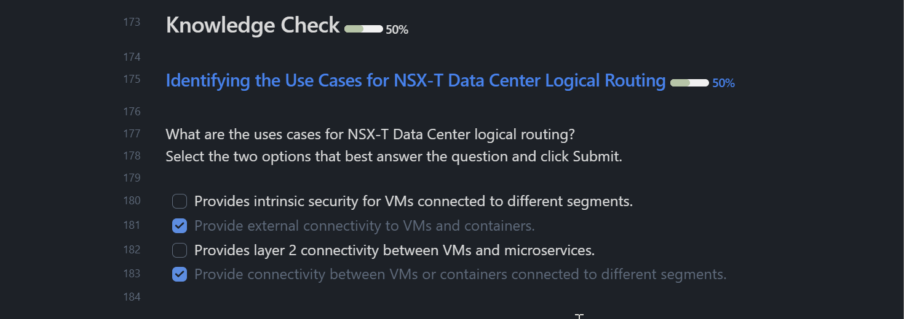
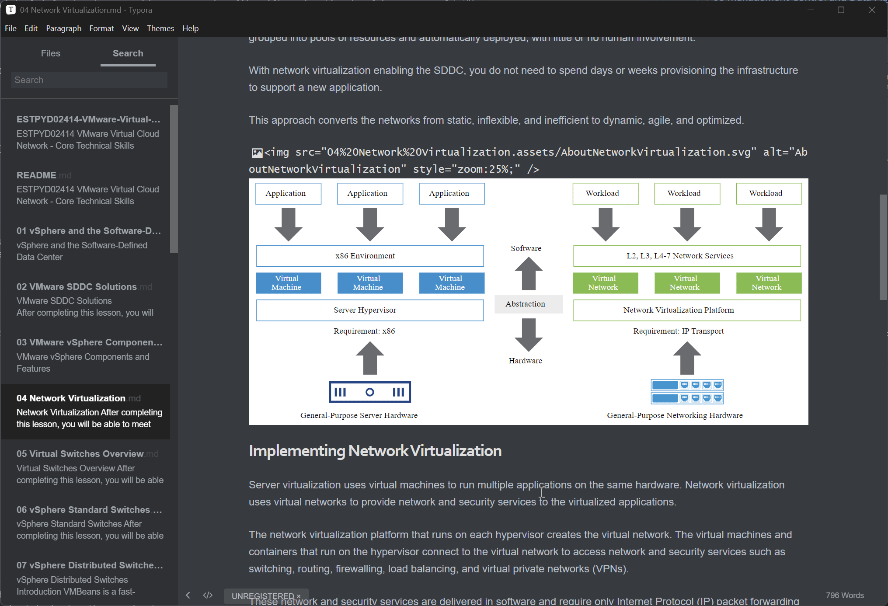

# ESTPYD02414 VMware Virtual Cloud Network - Core Technical Skills

- Sabe: [ESTPYD02414 VMware Virtual Cloud Network - Core Technical Skills](https://dell.sabacloud.com/Saba/Web_spf/PRODTNT091/app/shared;spf-url=common%2Fledetail%2Fcours000000000456128%3FfromAutoSuggest%3Dtrue)
- VMware: [VMware Virtual Cloud Network - Core Technical Skills | Connect Learning](https://learning.customerconnect.vmware.com/oltpublish/site/program.do?dispatch=showCourseSession&id=9fce082b-fcc8-11ea-9f48-0cc47adeb5f8&ssosign=true)

## Course Introduction:

### Course description:

The Virtual Cloud Network: Core Technical Skills self-paced course targets candidates who are new to the industry or entry-level employees looking for opportunities to advance their knowledge, skills, and understanding of VMware NSX®, which is the VMware network virtualization platform. Through a series of targeted, self-paced modules, the student will learn how to perform standard and typically repeated tasks that are delegated by an administrator to an operator or junior administrator.

The course aligns with the VMware Certified Technical Associate (VCTA) certification exam.

- Explain the basic concepts and features of the software-defined data center and VMware vSphere®
- Define network virtualization and software-defined networking
- Describe the features, components, and basic architecture of VMware NSX-T™ Data Center
- Describe the networking and security capabilities of NSX-T Data Center, including switching, routing, and firewalling
- Explain the implementation of networking services such as DHCP, DNS, NAT, load balancing, and VPNs in NSX-T Data Center
- Monitor the NSX components and objects from the NSX user interface
- Explain the VMware Virtual Cloud Network vision

### Overview

The Virtual Cloud Network: Core Technical Skills self-paced course targets candidates who are new to the industry or entry-level employees looking for opportunities to advance their knowledge, skills, and understanding of VMware NSX®, which is the VMware network virtualization platform. Through a series of targeted, self-paced modules, the student will learn how to perform standard and typically repeated tasks that are delegated by an administrator to an operator or junior administrator.

The course aligns with the VMware Certified Technical Associate (VCTA) certification exam.

**Please Note:** This course **requires a Premium subscription** to VMware Customer Connect Learning. Click [here](https://mylearn.vmware.com/mgrReg/courses.cfm?ui=www_edu&a=one&id_subject=82786) to purchase this subscription to gain access to this course. If you have a Premium subscription, log in first and then search for the course.

## Objective

- Explain the basic concepts and features of the software-defined data center and VMware vSphere®
- Define network virtualization and software-defined networking
- Describe the features, components, and basic architecture of VMware NSX-T™ Data Center
- Describe the networking and security capabilities of NSX-T Data Center, including switching, routing, and firewalling
- Explain the implementation of networking services such as DHCP, DNS, NAT, load balancing, and VPNs in NSX-T Data Center
- Monitor the NSX components and objects from the NSX user interface
- Explain the VMware Virtual Cloud Network vision

## Modules

- [ ] [01-vSphere-and-the-Software-Defined-Data-Center](01-vSphere-and-the-Software-Defined-Data-Center.md)
- [ ] [02-VMware-SDDC-Solutions](02-VMware-SDDC-Solutions.md)
- [ ] [03-VMware-vSphere-Components-and-Features](03-VMware-vSphere-Components-and-Features.md)
- [ ] [04-Network-Virtualization](04-Network-Virtualization.md)
- [ ] [05-Virtual-Switches-Overview](05-Virtual-Switches-Overview.md)
- [ ] [06-vSphere-Standard-Switches](06-vSphere-Standard-Switches.md)
- [ ] [07-vSphere-Distributed-Switches](07-vSphere-Distributed-Switches.md)
- [ ] [08-Management-Control-and-Data-Plane](08-Management-Control-and-Data-Plane.md)
- [ ] [09-Software-Defined-Networking](09-Software-Defined-Networking.md)
- [ ] [10-Introduction-to-NSX-T-Data-Center](10-Introduction-to-NSX-T-Data-Center.md)
- [ ] [11-NSX-T-Data-Center-Components](11-NSX-T-Data-Center-Components.md)
- [ ] [12-NSX-T-Data-Center-Architecture](12-NSX-T-Data-Center-Architecture.md)
- [ ] [13-Benefits-of-NSX-T-Data-Center-Logical-Switching](13-Benefits-of-NSX-T-Data-Center-Logical-Switching.md)
- [ ] [14-NSX-Logical-Switching-Components](14-NSX-Logical-Switching-Components.md)
- [ ] [15-NSX-Logical-Switching](15-NSX-Logical-Switching.md)
- [ ] [16-Benefits-of-NSX-T-Data-Center-Logical-Routing](16-Benefits-of-NSX-T-Data-Center-Logical-Routing.md)
- [ ] [17-NSX-Routing-Components](17-NSX-Routing-Components.md)
- [ ] [18-NSX-Logical-Routing](18-NSX-Logical-Routing.md)
- [ ] [19-Micro-segmentation](19-Micro-segmentation.md)
- [ ] [20-Zero-Trust-Security](20-Zero-Trust-Security.md)
- [ ] [21-NSX-Data-Center-Firewalls](21-NSX-Data-Center-Firewalls.md)
- [ ] [22-NSX-DHCP](22-NSX-DHCP.md)
- [ ] [23-NSX-DNS](23-NSX-DNS.md)
- [ ] [24-NSX-NAT](24-NSX-NAT.md)
- [ ] [25-NSX-Load-Balancing](25-NSX-Load-Balancing.md)
- [ ] [26-NSX-VPNs](26-NSX-VPNs.md)
- [ ] [27-Virtual-Cloud-Network](27-Virtual-Cloud-Network.md)
- [ ] Certification Information

## TODO

- [ ] Reformatting. Ex. Callout format for Quiz/Question.

- [ ] Rename files to a non-space scheme, ex: `22-NSX-DHCP.md`.
- [x] Convert EOL: CRLF to LF (Windows to Linux)
- [x] Convert image tag format: HTML (``) to Markdown (``).

- [x] Move all assets (under "Topic.assets") to the `assets` folder.
